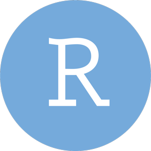
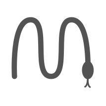

+++
title = "About Pierre-Edouard GUERIN"
template = "static_page.html"
slug = "about"

+++

# Please, call me Pierre. Thanks for visiting my site.

I am a computational biologist engineer in Center of Functional Ecology and Evolution, CNRS, Montpellier. I am mainly focusing on second and third Next-Generation Sequencing data analysis for the european project RESERVEBENEFIT. I am also strongly involved in environmental DNA studies such as MONACO MARINE WORLDWIDE EXPEDITION. My expertise is related to programming, whole-genome assembly, 3D protein modelling, variant calling, parsing large public database and statiscal analysis. I am interested in working on next-generation approaches, solving complex problems using combination of state-of-the-art algorithms.

 

 
<h2> Code </h2>
 

	

		
	

	

		
	

	

		
	

<small>My main computational languages are Bash, Python and R. However I also realised several projects using C, C++, Perl or Julia.
</small>

 
<h2> Tools </h2>
 

	

		
	

	

		
	

	

		
	

<small>
Sublime Text, Pycharm, Rstudio, Visual Studio to create computer softwares. SLURM or Univa Grid Engine to submit job on the cluster.
</small>

<h2> Reproducible sciences</h2>
 

	

		
	

	

		
	

	

		
	

<small> 
In order to ease the reproduction of my works, I take advange of Git, Singularity, Docker, Conda, Jupyter notebook, SnakeMake or Nextflow.
</small>

 

