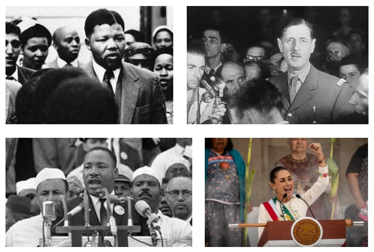

+++
template = "page.html"
title = "Analytical Skill"
date =  2022-02-15
draft = false
description = "The method to compose a discourse articulating facts and knowledge to describe a problem."
[taxonomies]
tags = ["career"]
+++

When I was in junior high school, I had the opportunity to take History and Geography classes from **Nicolas Ben Fredj**. He taught us the method ("the way" in Greek) to compose and articulate our thoughts and knowledge. I recently watched a [MOOC he recorded for Lycée français international Louis-Massignon](https://www.youtube.com/watch?v=IxPyIlTKZnI). The ability to think analytically and to express ideas is useful. In science, whether in academia or industry, we need to compare different solutions or hypotheses objectively and communicate our analysis to our peers in order to make the best decisions.
<!-- more -->

## Speak One's Mind

Constructive argumentation is like composition in music. Often, we don't like what we write or say because this is disappointing in regard of the prior efforts, the depth of knowledge we are presenting *e.g.* a difficult experiment, a thorough [state of the art](/articles/state-of-the-art).

This disappointment often comes from a lack of methods, and it leads us to fear any form of evaluation: reports, presentations, annual reviews and job interviews. Yet **these trials should not be feared but rather seen as opportunities to show our skills, our mastery of knowledge and our ability to articulate information**. Everyone should strive to master both knowledge (savoir) and know-how (savoir-faire). Confident in your method, then you have confidence in yourself. After all, an evaluation is meant to show your value. Here is the toolkit to craft any communications based on analysis, whether it be a presentation, a report, or an interview.

## Saying is not Speaking

To describe the world, nothing goes without saying. Things must be ordered into a discourse to say the world. Yet saying is not the same as speaking. While both 'saying' and 'speaking' can be oral, 'saying' can also be written. Speaking is a natural ability slowly acquired through imprinting and mimicking. Saying is always about a set of rules, constraints or emphasized injunctions. 

The world, like ourselves, is alive, and in its impatience creates more disorder than order. To describe and understand the world, we need to put a bit of order to it from time to time. The problem is that we tend to write the way we speak. Speaking gives the illusion of freedom. But this freedom is a mirage. Without order, we cannot articulate ideas and organize complex and technical information. Because the work is too difficult, the writing is limited: the content is approximate; the flow of ideas is disrupted.

Therefore, to put order in our knowledge is fundamental. It must be done whatever the field. **You cannot leave the choice of words, their order, the sentence construction to hazard**. Like a body, every element of your words must be articulated, assigned to a specific place, and given a specific role.

## A place for everything, and everything in its place 

This *chiasm* shows that in a sentence, the meaning of words matters as much as their order.

1. To explain the idea to the reader
2. To show the direction the reader has to follow

The way to say something changes the interpretation. Some examples to understand:

| Phrasing | Interpretation | 
| --- | --- |
| "The French team defeated England." | Inaccurate as England is a country. |
| "The French team defeated the English team." | Accurate. |
| "The French team defeated the English team on their home ground." | Strenghten the merits of the winner. |
| "The French XV defeated the English XV." | Outdated and wrong expression. |
| "The English team lost against the French team." | Minimize the French victory. | 
 
There are infinite ways to phrase.

Depending on the phrasing, one says not the same thing from the same fact. Without even starting to convey an idea, the simple act of reporting a raw fact is enough to create a different reality.

## An Opinion is not an Analysis

>
> "Well, opinions are like assholes. Everybody has one."
>
> *Dirty Harry, The Dead Pool, 1988*
>

Expressing an opinion is different from producing an analysis, because it is not about the content of the *thought*, but the *self*. In an opinion `I think`, the `I` takes precedence over the `think`.

Example:

> "On Saturday, the French Team confirmed the growing strength and confidence of their play."

I go beyond the fact to introduce an analysis.

On the contrary If I say:

> "The French team dominated a bewildered English team on Saturday, their performance a testament to skill and confidence."

I introduce elements of evaluation and judgment that reveal my opinion.

## All Generalizations are Dangerous, even this One

The main error is excessive generalization, which distorts the meaning of what is being said.

Example:

> "There is a war in Ukraine."

The problem with this phrasing is that it creates a sense of normality. Like in `There is a sea in Ukraine.`, indeed, the sea is here, was always here and will likely still be there in the future. Unlike the sea who is a *constant*, the war is a *rupture*. Saying `there is` denies the exceptional nature of the event by treating it as an ordinary occurrence.

Second Example:

> "The war was triggered by either the Russians or the Ukrainians."

I am taking a side. The term `trigger` implies an aggressor. 

Yet if I want to be factual:

> "The Russian armies attacked Ukraine."

Here the difference is that I express a fact instead of an idea.

To summary, never use `There is`. In the world, everything is always the consequence of something else.

## Do not essentialize

If I say:

> "The Russian armies attacked Ukraine."

It is different from:

> "The Russians attacked Ukraine."

I do a **generalization**. I am not saying true because not all the Russians attacked Ukraine. Most of the Russians are in their home in Russia. Some of the Russians are worried, some others are in opposition to this war. It is impossible to estimate their number but their existence is enough to do not say `The Russians`.

* Do not attribute fact to a whole nation, population, or category.
* Create false particularism like `To be Russian is a condition to be opposed to Ukraine`.
* Weaken your ability to build a constructive argumentation.

Minimize generalization and essentialization. 

## How to do an Analysis?

*  **Statement**: Break it into components (`Analysis` 'to break apart' in Greek). *Subject, verb, objects, logical connectors, punctuations*. Identify key concepts.
* **Ideas**: Order ideas from the most relevant to the least in regard of the identified key concepts. Group items of your knowledge according to ideas they support.
* **Scientific question**: More than just turning the statement into an interrogative form. You go beyond the statement by presenting the identified key concepts, the ideas you related to them supported by your knowledge. Starting point of your argument.
* **Tree of the discourse**: Main ideas are the components of the main branch. Secondary ideas are supporting the main branch as leaves. The tree represents the logic you will follow.
* **Plan**: Name components of branch and leaves. Roadmap to your audience.

## Deciphering Words

>
> "Are the roots of words square?"
>
> "— Square or cubic. It depends."
>
> *Eugene Ionesco, The Lesson, 1951*  
>

In any statement, you must identify key concepts by describing every components.

### First Example of Analysis (History)

> "The second world war, a total war?"

* `?` never on random place. Here we interrogate the `total war` not the `world war`.
* Notice the singular form. You know that the WWII is plural: war of the totalitarisms, war of the resistances, war of the democracies.
* Each war evolves to become more and more extreme.
  * The totalitarisms increase mobilization thanks to their ideology that deshumanizes the enemy.
  * The resistances have a growing level of engagement among members whatever their sex and origins. 
  * The democracies initially opposed to the war, progressively adopt elements of the total war.

**Scientific question:** In which way, the different wars in the second world war, totalitarisms, resistances, democracies, are complementary forms of the total war?

### Second Example of Analysis (Geography)

> "Seas and oceans: spaces at the heart of globalization?"

* `and` precises that a `sea` in not an `ocean` and reciprocally. `and` both separates and links the two words.
* Develop the idea that maritime areas are both anthropized, exploited territories and contested free spaces.
* `Globalization` must be explained under this prism of conquest of the `seas` and the `oceans`.
* `heart` is *polysemous*:
  * Centrality of the territory.
  * Motor or pump of the `globalization`.
  * Loving heart of the `globalization`. Does it worry about the populations and their environment?

**Scientific question:** In which ways, seas and oceans, two distinct but interconnected maritime areas, can be seen both as territories driving the mondialization and paradoxaly, as the main victims of its secondary effects?

### Third Example of Analysis (Sociology)

> How does the school shape individual life trajectories and contribute to the evolution of society?

* which type of `society`? democracies or authoritarian.
  * In democracies: the school's objective of personal fulfilment goes with improvement of the economic efficiency of the society. Despite the gradual restriction of individual choices, they remain at the service of the people.
  * In authoritarian regimes: the state is not at the service of the individual but the individual is at the service of the state. Individual destinies are directed not with concern about personal fulfilment but for the benefit of the society. Society of a state that serves an ideology, or, in the case of illiberal democracy, serves a ruling clique that has confiscated the state.
* How does the school shape the `evolution of society`?
  * In China, the non-democratic society assign to school the objective to contribute to the `evolution` of the society.
  * *Progress* is not `evolution`.
  * School is contributing to progress only for the democratic project. The question by using the term `evolution` covers both democracies and authoriarian regimes.
* The capacity of the `school` as an institution, and of its actors, to achieve objectives, raises the question of resistance or resilience.
  * *Resistance* is not *Resilience*. In face of difficulty, resistance fights whereas resilience adapts.
  * Knowledge of school objectives, the means and policies used at different historical times.
  * Different actors mobilized by the educational project. Each actor must assess his level of responsability in the success or the failure of the assigned mission in the educational project.
    * **Pierre Bourdieu**: responsibility directed by the force of *habitus*.
    * Responsibility  of the institutional body with strong corporatism
    * Responsibility  of the political body
  * **Michel Foucault**'s epistemè of modern times: opposition between the democratic ideal for schools and a more pessimistic perspective that sees schools as instruments of coercion rather than education. School as a privileged tool for a control-oriented society.
  * School as an instrument of social control instead of a dual lever for both education of individuals and evolution of society. 

**Scientific question:** Can the educational institution, particularly in democracies, fulfill its dual objectives of individual self-realization and social equalization, as assigned by a democratic society committed to the values of progress?

### Last Example of Analysis (Philosophy)

> To discuss, is it to renounce violence?

* To produce a `discussion` through the distorting prism of `violence`. There is a logical connection this prism weaves between the two poles of the question. This link must be critisized.
* *Historiography* organizes the "living together". It is a good example of the relationship between `discussion` and `violence`.
  * **Michel Foucault** links different historical times considering that the human mind remains identical.
  * **Montaigne** considered himself as a guelfe with the gibelins and as gibelin with the guelfes. A way to say that one must always look the world with the eyes of another. Challenge what seems obious. Uncover the foundation of each concept.
* Two historiography in opposition:
  * *The Agora*: the society is the place for encountering others, building a social harmony protected by laws. It gathers all discussions."
  * *The Stasis*: codified discussion in order to regulate violence in social relations. How to settle conflicts. Examples: The United Nations (UN); the prosecuting of the war criminals after the WWII in Nuremberg.

Plan:

1. Critics of the question itself as it states a "logical link" between discussion and violence.
2. How can discussion regulate the violence inherent in all social and political relationships. Limits?
3. On the other hand, instead of reducing violence, does the public expression of thought itself not become a source of violence?

Synthesis:

* The compromise born from the violence of the discussion is the foundation of the City.
* Most schools of thought are formed in opposition to each other: Parmenides against Heraclitus; Socrates and Plato against the Sophists; and so on.

> To discuss or to discuss?

## Conclusion

To think a discourse is to deconstruct it in order to build one’s own discourse about the world. It is a double task: first unraveling, then reweaving what has been unraveled. This task requires both **method** and **culture**.

Culture is made by learning, by acquisition of knowledge. This is not enough.

To acquire a useful culture *i.e.* a toolbox for analytical thinking, your knowledge must be challenged. By your *curiosity* which is never a flaw.

Question any new information. Is it useful? What does it teach you about the world? 

Otherwise, a stored but not processed information is useless.

This tedious work at the beginning becomes playful once it turns into a reflex through practice. This is a game for one or more players. Engaging in discussion is never wasted time. **Through discussion, the work of building culture occurs.**

## To go further

**Nicolas Ben Fredj** is a social science teacher in Lycée français international Louis-Massignon in Emirate of Abu Dhabi.

{{ youtube(id="IxPyIlTKZnI") }}

## Music suggested to listen while reading this article

> **Rudolf Serkin plays Shubert**
>
> *Rudolf Serkin, Franz Schubert, Adolf Busch, Hermann Busch*
>
> Piano Trio in E-Flat Major, D. 929 (Op.100) : II. Andante con moto. 1953 Sony Music Entertainment. [YouTube Music](https://music.youtube.com/watch?v=BzHKko0Tz6w&si=daRi0nX9c3I6G5A4)

## References

* MOOC Lycée français international Louis-Massignon: ["La langue dans la poche" par Nicolas Ben Fredj](https://www.youtube.com/watch?v=IxPyIlTKZnI)

