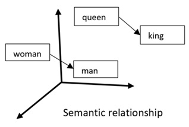
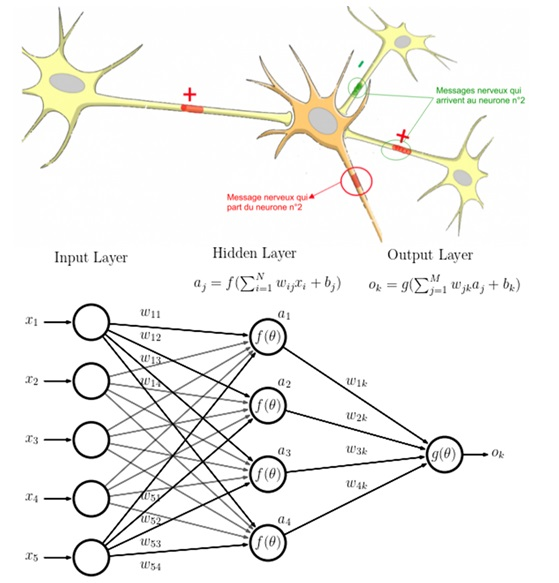
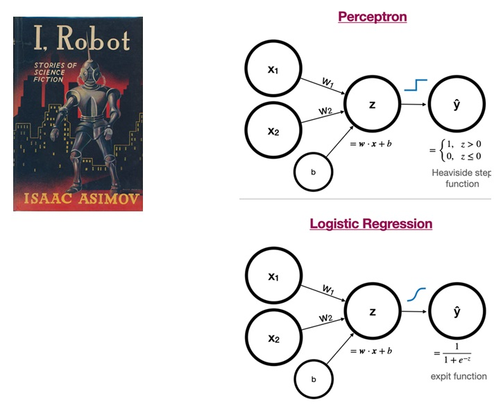

+++
template = "page.html"
title = "BioGPT: Generative Pre-trained Transformer for Biomedical Text Mining"
date =  2024-01-18
draft = false
description="GPT application using all publications in the PUBMED database"
[taxonomies]
tags = ["data-science"]
+++

Following the recent breakthrough in Natural Language Processing models, everyone is now talking about Transformers and ChatGPT. I wondered whether some models had been trained for use in biology or bioinformatics. I discovered a research project called **BioGPT** developped by Microsoft. This article to both describe BioGPT and summarise the recent history of Transformers and NLP.

## Bibliography is Hard Work (and is getting worse)

The [PubMed database](https://pubmed.ncbi.nlm.nih.gov/) contains more than 36 million publications. Every year this number increases following an exponential growth. 

They are no universal glossary *e.g.* a drug can have multiple synonyms depending on the field, the time frame, the country, etc. So, the research by keyword may be incomplete and not cover all the related articles. In addition, articles are sorted by field or key words making any cross-disciplinary research tedious.

## Natural Language Processing

NLP are methods to give the computer the ability to understand and speak human language. **BioGPT** is a model trained on the content of all available articles in PubMed. 

**BioGPT** can do:
* Answer question using PubMed materials
* Find drugs relations using PubMed materials

### History of NLP

* In the early 20th century, **Ferdinand de Saussure** establishes human language as a logical structure.
* In 1952, **Alan Hodgkin** and **Andrew Huxley** discover neural networks (Nobel Medicine 1963). 

These events inspire the idea of **a machine able to speak and understand human language**.

**Alan Turing** stated that if a machine could chat with you and you can’t tell it apart from a human, then the machine could be considered capable of thinking.

### Boolean request

Boolean logic involves `TRUE` or `FALSE` answer. The found documents are the ones matching an *exact term*. To go further, you can combine statements `OR`, `AND`, `NEAR`. 

Example: in a search engine, you type "puppy" and "kitten" to find any documents that contains both "puppy" and "kitten".

### Terms frequency


<div class="encart_inside_article">

**Term frequency**: How often appears a word in a document.

**Inverse Document frequency**: importance of a word in multiple documents.

</div>

Term frequency identifies important word that are both frequent in a document and rare across the dataset. It ignores common words like “the” or “is” as well.

Example: [Tag cloud](https://en.wikipedia.org/wiki/Tag_cloud).

### Co-occurence matrix

**Co-occurence matrix** is the table of the number of times two words appear together. The aim is to find words significantly associated. It is possible to reduce a set of words into a set of vector of associated words in order to process vector of words instead of words.

Example: 

>
> Apples are green and red.
>
> Red apples are sweet.
>
> Green oranges are sour.
>

| - | `apples` | `green` | `red ` | `sweet` | `oranges` | `sour` |
| --- | --- | --- | --- | --- | --- | --- | 
| `apples` | 2 | 1 | 2 | 1 | 0 | 0 |
| `green` | 1  | 1 | 1 | 0 | 0 | 0 |
| `red ` | 2 | 1 | 2 | 1 | 0 | 0 |
| `sweet` |1 | 0 | 1 | 1 | 0 | 0 |
| `oranges` | 0 | 1 | 0 | 0 | 1 | 1 |
|  `sour` | 0 | 1 | 0 | 0 | 1 | 1 |


In this text, `red` and `apples` are associated while `sour` and `apples` are not.


### Word2vec: Word to Vector

A word is considered as a vector. The computer follows an unsupervised learning (~no involved human) from the document. Each surrounding words is a *context* or *bag of words* teaching the word to predict given the context. The sum of all predictions produce a vector space or *semantic relationship*.

Example:

The computer understand from a document that the word `queen` and `king` are linked and `woman` and `man` relationship are aligned with `king` and `woman` relationship. By summing the vectors, the computer can deduce association between `queen` and `woman`  and `king` and `man`.



## Neural Network

Inspired by human brain, they are interconnected neurons organised into layers (input, hidden and output). Each connection between neuron has a weight. The network is trained on documents to adjust weights. Weights are self-corrected to minimise the difference between the prediction and the expected result.

Example: Word2vec is based on neural network of three layers.



## Perceptron

Designed in 1969 with the idea of creating a robot in the image of human. The **perceptron** is a neural network of 2 layers: input and output.

**:bulb: Note:** Without the hidden layer, a neural network is a **logistic regression model** (Berkson et al. 1944) with a Boolean output.



## Transformer

The **transformer** is a neural network with four layers. It adds a a new intermediate layer called *attention* (Vaswani et al. 2017). The decoder layer transforms the input document into a *bag of words*. The encoder layer produces a predicted *vector of words* using word2vec. *Attention* assigns weights to link the encoder and decoder layers. The transformer is the state-of-the-art method in natural language processing. **BERT** and **GPT** are based on transformer.

Example: [deepL](https://www.deepl.com/en/translator) for document translation.

### Bidirectionnel Encoder Representations from Transformers (BERT)

Transformer architecture developed by Google in 2018. In France, Martin et al. developed camembert in 2019. The context is processed twice from right to left and from left to right. Pre-trained: the neural network is already weighted based on a training using a HUGE dataset so it can be fine-tuned for specific use.

Example: [Google Search](https://www.google.com/) when you type a full sentence.

```
Can google find my missing sock?
```
People also ask
```
How do I find my lost sock?
When socks disappear where do they go?
Why can't I find my socks?
```

### Generative Pretrained Transformer (GPT)

Transformer architecture developed by openAI in 2020. Contrary to BERT, the document is processed with an unidirectional attention. In addition, the pre-training is different between GPT and BERT. While BERT is trained to predict the missing word giving a context, GPT is trained to generate complete comprehensive sentence giving a context.

Example: [chatGPT](https://chatgpt.com)

## BioGPT

* **BioGPT** is a **GPT** model fine-tuned based on PubMed publications.
* Microsoft provided the source code to build a bioGPT software: [github source code BioGPT](https://github.com/microsoft/BioGPT)
* The **[ :hugs: Hugging Face](https://huggingface.co/docs/transformers/en/model_doc/biogpt)** is an online library of all natural language processing neural network models including transformers including BioGPT.


## Conclusion


Transformer models are not trained on human words but on *token*. Token are the unit of chunks of information extracted from the original document. They are not human readable. Purely *black box* machine abstraction. Computer language comprehension relies on maths, not on real text comprehension. On the other side, we could say human language comprehension relies on neurotransmitter concentration. The point is the computer and the human are able to understand each other.

BioGPT is based on biomedical dataset so this is not relevant for other fields yet. For instance if I ask information about the sugar beet to BioGPT, he will give only information related to human nutrition. BioGPT is specialized into biomedical data and nothing else. Can we imagine a similar AI based on crop science literature in the future? The hardest part will be to collect and format relevant crop science text material.


## References

> **BioGPT: generative pre-trained transformer for biomedical text generation and mining**
>
> *Renquian Luo, Liai Sun, Yingce Xia, Tao Qin, Sheng Zhang, Hoifung Poon, Tie-Yan Liu*
>
> Briefings in Bioinformatics, November 2022. DOI: [10.1093/bib/bbac409](https://doi.org/10.1093/bib/bbac409)

> **Hugging Face**
>
> *Jain, S.M.*
>
>  Introduction to Transformers for NLP. Apress, Berkeley, CA, october 2022. DOI: [10.1007/978-1-4842-8844-3_4](https://doi.org/10.1007/978-1-4842-8844-3_4)

> **CamemBERT: a Tasty French Language Model**
>
> *Louis Martin, Benjamin Muller, Pedro Javier Ortiz Suárez, Yoann Dupont, Laurent Romary, Éric Villemonte de la Clergerie, Djamé Seddah, Benoît Sagot*
>
> Submitted in november 2019. DOI: [10.48550/arXiv.1911.03894](https://doi.org/10.48550/arXiv.1911.03894)


> **Attention is All you Need**
>
> *Ashish Vaswani, Noam Shazeer, Niki Parmar, Jakob Uszkoreit, Llion Jones, Aidan N Gomez, Łukasz Kaiser, Illia Polosukhin*
>
> Neural information processing systems, december 2017. DOI: [10.48550/arXiv.1706.03762](https://doi.org/10.48550/arXiv.1706.03762)

> **Word2Vec**
>
> *Kenneth Ward Church*
>
> Natural Language Engineering, january 2017. DOI: [10.1017/S1351324916000334](https://doi.org/10.1017/S1351324916000334)

> **The Perceptron: A Model for Brain Functioning**
>
> *H.D. Block*
>
> Reviews of Modern Physics, january 1962. DOI: [10.1103/RevModPhys.34.123](https://doi.org/10.1103/RevModPhys.34.123)


> **Propagation of electrical signals along giant nerve fibres**
>
> *Alan Lloyd Hodgkin and Andrew Fielding Huxley*
>
> Processdings of The Royal Society B, october 1952. DOI: [10.1098/rspb.1952.0054](https://doi.org/10.1098/rspb.1952.0054)