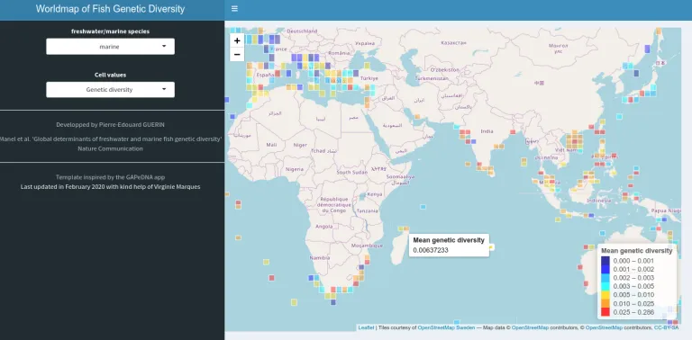

+++
template = "page.html"
title = "La première carte de la diversité génétique des poissons publiée"
date =  2020-03-04
draft = false
description= "L'analyse de 70 000 séquences codes-barres ADN mitochondrial géoréférencées pour les espèces de poissons révèle la corrélation entre la diversité génétique, la diversité des espèces et leur répartition mondiale en fonction du climat et de la géographie."
tags = ["sciences"]
+++

En ce début d’année 2020, notre équipe* a publié la première carte mondiale de la diversité génétique des poissons d’eau de mer et d’eau douce. C’est un instrument important pour la préservation des espèces. Cette première carte est publiée dans la revue [Nature Communications](https://doi.org/10.1038/s41467-020-14409-7). Comme j’ai réalisé l’ensemble des analyses bio-informatiques, je me suis dit que je pourrais vous en parler un peu plus en détail, avec le point de vue qui est le mien c’est-à-dire celui du bio-informaticien. En effet, ce travail a nécessité la collaboration d’un large panel de métiers : écologue, océanographe, statisticien et généticien.

<small> *Equipe "Biogéographie des Vertébrés" de l'Ecole pratique des Hautes Etudes integrée à l'Unité de Recherche Mixte du CNRS de Montpellier "Centre d'Ecologie Fonctionnelle et Evolutive" en parternariat avec l'IFREMER et l'Ecole Polytechnique Fédérale de Zurich</small>

## La diversité génétique ?

Dans le contexte de notre étude, la diversité génétique est simplement la variété des gènes au sein d’une même espèce. Influencé par les maladies, l'espace vital ou les changements climatiques, ce facteur est susceptible de diminuer plus rapidement que la diversité entre les espèces. Bien sûr, il s’agit là d’une définition de l’objet de notre étude, mais l’enjeu ici était de mesurer notre grandeur (la diversité génétique). Pour ce faire nous avons comparé les séquences de gènes de différents individus au sein d’une même espèce. À partir d’un alignement de séquences, il est possible de calculer la diversité nucléotidique П décrite par Nei et Li en 1979. Cette mesure indique la distance moyenne (le nombre de nucléotides différents) entre chaque comparaison par paire de séquences.

## Barcode of Life

Ces dernières années ont vu l’émergence de grandes banques de données publiques rassemblant notamment les séquences ADN de plusieurs millions d'individus d'espèces différentes issues de milliers d’études scientifiques à travers le monde. L’une de ces banques de données est la BOLD (Barcode of Life) qui rassemble les codes-barres ADN produits, rapportés et annotés par des centaines de missions scientifiques. Les codes-barres ADN sont des séquences ADN caractéristique de l’espèce. Ces séquences permettent une identification rapide et fiable de l'individu à son espèce. Dans le cas du projet BOLD, le code-barre ADN correspond à la séquence d'un gène de la mitochondrie (Cytochrome Oxydase I pour les connaisseurs). Les mitochondries n’étant pas soumises aux forces de sélection contrairement à leurs cellules hôtes, les différences entre les séquences ADN mitochondriales observées entre différents individus ou espèces résultent de la dérive génétique seule. Il est donc possible d’utiliser ces séquences d'ADN mitochondrial judicieusement nommées code-barres ADN comme des identifiants de l’espèce voire de l’individu. L’intérêt tout particulier de BOLD, c’est de fournir un grand nombre de codes-barres ADN géo-référencés. Il est alors possible non seulement de calculer la diversité génétique intraspécifique mais également sa distribution géographique. En couplant ces deux caractéristiques nous avons généré une carte de la diversité génétique.

##  Mots Clés

**Biodiversité :** la variabilité des organismes vivants de toute origine y compris, entre autres, les écosystèmes terrestres, marins et autres écosystèmes aquatiques et les complexes écologiques dont ils font partie; cela comprend la diversité au sein des espèces et entre espèces ainsi que celle des écosystèmes.

**Code-barre ADN :** un gène, ou une partie de gène, qui est à la fois suffisamment conservé entre organismes pour pouvoir comparer des organismes distants, et à la fois suffisamment variable pour pouvoir identifier un genre voire une espèce ou un individu.

**Diversité des espèces :** nombre d'espèces différentes recensées dans un milieu après raréfaction des comptages.

**Diversité génétique :** degré de variétés des gènes au sein d'une même espèce. Dans cette étude elle est estimée à partir des code-barres ADN comme la probabilité qu'un nucléotide diffère entre deux séquences d'individus pris au hasard au sein d'une même espèce dans un milieu.

____________

## La distribution de la diversité génétique des poissons à l’échelle globale est inégalement répartie

Nous avons assemblé une base de données de plus de 50 000 séquences d’ADN mitochondrial, géo-référencées, appartenant à 3 815 espèces de poissons marins et 1 611 espèces de poissons d’eau douce. Ces données ont permis d’estimer la diversité génétique moyenne dans des cellules de 200 km de résolution. Les analyses ont montré que la diversité génétique des espèces marines et d'eau douce était répartie de façon hétérogène à travers le monde. Les 10 % de cellules les plus riches génétiquement (points chauds) sont situées dans le Pacifique occidental, le nord de l'océan Indien et les mers des Caraïbes pour les espèces marines, tandis qu’elles sont localisées en Amérique du Sud pour les espèces d’eau douce. En étudiant les facteurs environnementaux propres à chaque cellule (plus d’une cinquantaine), nous avons établi que la diversité génétique des espèces marines augmente avec la température (et les facteurs qui y sont corrélés positivement, tels que la latitude ou négativement, tels que la concentration en oxygène par exemple), alors que la diversité génétique des poissons d’eau douce est principalement influencée par la complexité de l’habitat et l’histoire ancienne de la région.

## La diversité des espèces n’est pas vraiment corrélée à la diversité génétique dans le cas des poissons

Enfin, nous avons recherché si il existait une corrélation entre diversité des espèces i.e. nombre d'espèces après raréfaction des comptages et diversité génétique intraspécifique. Il s’avère que cette corrélation est très faible, ce qui suggère que les régions avec la plus grande diversité génétique ne sont pas nécessairement confondues avec les régions avec la plus grande diversité en espèces.

<small>Adéquation entre la diversité des espèces et la diversité génétique dans les cellules géographiques. Le classement des cellules dépend à la fois de leur valeur en nombre d'espèces et en diversité génétique pour (a) les espèces marines et (b) les espèces d'eau douce. Les valeurs de la diversité ont été reportées sur la carte en utilisant un gradient de couleur en fonction des valeurs de la diversité génétique et de la diversité des espèces pour (b) les espèces marines et (d) les espèces d'eau douce. La ligne noire représente le modèle linéaire de le la diversité génétique en fonction de la diversité des espèces. Les coefficients de corrélation r calculés dans les régressions linéaires sont indiqués sur la figure.</small>

## Conclusion

En identifiant les points chauds de la diversité génétique, cette carte devrait notamment aider à prendre des mesures de protection plus adaptée. En effet, plus une population est diversifiée, mieux elle sera à même de s'adapter aux modifications de son environnement. La facette de la diversité génétique est donc à considérer à part de la facette de la diversité des espèces. Ce qui implique de nouveaux développements supplémentaires de conservation. Ces efforts seront peut-être atteints avec le nouvel objectif, préconisé par l'[Union internationale pour la conservation de la nature](https://www.iucn.org/resources/issues-briefs/marine-protected-areas-and-climate-change), de protéger 30% des surfaces océaniques et terrestres d’ici 2030 .

Pour rendre mon projet plus accessible grâce à Shiny (ici je vous recommande l'excellent article de Thomas Denecker qui vous expliquera comment créer une application web), j'ai réalisé une carte interactive de la diversité génétique : https://shiny.cefe.cnrs.fr/wfgd/

<small>L'application en ligne "[Worldmap of Fish Genetic Diversity](https://shiny.cefe.cnrs.fr/wfgd/)" permet de visualiser la distribution de la diversité génétique des espèces marines et d'eau douce de poissons sur une carte du monde.</small>

## Codes source
* L'analyse statistique : https://github.com/Grelot/global_fish_genetic_diversity
* L'application shiny : https://gitlab.mbb.univ-montp2.fr/reservebenefit/webapp_marine_worldmap_bold

## Références

* Manel, S., **Guerin, P.E.**, Mouillot, D. et al. Global determinants of freshwater and marine fish genetic diversity. Nat Commun 11, 692 (2020). https://doi.org/10.1038/s41467-020-14409-7
* Nei, M. & Li, W. H. Mathematical model for studying genetic variation in terms of restriction endonucleases. Proc. Natl Acad. Sci. USA 76, 5269 (1979).
* Miraldo, Andreia, et al. "An Anthropocene map of genetic diversity." Science 353.6307 (2016). 

_______________________________________________________________________________