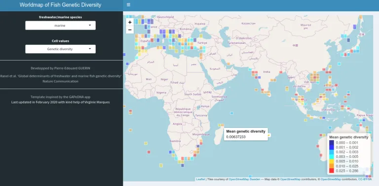

+++
template = "page.html"
title = "Global determinants of fish genetic diversity"
date =  2020-03-04
draft = false
description= "Data mining on up to 70,000 georeferenced mitochondrial DNA barcode sequences for fish species unveils the correlation between genetic diversity and species diversity and their global distributions in relation to climate and geography."
[taxonomies]
tags = ["sciences"]
+++

At the beginning of 2020, our team* has published the first global map of the genetic diversity of marine and freshwater fishes. This is an important instrument for the preservation of species. This first map is published in the journal [Nature Communications](https://doi.org/10.1038/s41467-020-14409-7). As I have done all the bioinformatics analysis, I thought I could present this work from my point of view as a computer scientist. Indeed, this work required the collaboration of a wide range of professions: ecologist, oceanographer, statistician and geneticist.
<!-- more -->

<small> *Team "Biogéographie des Vertébrés" Ecole pratique des Hautes Etudes from UMR CNRS "Centre d'Ecologie Fonctionnelle et Evolutive" in collaboration with IFREMER  and ETH Zurich</small>

<a href="https://bioinfo-fr.net/la-premiere-carte-de-la-diversite-genetique-des-poissons-publiee" 
   class="external-article-box" 
   target="_blank" 
   rel="noopener noreferrer">
  
  Cet article est publié en version française sur Bioinfo-fr.net
</a>

## Genetic diversity ?

In the context of our study, **genetic diversity** is the variety of genes within a single species. Influenced by disease, living space or climate change, this factor is likely to decrease faster than the diversity between species. Of course, this is a definition of the subject of our study, but the issue here was to measure our magnitude (genetic diversity). In order to do this we compared the gene sequences of different individuals within the same species. From a sequence alignment it is possible to calculate the nucleotide diversity *П* described by Nei and Li in 1979. This measure specifies the average distance (the number of different nucleotides) between each pair of sequence pair comparisons.

## Barcode of Life

Recent years have seen the emergence of large public databases containing the DNA sequences of several million individuals of different species from thousands of scientific studies around the world. One of these databases is the **BOLD** (Barcode of Life), which gathers produced, reported and annotated DNA barcodes from hundreds of scientific missions. DNA barcodes are DNA sequences which are characteristic of the species. These sequences allow rapid and reliable identification of the individual to its species. In the case of the BOLD project, the DNA barcode corresponds to the sequence of a mitochondrial gene such as Cytochrome Oxidase I. Since mitochondria are not subject to selection forces unlike their host cells, differences in mitochondrial DNA sequences observed between different individuals or species result from genetic drift alone. It is therefore possible to use these mitochondrial DNA sequences, judiciously named DNA barcodes, as identifiers of the species or even the individual. The particular interest of BOLD is to provide a large number of geo-referenced DNA barcodes. It is then possible to calculate not only the intraspecific genetic diversity but also its geographical distribution. By coupling these two features we have generated a map of genetic diversity.

##  Key words

**Biodiversity:** the variability among living organisms from all sources including, inter alia, terrestrial, marine and other aquatic ecosystems and the ecological complexes of which they are part; this includes diversity within species, between species and of ecosystems.

**DNA barcode:** a DNA sequence of a gene or part of a gene. First, a DNA barcode must be sufficiently conserved between organisms to be able to compare distant organisms. Second, a DNA barcode must be sufficiently variable to be able to identify a genus or even a species or an individual.

**Species diversity:** number of different species recorded in a given environment 

**Genetic diversity:** degree of variety of genes within a species. In this study it is estimated from DNA barcodes as the probability that a nucleotide differs between two sequences of individuals taken at random within the same species in a given environment.

____________

## The distribution of fish genetic diversity on a global scale is unevenly distributed

I assembled a database of more than 70,000 geo-referenced mitochondrial DNA sequences belonging to 3,815 species of marine fish and 1,611 species of freshwater fish. These data made it possible to estimate the average genetic diversity in cells with a resolution of 200 km. The analysis showed that the genetic diversity of marine and freshwater species was heterogeneously distributed throughout the world. The 10 % of cells with the highest genetic richness (hot spots) are located in the Western Pacific, Northern Indian Ocean and Caribbean Seas for marine species, while they are located in South America for freshwater species. By studying the environmental factors specific to each cell (more than fifty), we have established that the genetic diversity of marine species increases with temperature (and the factors that are positively correlated with it, such as latitude, or negatively correlated with it, such as oxygen concentration, for example), whereas the genetic diversity of freshwater fish is mainly influenced by the complexity of the habitat and the ancient history of the region.

## Species diversity is not really correlated with genetic diversity in the case of fish.

Finally, we investigated whether there was a correlation between species diversity, *i.e.* the number of species after the scarcity of counts, and intraspecific genetic diversity. This correlation is very weak, suggesting that regions with the greatest genetic diversity are not necessarily regions with the greatest species diversity.

<small>Classification of cells depending simultaneously of their values of genetic and species diversity for marine **(a)** and freshwater **(c)** species. Values of diversity were reported on the global map using a colour gradient depending on the values of the genetic and species diversities for marine species **(b)** and freshwater species **(d)** respectively. The colour scale of Fig. 2a–d is defined in the Fig. 2d. The line was represented as the output of a linear model (lm) of the correlation between genetic diversity and species diversity. Person coefficient of correlations calculated in linear regressions (r) are reported on the figure. Drawn with R version 3.2.3.</small>

## Conclusion

By identifying the hot spots of genetic diversity, this map should help to take more appropriate protection measures. Indeed, the more diverse a population is, the better it will be able to adapt to changes in its environment. The genetic diversity aspect should therefore be considered separately from the species diversity aspect. This implies further conservation developments. These efforts will perhaps be achieved with the new objective, advocated by the [International Union for Conservation of Nature](https://www.iucn.org/resources/issues-briefs/marine-protected-areas-and-climate-change), of protecting 30% of ocean and land surfaces by 2030 .

In order to ease the access of the map, I realised an interactive map of fish genetic diversity as a web application: https://shiny.cefe.cnrs.fr/wfgd/

<small>The application "[Worldmap of Fish Genetic Diversity](https://shiny.cefe.cnrs.fr/wfgd/)" allows visualisation of the  distribution of the genetic diversity of marine and freshwater fish species on a world map.</small>

## Codes source

* Statistical analysis: https://github.com/Grelot/global_fish_genetic_diversity
* Web Shiny Application: https://gitlab.mbb.univ-montp2.fr/reservebenefit/webapp_marine_worldmap_bold

## References and notes

> **Global determinants of freshwater and marine fish genetic diversity**
>
> *Stephanie Manel, Pierre-Edouard Guerin, David Mouillot, Simon Blanchet, Laure Velez, Camille Albouy & Loic Pellissier*
>
> Nature communications. 2020 Feb 10. DOI: [10.1038/s41467-020-14409-7](https://doi.org/10.1038/s41467-020-14409-7)

> **An Anthropocene map of genetic diversity**
> 
> *Andreia Miraldo, Sen Li, Michael Borregaard, Alexander Florez-Rodriguez, Shyam Gopalakrishnan, Mirnesa Rizvanovic, Zhiheng Wang,Carsten Rahbek, Katharine Marske, David Nogues-Bravo*
>
> Science. 2016 Sep 30. DOI: [10.1126/science.aaf4381](https://doi.org/10.1126/science.aaf4381)

