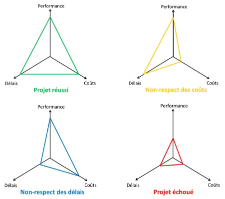
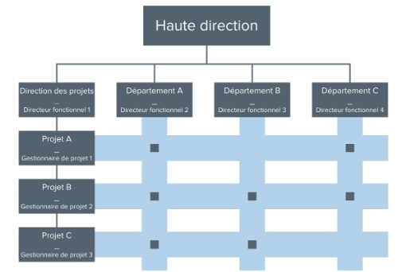
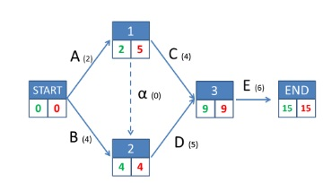

+++
template = "page.html"
title = "How to Manage a Project?"
date =  2025-06-18
draft = false
description = "Pierre Mahe course about classical approach to manage project"
[taxonomies]
tags = ["management"]
+++

In any company, every task is part of a project. I am responsible for managing multiple projects each year. I have to present deliverables to stakeholders, meet deadlines, allocate mandays and coordinate everyone’s actions. This is a meticulous work that requires a strong methodology. 
<!-- more -->

## What is a project?

A project can be defined as an unique process, which is a set of coordinated **tasks**, having a starting and an ending date, with specific start and end dates, undertaken to achieve a defined objective.

A project is characterised by:
* Being unique
* A set of tasks
* Clear objectives
* Time constraints (start and end date)
* Cost constraints (predetermined budget)

## Project constraints: the PCD triangle

A sucessful project is evaluated using the **PCD triangle** (**P**erformance, **C**ost, **D**eadline).

## Types of project

Depending on their purpose:
* **Engineering projects**: unique deliverables for a single client *e.g. bridges, buildings*
* **Product projects**: recurring projects producing industrial goods
* **Organizational projects**: internal transformations or events
* **Societal projects**: large-scale initiatives impacting society *e.g. The European Constitution*

## The Role of the project within companies

Depending on the nature of the company, the weight of the project differs:

* **Project-driven companies**: innovation-focused, few but critical projects
* **Multi-project companies**: many parallel projects across sectors
* **Collaborative project**: single project shared by different companies
* **Start-ups**: the company itself is a single project
* **Internal transformation projects**: change management structure

## Matrix organisation

Many companies use a matrix structure. They are two axes:
* x-axis: **functional management** which is the technical expertise but also the development of the carreers.
* y-axis: **project management** which is the operational execution and how everybody is implied into the success of the project.

Therefore, an employee has always two managers (hierarchy and project). The influence of each manager is based on the weight of the projects within the company. Teams can be tailored according to the needs of the project.

## Stakeholders in a project

Stakeholders are any individual, group, or company who can affect or be affected by the outcome of a project.

* **The Project Owner**: a company or a service who identify the needs, then define the objectives and constraints of the project.
* **The Lead Contractor**: a company or a service in charge to execute the project for the Client.
* **The Owner's Representative**: reports advancement of the project to the Project Owner.
* **The Project Manager**: coordinates execution and delivery, provide reports to the Owner's Representative.
* **The Project Team**: performs operational tasks under supervision of the project manager.
* **The Functional Manager**: provides the needed experts to the project team.
Functional managers: provide resources and expertise

## What is project management?

They are many reason explaining why a project face difficulties such as delays, budget ovveruns or reduced performance. Common causes of failure are unclear or unrealistic requirements, poor planning, lack of resources, weak communication or lack of support.

**Project management** refers to the methods and tools used to plan, organize, and control project activities in terms of:
* Technical performance
* Cost control
* Deadline management
* Quality

Main methods for project management are: [Gantt charts](/articles/gantt-chart-excel-for-project-management/), agile approaches (scrum, sprints, backlogs).
The project team can also use collaborative tools such as [Git](/articles/team-working-with-git) for software developpement, Microsoft Teams for coordination and online meeting, and Overleaf for writting papers and reports.

## Project definition

First we need to give a neat and accurate formulation of what is the purpose of the project. What is the limits in terms of time and cost? Stakeholders should participate to this first step.
Second, we have to define the objectives of the project. What are the expected results? What are the constraints and risks?
Good question to ask to the stakeholders:
* What do you want to have at the end of the project?
* How will you know the project is successful?
* Which results do you want on the short term ? and on the long term?

The objectives must be **measurables** (the P of the PCD triangle) to know if they are achieved at the project closure. Objectives can be ordered as primary objectives (mandatory) or secondary objectives (nice to have). Once objectives are defined, we can define the tasks for the project team. Objectives will serve as a non-technical description of the project to the other stakeholders.

**Task**: elementary action to do for achieving an objective.
A task is characterised by:
* A measurable objective, producing a **deliverable**.
* A duration, start and end date
* Some needed resources

**Deliberable**: any outcome, product, or service that must be completed and delivered to a stakeholder.
 

Tasks can be fractionned into smaller tasks. Fraction tasks until you reach a point when it becomes easy to attribute responsabilities of each task to a person. A good practice is to describe a task by the wanted results instead of the delivrable itself *e.g. do not say "report" but "written report"*.

## Project planning

### Plan Responsabilities

We attribute each work-package to a person or a group. The responsible of the work-package must ensure the deliverable. The attribution of responsabilities is the results of a discussion between the project manager and the functional manager.
* Is the work in adequation with the person?
* Is the person available? To which proportion of his time? 20%? 50? 100%?
* Is the task doable?

### Plan Deliverables

First, we have to order deliverables in time. Each deliverable must have a delivery date. Which deliverables must be done before which ones? Which deliverables can be done in parallel? Which delivery date can be shifted?

Use an **Anteriority table**. This table display anteriorities of tasks which is based on dependance or good practices. For instance you need to have A to start C.

| Task | Duration | Anteriority |
| --- | --- | --- |
| A |2 | - |
| B |4 | - |
| C | 4 | A |
| D | 5 | A,B |
| E | 6 | C,D |

**PERT chart** is a graphe to visualise how tasks are linked.
* Nodes are the states of the project
* Edges are the tasks themselfself and weighted by its duration.

In green, earliest delivery date, in red, latest delivery dates. The latest delivery date is the date the task must start to do not compromise the project. The **critical path** is the set of tasks that define the total duration of the project. If one of the task of the critical path is late by one day, the whole project is late by one day. In this example the critical path is B,C,D,E. A can be shifted without compromising the execution of the project.

### Plan Resources

We need to be sure the resources we need will be available on time. If the resources is not available, we must modify the planning. Otherwise we can try to find a substitute or to externalize it.
We define a **critical milestone** in the planning. Can the project be done at this date? If the answer is NO, we need to attribute more resources to reduce the delay.

### Protect the Plan

We identify the parts of the plan that can be problematic. We identify the potential **problems** and their **causes**. Then we anticipate by finding way to mitigate such risks.

Useful questions:
* Where the work is the most complex?
* Where they are shared or blurred responsibility?
* What are the critical resources?

## Do the Project

### Project Start

**"Kick-off"** is the official start of the project. The starting date can be different from the date when the project have been defined/planned. A **"Kick-off" meeting** is organised to launch the project. The objectives of the kick-off meeting is to inform all the stakeholders about the project planning and to ensure everybody knows it in detail. All contributors to the project must know the tasks they have to do and the deadlines they must meet. Last but not least, it is important to motivate everyone and to demonstrate the interest of the project and its objectives.

### Project Control

The objectives of the **project control** are:
1. Ensure the project stays on schedule and deadlines are complied.
  * Use **Gantt chart** to check tasks done late or ahead of schedule
  * Watch critical milestones
2. Prevent budget overruns
  * Spending money for consumables or prestation
3. Quality of project deliverables
  * Use **quality criteria** defined with stakeholders
4. Communication of project status progress to stakeholders
  * Schedule technical update meeting with the project team every month
  * Schedule non-technical update meeting with the stakeholders on occasion
  * Define critical milestones and time them with the planned meetings
  * Any failure should be shared

### Project Modification

Modify the project to adapt to aleas. They are different kind of aleas:
* Lack of resources
  * A team member is sick or leaving
  * A material is missing *e.g. a machin is not working or affected to another project*
* Specific to Research & Development projects, things can have been poorly anticipated.
* Wrong estimate of a cost *e.g. price of a commodity have changed*

Aleas are inevitable, the aim is to plan project to minimise the impact of aleas in terms of delays, cost and performance. Some tips to handle that:
* Lack of human resources: negociate with the functional managers to find a substitute.
* Lack of material resources: negociate with the program directors to arbitrate the priority of allocation between projects
* Unplanned difficulties: negociate with the functional managers to improve the allocated ressources or call an external provider.

A **Program** is a set of projects sharing the same theme.

### Project Closure

Project closure is the review in respect to its initial objectives and the **PCD triangle**. The team evaluates wether the expected results have been achived within the planned constraints. 

Project closure also involves a critical analysis of the project organisation and execution:
* what worked well
* what did not work
* Practices that should be kept in future projects
* Difficulties encountered during the project
* Learned skills by the team

## Conclusion

**Project management** is not an exact science, but a rational approach helps mitigate risks and navigate difficulties. It requires organisation and common sense. Keys of the success: project definition, planning and communication.

Project management plays a central role in the company. However it is still mostly learned by doing the job!

## References

* University Grenoble-Alpes, 2016-2022: [Pierre Mahe teaching project](https://pmahe.github.io/teaching_project/)

