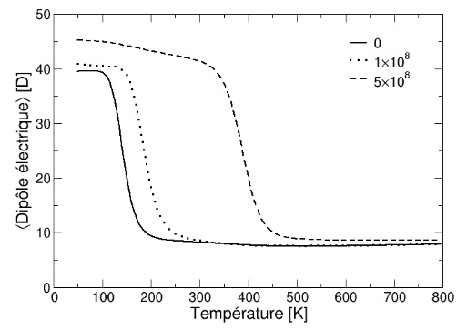

+++
template = "page.html"
title = "Internship Report"
date =  2015-05-13
draft = false
description="How to Write an Internship Report"
[taxonomies]
tags = ["communication"]
+++

During my intership in [INSERM Unit S1134, Macromolecular Biology](https://www.dsimb.inserm.fr/), my supervisors **Yassine Ghouzam** and **Jean-Christophe Gelly** explained to me the structure of a master internship report. Here is the structure to follow and what to include in each section.

<!-- more -->

## Plan

### 1. Summary

If they are more than 5 pages, you have to write a summary. It must be short; half a page maximum. It includes:
* Scientific context of the study
* Main results
* Relevant conclusions

### 2. Introduction

Detailled presentation of the scientific context *i.e.* previous published works done about the scientific question. It put the emphasis on the originality of your work and your main objectives. It also includes the annoucement of the plan of the report.

### 3. Materials & Methods

This is the most thorough part of the report and show to the reader how to reproduce your work. 
* Sources of data
* Methods for processing data
* Methods for the analysis
* Softwares and dependencies (always introduced with the implemented method)
* Bibliography references

### 4. Results

The results produced by the methods described in Materials & Methods section. Their order of presentation must be *logicial* (not necessary chronological).
* Objectives and purpose
* Used method described in the Materials & Methods section
* Resulting tables, values and figures
* Commentaries about tables, values and figures

### 5. Discussion & Conclusion

* List of all conclusions of each result (1-2 sentences per result).
* Where each result is in the scientific context presented in the introduction
* Open about suggestion of the next analysis that will be required to go further after this study

### 6. References

List of all the bibliography references ([scientific articles](/articles/scientific-article/), books, websites, etc.) quoted in the report. References are numbered by order of appearance within the text: [1], [2], [3], etc. In the References section, they are listed by their number. Each reference must show:
* Number
* List of all Authors
* Title
* Journal
* Volume number
* Page number
* Publishing year
* **DOI** (**D**igital **O**bject **I**dentifier) unique link `publisher_id`/`article_id` to access article online
* **ISBN-13** (**I**nternational **S**tandard **B**ook **N**umber) unique 13-digit number to identify book online

Example of scientific article reference:

> **[1] ORION : a web server for protein fold recognition and structure prediction using evolutionary hybrid profiles**
>
> *Yassine Ghouzam, Guillaume Postic, Pierre-Edouard Guerin, Alexandre G. de Brevern & Jean-Christophe Gelly* 
>
> Scientific Reports6, Article number: 28268 (2016) DOI: [10.1038/srep28268](https://doi.org/10.1038/srep28268)

Example of book reference:

> **[2] Learning the bash Shell: Unix Shell Programming**
>
> *Cameron Newham and Bill Rosenblatt*
>
> O'Reilly Media, 1995. ISBN‑13: [978-0596009656](https://openlibrary.org/isbn/978-0596009656)

## Content

### Figures 

Any figure in the document must be completed with:
* Figure number (1, 2A, 2B, 3, etc.) by order of appearance within the text
* Title
* Legend

If the figure is a set or a grid of figures, then you must name each figure within the figure as (A), (B), (C), etc.

The resolution must be high enough so the text can be visible. The used palette must be colorblind-safe. Always label axes with units. Do not use abbreviations.

Example:

>
> 
>
> Figure 1: **Variations of the mean electric dipole moment of the Ala12 peptide as a function of temperature.**
> Different electric field strenghts are shown: 0 V/m (solid line), 1x 10^8 V/m (dashed line), and 5 x 10^8 V/m (dotted line)

### Tables

Any table in the document must be completed with:
* Figure number (1, 2A, 2B, 3, etc.) by order of appearance within the text
* Title
* Legend

## Practical Advices

* Start with the figures, the tables and the results
* Describe the methods that produced the results. You do not need to have a nice style for this part as it is technical.
* Introduction and discussion should be written together as it is about *scientific context* and you need to put your results within this perspective only.
* Never use expressions such as `here it is`, `This is obviously` or `One can say` or `In my opinion`.
* Write your report in two or three sessions. Submit it for review.

## Layout

### Cover page 

The cover page is the first visible page of the report. It is therefore essential to include the following information:

* Surname, first name, and student ID number
* Program/degree track
* Course title and code
* Report title (short but sufficiently descriptive)
* University and date

It is also good practice to include the logo of your university, as well as, where applicable, the logos of institutes or organisations funding or hosting you *i.e.* providing you with a workspace and a bench.

### Format

**Footers** should include the report writing date, page number, and total number of pages.

The **header** may be used to repeat the report title.

For a written report, a serif font *e.g. Times New Roman* should be used, as these are more readable. Serifs act as guides for the eye, improving reading flow. Sans-serif fonts *e.g. Arial, Helvetica* should be reserved for posters and presentation slides.

A font size of 12 pt is a minimum (slightly smaller may be acceptable for the bibliography). Line spacing of 1.5 is recommended to allow room for annotations.

Margins should be sufficiently wide (1.5 to 2 cm) to leave space for notes and to improve page layout.

Sections and subsections should be numbered. A table of contents placed immediately after the cover page is strongly recommended, as it provides a quick overview of the structure and helps locate specific sections.

## References

* Advices to write a scientific report: [Gaelle Lelandais et Pierre Poulain](https://cupnet.net/images/conseils_redaction.pdf)