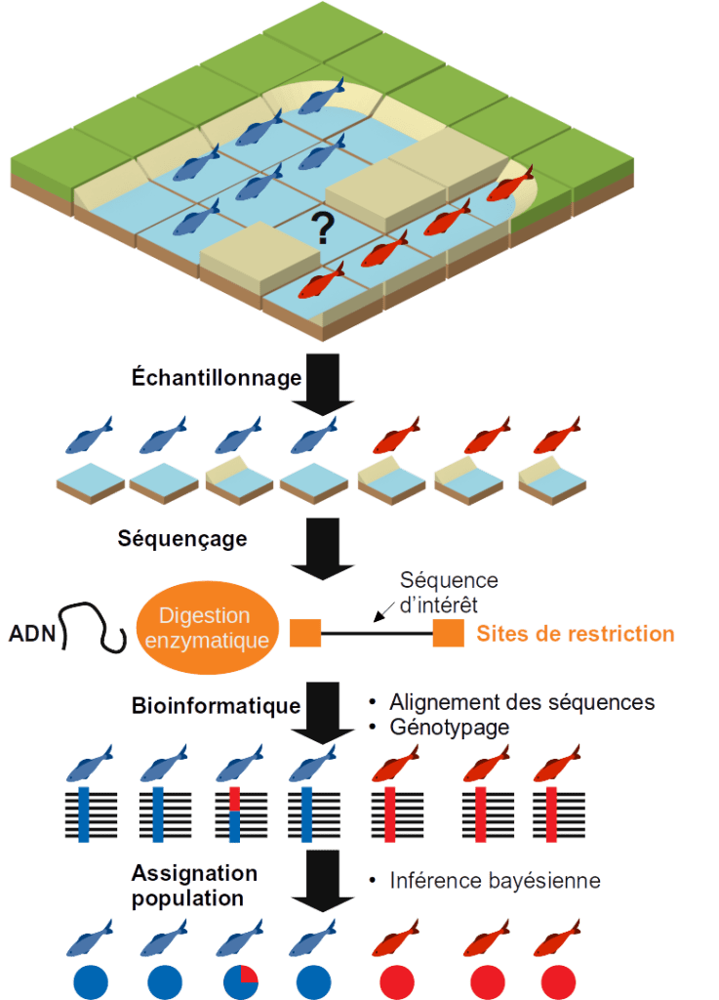

+++
template = "page.html"
title = "Landscape genomics"
date =  2019-11-14
draft = false
description = "An emerging research field that studies how genetic diversity distributes across space and how environmental features can modify this structure through local adaptation."
[taxonomies]
tags = ["omics", "sciences"]
+++

Environmental conservation issues have urged a need to better understand and describe species and populations on Earth. Recently, progress in sequencing technologies made it possible to refine this understanding through genomics. Understanding and describing populations of living organisms in a given environment by exploiting sequencing data is the ultimate goal of landscape genomics. So this article is an introduction of this field.
 <!-- more -->

 
« Landscape genomics » sounds like a work by Eduardo Kac. This somewhat post-modern term actually refers to a scientific field that has expanded over the past decade.

## Populations : an ambiguous definition

Individuals from a same species, unless they are clones, are all slightly differents from each others. In breeding conditions where parents and genotypes are known, it is possible to idendificate accurately relationships between genetic diversity and phenotype. However, in other conditions where these information about pedigree are not available (for instance a study about a wild species with few related information) so it is necessary to infer this genetic structure. 

Indeed, a species - let's take the example of an animal species - can be composed of several populations.

Speaking of populations, two very thorough researchers, Oscar Gaggiotti & Robin Waples, have listed 17 very exact definitions of this concept. The two authors concluded that with so many definitions for the same concept, based on the same observations, different researchers could reach different or even contradictory results. What is a population? There is no correct answer, the definition depends on the context. In the context of landscape genomics, a population is a group of individuals of the same species capable of interacting at the time of reproduction. A population is therefore defined according to spatial, genetic and temporal criteria. Indeed, not all individuals will have the opportunity to interbreed due to geographic distance, habitat heterogeneity or other factors.

Hardy and Weinberg defined the equilibrium state of an ideal population in which genetic diversity would tend towards a constant value. The conditions necessary for such an equilibrium are:

* The absence of mutations to prevent the introduction of new alleles
* Panmixie, a scholarly word meaning equal opportunity for access to reproduction
* Generations do not overlap
* There's no natural selection
* There is no transfer of genetic variants to a population from another

In reality, the ideal population does not exist, but the knowledge of this theoretical equilibrium state of a population's genetic diversity makes it possible to determine the effects of external factors on a real population's genetic diversity. In other words, the way in which a population is not ideal unravels how the natural habitat affects the genetic structure of this population.

## Threatened populations in their habitat

In my choice of animal species, I pick up a fish, for instance the red mullet (*Mullus surmuletus*). As we have seen, in the state of Hardy and Weinberg, the populations are undisturbed and extend infinitely. In the real world, fish stocks are declining and the size of individuals is decreasing.

While numbers of individuals or morphology can give us trends in the characteristics of a species at a given location, it is difficult to identify multiple populations and the interchanges between them. The transfer of genetic variants from one population to another is called gene flow. If there is gene flow between populations and individuals from one population acquires adaptive traits then individuals from other populations are likely to acquire that adaptation as well.

The appearance or disappearance of gene flows, the acquisition or loss of adaptive traits are processes related to the species habitat. A knowledge of the habitat and geographical distribution of individuals is therefore necessary. To understand and describe these processes of gene flow and adaptation in relation to the geography and nature of the habitat is therefore to understand the population structure of a species and the way in which the habitat (the landscape) contributes to this structure. To understand how habitat structures the genetics of a species populations. It means making informed decisions in terms of conservation policy.

## From geography to genomics: a bit of history

The possibilities offered by next generation DNA sequencing combined with new statistical approaches (in particular Bayesian) exploiting the power of computing clusters has allowed the emergence of a science between population genetics and landscape ecology: landscape genetics, which now tends to be called landscape genomics because of the systematic use of full or reduced genome sequencing data in recent studies.

This discipline has its origins in the work of botanist Augustin Pyrame de Candolle (1778-1841) and naturalist geographer Alfred Russel Wallace (1823-1913). De Candolle was the first to observe that the spatial distribution of individuals within a species is determined by physical causes or resources. Similarly, during a travel in the Malaysian archipelago, Wallace noticed a physical 'boundary' separating the fauna between Australia and the eastern region.

This approach gives the spatial mapping of the allelic frequencies observed in one or several species or populations. Subsequently, it then becomes possible to study possible correlations between landscape characteristics and this distribution. For a long time this approach has been limited by the number of genetic or molecular markers available (parasitic fauna associated with individuals, faecal composition, microsatellite DNA...). It was then difficult to obtain genetic data on several populations on a spatial scale.

Today, with computer technology, it is possible both to process complex geographical maps of very numerous environmental descriptors with high resolution and at the same time to process tens of thousands of genetic variants among the populations studied. With the emergence of new high-throughput sequencing technologies and the increasingly urgent problems of conservation, landscape genetics is thus experiencing renewed and growing interest.

I'm not trying to present all aspects of landscape genomics, I will simply describe the role that bioinformatics plays in it through the point of view of a bioinformatician.

## A case study in landscape genomics

### Our example

Let's imagine that we have a fish species with two distinct observed phenotypes (red and blue) and we want to know if there are several genetic populations of this species and if the distribution of individuals within a population is structured by environmental factors.

### Data

We need to collect two types of data for each individual:

* Environmental descriptors: temperature, bathymetry, substrate, phytoplankton production, current measurement, distance to shore... These data can be retrieved from the GPS coordinates of the individuals on specialized databases such as the [Global Marine Environment Datasets](gmed.auckland.ac.nz).
* Genotypes are more expensive to obtain. It is necessary to sample each individual, extract their DNA and sequence them. Although the cost of high-throughput genome sequencing has steadily decreased over the past 15 years, it is still too high for large-scale analyses involving the sequencing of hundreds of individuals. This is why reduced genome sequencing is prefered.

### DNA sequencing

One method for sequencing reduced genomes is RAD-seq for Restriction site Associated Dna SEQuencing. The individual's DNA is extracted and then digested by a restriction enzyme. A sequence called an adapter sequence to initiate sequencing is then incorporated at the digested ends with a tag sequence that will identify the individual. Thus during sequencing, only the consecutive regions of the restriction sites are sequenced. Depending on the enzyme used and the species studied, the number of restriction sites may vary. It is necessary to choose an enzyme that generates a number of fragments that is neither too high (if there are too many sites to sequence, the coverage will be low and there will be missing data for each individual which prevents the comparison of genotypes between individuals) nor too low (if there are not enough sites, there will not be enough genetic markers and it will not be possible to distinguish genetic structures within populations). If a reference sequence of the genome of the species studied is available or in the absence of a close species, it is possible to carry out simulations of enzymatic digestion of the genome in order to choose the most relevant enzyme (see the simRAD package available under R).

### Processing of sequencing data

Another aspect of our work will be the processing of this RAD-seq data. This is a classic `FastQ` file. The first step will be to clean these data by removing the bad quality sequences or contaminations (phiX, adapters, PCR clone...). For the second step, it will be a question of demultiplexing, *i.e.* from the reading of the tag sequences incorporated in the sequencing, assigning each sequence to an individual.

### Genotyping

Then comes the crucial step of calling the variants. This involves grouping together all the sequences of the same enzymatic site for all the individuals in order to deduce from the frequencies of each type of base at each position of the sequence, whether the individual is homozygous to the reference, heterozygous or alternatively homozygous. For each enzyme site, genetic variants are sought among the individuals and a genotype is assigned to each individual.

There are two popular methods for processing this RAD-seq data: STACKS and freebayes.

* As the name implies [STACKS](http://catchenlab.life.illinois.edu/stacks/) creates stacks of sequences in order to search for individual variations. STACKS has the advantage of being a rigorous and robust method but requires good average coverage of sites per individual and that the sequences must be of identical size (it is therefore not possible to trimm sequences where only the 3' tail is of poor quality during the cleaning step). It is therefore a suitable method if your data is of good quality. 

* [Freebayes (dDocent)](https://www.ddocent.com/) is based on the concept of genome reference sequence locus rather than sequence stacking and uses a Bayesian approach to assign a genotype knowing the sequences observed at the locus in question. It is therefore possible to use trimmed sequences and genotype an individual even with low coverage where STACKS would have produced only missing data. 

### Population assignment

Individual genotypes can be retrieved as a `VCF` file. Software such as [STRUCTURE](https://web.stanford.edu/group/pritchardlab/structure.html) or [ADMIXTURE](http://software.genetics.ucla.edu/admixture/) allows, using a hierarchical clustering approach, to perform a population assignment test for each individual based on the genotypes. The allelic frequencies observed for each locus make it possible to infer genetic populations to which individuals are assigned according to their alleles. Each iteration of this operation makes it possible to refine the assignment. The final result is a probability of belonging to one or more genetic populations for each individual.

### Analysis of populations in relation to environmental descriptors

By combining population assignments to environmental descriptors, we can then look for correlations between environmental factors and the genetic structure of our observed populations. For example, goldfish, located at the pond level, live in warm water with low salinity while blue fish, located at the seashore, live in cold water with high salinity. The two populations are only connected by a *grau* (estuary in Occitan). Differences in environmental conditions and the relative isolation of the two populations may explain the genetic differences observed between the two populations (red and blue). So the landscape structures the genetics of the species.

* If you are interested in a real case study of landscape genomics in a marine environment, then I recommend [Laura Benestan's article on American lobster in Canada](https://onlinelibrary.wiley.com/doi/full/10.1111/mec.13811).
* If you don't like the sea and have a preference for plants, then I recommend [Jimena Guerrero's article on truncated alfalfa in the Mediterranean](https://nph.onlinelibrary.wiley.com/doi/full/10.1111/nph.15171).

# Conclusion

Landscape genomics is a discipline that integrates concepts and tools to test the effect of landscape on individual dispersal and gene flow. It is used to estimate the adaptive capacity of individuals to changes in their environment. We have seen that bioinformatics brings power to these methods at the crossroads between ecology, statistics, computer science and genomics. These approaches are useful both for research laboratories and design offices. The numerous landscape genomics studies carried out during this decade have contributed to making informed choices for nature conservation policy. This has made it possible to maintain ecosystems and to prevent or correct any degradation they may suffer. 

Currently in the western Mediterranean sea, the RESERVEBENEFIT project aims to assess the connection between marine protected areas. This assessment is based on a landscape genomics approach and aims ultimately at optimizing the placement of future marine protected areas in the Mediterranean sea in order to sustain fish stocks. The fruits of this work, a collaboration between fishermen and scientists for which I have the honor of carrying out the bioinformatics part, are disseminated on a [dedicated twitter account](https://twitter.com/reservebenefit).
