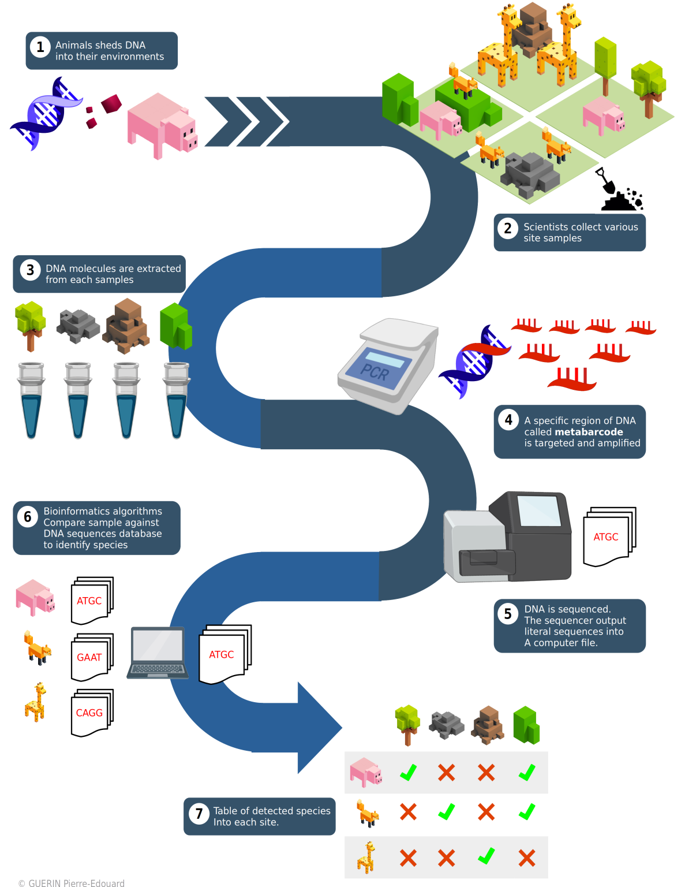

+++
template = "page.html"
title = "Les métabarcodes"
date =  2019-02-09
draft = false
description="Une méthode de capture et d'amplification des codes-barres ADN qui permet grâce au séquençage haut-débit l'identification des espèces ou l'estimation de la diversité génétique dans un ou plusieurs échantillons."
tags = ["omics"]
+++

L'une des technologies en génomique les plus prometteuses pour l'évaluation de la biodiversité est le *métabarcode* (de l'anglais *metabarcoding*) de l'ADN environnemental (ADNe). J'ai travaillé longuement sur ces méthodes et développé plusieurs workflows pour traiter et analyser les données de métabarcodes. J'ai notamment été en charge du traitement des données génomiques récoltées par l’expédition scientifique d'exploration marine de Monaco entre 2018 et 2020.

## Un point d'horizon : pourquoi évaluer la biodiversité marine ?

Les environnements marins, qu'ils soient sur les côtes ou au large sont tous sévèrement impactés par les activités humaines récentes ou traditionnelles. Il peut s'agir de régressions ou de pertes d'habitats pour la faune, de pollutions ou de surexploitation des ressources menaçant ainsi la biodiversité marine. Certains effets de l'activité humaine compromettent alors la durabilité des écosystèmes marins et leurs services pour l'approvisionnement (pêcherie et matériaux de construction), pour le tourisme, pour la culture et finalement pour la régulation du climat et la séquestration du carbone. Afin de prévenir la dégradation de ces environnements, de nombreuses initiatives gouvernementales ou privées visent à protéger les écosystèmes marins. C'est pourquoi le développement d'outils fiables pour mesurer et évaluer la biodiversité marine est nécessaire. Au cours de la décennie 2010, l'état de développement du *metabarcoding* a progressé et c'est une technologie appliquée très largement de nos jours. Les résultats de cette méthode sont prometteurs et sa démocratisation pourrait à terme améliorer l'évaluation de la biodiversité.

## Qu'est ce que le métabarcode

### Brève histoire de l'identification moléculaire

A l'origine, les microbiologistes identifiaient les bactéries en observant leurs caractères morphologiques par exemple au microscope. C'est en 1965 que Zuckekandl et Pauling proposent d'utiliser les séquences ADN comme marqueur moléculaire de l'évolution. Cependant les techniques de séquençage ADN n'apparaissent qu'en 1970 avec la méthode Sanger.

En 1983, Mullis et al inventent la réaction de polymérisation en chaîne qui permet d'amplifier le matériel ADN *in vitro*. Cette méthode de biologie moléculaire révolutionne le domaine de la microbiologie car elle permet de cibler par amplification un marqueur ADN spécifique au niveau de gènes ribosomaux. Permettant ainsi d'identifier les espèces présentes dans un échantillon à partir de leurs molécules ADN. 

### Les premiers codes-barres taxonomiques

Au début des années 2000, les écologistes s’intéressent à ces méthodes de biologie moléculaire d'amplification des marqueurs moléculaires type ADN. Paul Herbert est le premier à parler de *barcoding* ADN. Il recommande d'utiliser un marqueur moléculaire standardisé, permettant d'identifier l'ensemble des espèces des ordres du vivant, exactement comme un code-barres.

Le premier code-barres ADN est un fragment de 658 paires de bases du gène mitochondrial de la sous-unité de la Cytochrome Oxydase I (COI). Chaque espèce de vertébrés est identifiable par sa séquence ADN du COI. Pour répertorier de manière systématique l'ensemble des codes-barres du COI, le consortium scientifique Barcode of Life est crée en 2004. En 2007, la banque de données mondiales des codes-barres ADN est publiée. Le [Barcode Of Life Data System](https://www.boldsystems.org/) compte aujourd'hui des millions d'espèces répertoriées avec leurs codes-barres ADN issues de milliers de projets scientifiques à travers le monde.

Les marqueurs chloroplastiques RBCL (Ribulose Biphosphate CarboxyLase; 553 paires de bases) et MATK (MATurase K; 879 paires de bases) sont désignés comme marqueurs standards pour les plantes en 2009. En 2012, les *fungi* ont leur propre code-barres standard l'espaceur interne transcrit (ITS; 450 paires de bases). Concernant les bactéries le marqueur ribosomique 16S est principalement utilisé bien qu'il n'existe pas de marqueurs reconnus comme standard.

### ADN environnemental

Nous savons que tous les organismes vivants perdent et dispersent des morceaux de peau ou d'écailles dans leur environnement. Le matériel ADN contenu dans et autour des cellules constitutives de ces tissus persistent alors plusieurs jours dans l'environnement. Les cellules eucaryotes possèdent en elle des mitochondries, organite siège de la respiration cellulaire indispensable au métabolisme. Chaque cellule compte 300 à 1000 mitochondries. La mitochondrie possède son propre ADN distinct de l'ADN nucléaire de la cellule. Les copies de gènes mitochondriaux sont donc bien plus abondant que les gènes nucléaires dans l'environnement. En général, ce sont ces gènes qui sont sélectionnés en tant que code-barres pour le **barcoding**.

### Du code-barres au métabarcode

Le barcoding est une méthode d'identification des espèces qui utilise une séquence ADN provenant d'un ou plusieurs gènes spécifiques. Tout comme les codes-barres des supermarchés permettent d'identifier les produits, certaines séquences ADN *i.e* les codes-barres ADN permettent d'identifier les espèces voire les individus. Différentes régions de gènes sont utilisées pour identifier les différents groupes d'organismes à l'aide de codes-barres.

Si le barcoding s'applique à une espèce ciblée dans un environnement donné, le métabarcode est une méthode qui cible l'ensemble des séquences codes-barres capturées dans un environnement donné. Le séquençage de l'ensemble des codes-barres dans l'environnement ou métabarcode est rendu possible grâce aux méthodes de séquençage haut-débit notamment le séquenceur illumina. En effet, grâce au métabarcode il devient alors possible de détecter la quasi-totalité des organismes présents dans un échantillon issus d’un environnement complexe.

## Materiels et methodes

Les méthodes de séquençage haut-débit permettent d’obtenir rapidement des centaines de millions de métabarcodes à partir d’un environnement complexe. A partir de cette information, il devient possible de mesurer la biodiversité dans l'environnement. En effet, la quasi-totalité des organismes présents dans l'environnement sont détectés.

### Échantillonnage et capture de l'ADN environnemental

Pour commencer des prélèvements en mer sont nécessaires. Ils se font par filtration de l'eau grâce à un système de pompes et de filtration. Une des étapes fondamentales de la préparation à la filtration est la stérilisation et la limitation de la contamination du matériel. Le filtre à ADN est relié à une pompe qui fait remonter l'eau de mer. Le transect commence selon un plan d'échantillonnage préétabli en longeant une côte sur un temps de navigation donné. Afin de conserver l'ADN récolté lors de la filtration, le filtre est rempli par une solution tampon. Les échantillons contenant l'ADN sont ensuite réceptionnés par le laboratoire en condition stérile où il pourra être amplifié puis séquencé.

Il est à noter que des erreurs de réplication peuvent survenir pendant la PCR. Le taux d'erreur du séquençage est néanmoins assez faible. Enfin, il est possible de séquencer les fragments par leurs deux extrémités pour accroître la précision du séquençage. Cette méthode est appelée «séquençage pairé» de l'anglais *paired-end sequencing*.

### Traitement bio-informatique

La programmation pour le traitement bio-informatique se fait grâce à un gestionnaire de workflow. Les avantages sont nombreux : bonnes pratiques de développement, parallélisation du calcul, virtualisation, portabilité accrue sur cluster comme sur cloud et reproductibilité scientifique garantie. Pour développer vos prochains pipelines, je vous recommande [l'excellente introduction à Nextflow de Maxime Garcia](https://bioinfo-fr.net/nextflow-pour-votre-prochain-pipeline). Vous pouvez aussi vous essayer à [Snakemake présenté par le même auteur](https://bioinfo-fr.net/snakemake-pour-les-nuls?s=snakemake).

#### Assemblage

Le séquençage ADN a produit des lectures courtes des séquences ADN. De plus, bien que le taux d'erreur du séquençage soit faible, les lectures ADN en sortie de séquençage ne sont pas encore assez fiables pour l'identification des espèces. Les lectures complémentaires d'un même fragment ADN sont assemblées. Ainsi, la séquence complète du code-barres est reconstituée tout en augmentant la fiabilité de la séquence lue.

#### Démultiplexage

A la sortie du séquenceur, les séquences ADN issues des différents échantillons sont mélangées. Le démultiplexage consiste à réassigner chaque séquence ADN lue à son échantillon d'origine. Pour identifier l'échantillon d'origine d'une séquence lue, un court fragment ADN appelé étiquette a été incorporé en amont du séquençage. Il suffit d'identifier l'étiquette sur la séquence pour retrouver son échantillon d'origine. Si une séquence n'a pas d'étiquette à ce stade alors elle est retirée de l'étude.

#### Groupement et dé-bruitage

Les séquences identiques sont regroupées et comptées pour chaque échantillon. Certaines séquences ne différent que de quelques bases entre elles. En effet, lors de l'amplification des fragments ADN qui précède le séquençage, des mutations surviennent aléatoirement sur certaines copies. En sortie de séquençage, beaucoup de séquences sont en fait des versions légèrement erronées de la séquence originale. Pour éliminer le bruit de l'amplification, on utilise des algorithmes pour regrouper les séquences similaires entre elles. L'abondance relative permet de distinguer la séquence d'origine du bruit.

#### Assignation taxonomique

Cette étape requiert une base de données de référence. C'est-à-dire une liste de séquences de code-barres correspondant à des espèces connues. Si une séquence s’aligne sur une référence, son assignation dans l'arbre du vivant est obtenue en utilisant la taxonomie du NCBI (National Center for Biotechnology Information). Si une séquence s'aligne sur plusieurs références l'algorithme du Lowest Common Ancestor (LCA) est appliqué. Le LCA recherche le dernier nœud commun de l'arbre phylogénétique à partir duquel divergent les branches de chacune des lignées références impliquées. Le LCA permet donc d’assigner la séquence au dernier ancêtre commun. Finalement, chaque code-barres de chaque échantillon est assigné à un taxon. On obtient donc une liste des taxons présents dans les différents échantillons environnementaux.

### Analyses et applications : l'exemple des poissons en milieu marin

Emilie Boulanger et al., ont étudié les assemblages de poissons dans 6 aires marines protégées en Méditerranée et dans leurs zones de pêche adjacentes en utilisant l'ADN environnemental (ADNe). L'analyse des données de métabarcodes ADNe révèlent qu'il y a moins d'espèces de poissons dans les réserves marines que dans les zones de pêche voisines. En effet, le gradient de la richesse en espèces s'accompagne d'un changement marqué de la composition des espèces de poissons sous différentes gestions. Cette dissimilarité est principalement due à des espèces qui sont souvent négligées par les enquêtes visuelles classiques mais détectées par l'ADNe : poissons crypto-benthiques, pélagiques et rares. Ces résultats ne nient pas l'importance des réserves dans la protection de la biodiversité mais donnent un nouveau regard sur la manière dont les groupes d'espèces sous-représentés peuvent réagir positivement à la pression de la pêche et sur la façon dont les efforts de conservation peuvent façonner les modèles de biodiversité régionale.

## Pour aller plus loin

Lola Romant de l'UMR MARBEC a réalisé un beau documentaire sur les métabarcodes ADNe marins et leurs applications en Méditerannée.

{{ youtube(id="8b97UV6lXSk") }}

## References

> **Molecules as documents of evolutionary history**
>
> *Emile Zuckerkandl, Linus Pauling*
>
> Journal of theoretical biology. 1965. DOI:[10.1016/0022-5193(65)90083-4](https://doi.org/10.1016/0022-5193(65)90083-4)

> **Specific enzymatic amplification of DNA in vitro: the polymerase chain reaction**
>
> *K Mullis, F Faloona, S Scharf, R Saiki, G Horn, H Erlich*
>
> Cold Spring Harb Symp Quant Biol. 1986. DOI: [sqb.1986.051.01.032](https://doi.org/10.1101/sqb.1986.051.01.032)

> **Biological identifications through DNA barcodes**
>
> *Paul D. N. Hebert, Alina Cywinska, Shelley L. Ball and Jeremy R. deWaard*
>
> Proceedings of the Royal Society B. 07 February 2003. DOI: [rspb.2002.2218](https://doi.org/10.1098/rspb.2002.2218)

> **BOLD: The Barcode of Life Data System**
>
> *Sujeevan Ratnasingham, Paul D. N. Hebert*
>
> Molecular Ecology Notes. 24 January 2007. DOI: [j.1471-8286.2007.01678.x](https://doi.org/10.1111/j.1471-8286.2007.01678.x)

> **Développements méthodologiques autour de l’analyse des données de metabarcoding ADN**
>
> *Celine Mercier*
>
> Génétique des plantes. Université Grenoble Alpes, 2015. NNT: [2015GREAV060](https://tel.archives-ouvertes.fr/tel-01685615/document).

> **Dynamique de la structure des génomes et de leur biogéographie dans l’océan: analyses comparatives des données métagénomiques du projet Tara Oceans pour l’étude de la microalgue Bathycoccuset des communautés planctoniques globales.**
>
> *Thomas Vannier*
>
> Structure et dynamique des systèmes vivants. Université Paris Saclay, 2017. NNT: [2017SACLE002](https://www.biblio.univ-evry.fr/theses/2017/2017SACLE002.pdf).

> **Nécessité, potentiel et limitations de l’approche en unités taxonomiques moléculaires pour analyser la biodiversité de l’ADN environnemental des poissons**
>
> *Virginie Marques*
>
> Sciences agricoles. Université Montpellier, 2020. NNT: [020MONTG039](https://tel.archives-ouvertes.fr/tel-03209995/document)
