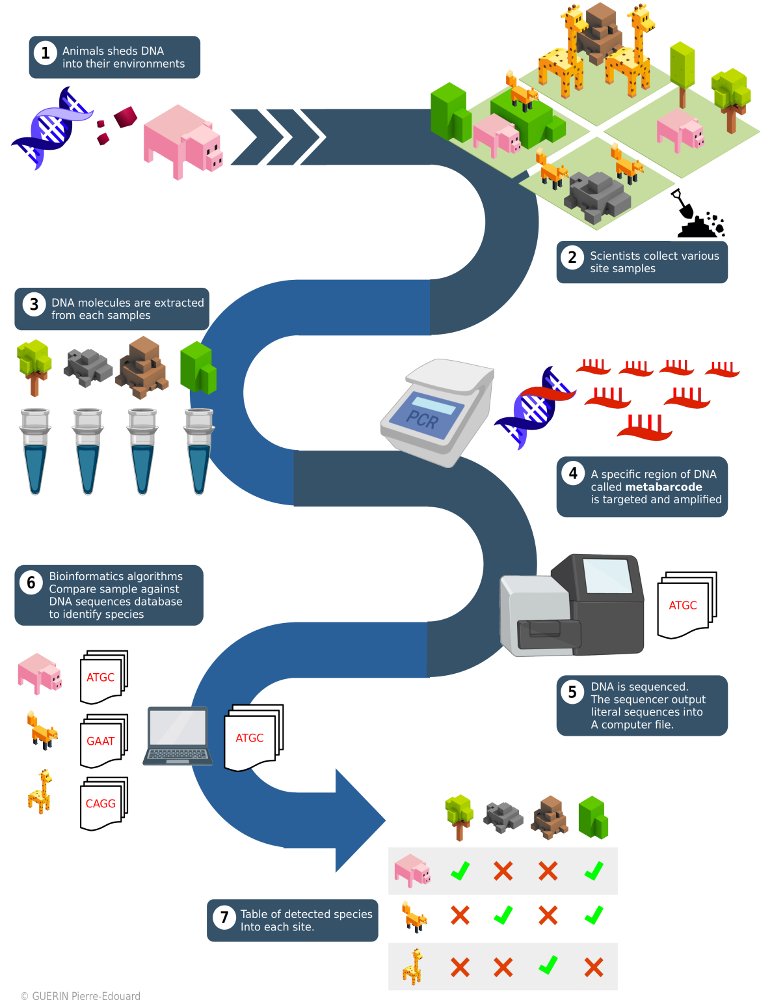
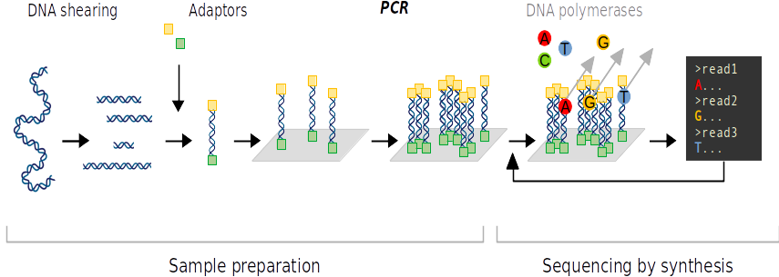
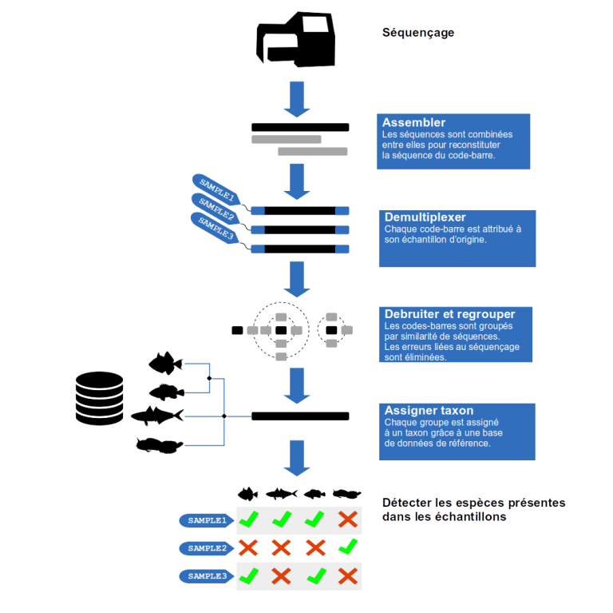

+++
template = "page.html"
title = "Metabarcoding"
date =  2019-03-09
draft = false
description = "Next-generation sequencing of environmental barcodes-DNA."
[taxonomies]
tags = ["omics", "biotech"]
+++

One of the most promising genetic techniques for improving biodiversity assessments is the *metabarcoding* of environmental DNA (eDNA). I did a state of the Art of available methods and developed serveral workflows to process and manage metabarcoding data from the Monaco Marine Scientific Exploration.
<!-- more -->

<a href="https://bioinfo-fr.net/metabarcodes-de-ladn-environnemental" 
   class="external-article-box" 
   target="_blank" 
   rel="noopener noreferrer">
  
  Cet article est publié en version française sur Bioinfo-fr.net
</a>

### Overview: the necessity to assess marine biodiversity

Marine environments, both coastal and offshore, are being severely impacted by traditional and emerging human activities. This is translated into habitat losses, pollution and overexploitation which treats marine biodiversity. It compromises the sustainability of marine ecosystems and services. As a response to the environmental degradation, initiatives aims to protect marine ecosystems. Development of reliable marine biodiversity assessment methods is necessary. One of the most promising genetic techniques for improving biodiversity assessments is the **metabarcoding** of environmental DNA.

## What is metabarcoding ?

### Short history of molecular identification

Originally, microbiologists identified bacteria by observing their morphological characteristics, for example under the microscope. In 1965, Zuckekandl and Pauling proposed to use DNA sequences as a molecular marker of evolution. However, DNA sequencing techniques only appeared in 1970 with the Sanger method.

In 1983, Mullis et al. invented the polymerase chain reaction, which allows DNA material to be amplified *in vitro*. This method of molecular biology revolutionized the field of microbiology because it allows to target by amplification a specific DNA marker at the ribosomal gene level. It allows to identify the species present in a sample from their DNA molecules. 

### Early taxonomic barcodes

In the early 2000s, ecologists became interested in these molecular biology methods of amplifying DNA-type molecular markers. Paul Herbert was the first to talk about DNA *barcoding*. He recommends the use of a standardized molecular marker, allowing the identification of all the species of the living orders, exactly like a supermarket barcode.

The first DNA barcode is a 658-base-pair fragment of the mitochondrial gene for the Cytochrome Oxidase I (COI) subunit. Each vertebrate species is identifiable by its COI DNA sequence. To systematically list all COI barcodes, the Barcode of Life scientific consortium was created in 2004. In 2007, the world database of DNA barcodes is published. The [Barcode Of Life Data System](https://www.boldsystems.org/) now has millions of species listed with their DNA barcodes from thousands of scientific projects around the world.

The chloroplast markers RBCL (Ribulose Biphosphate CarboxyLase; 553 base pairs) and MATK (MATurase K; 879 base pairs) are designated as standard markers for plants in 2009. In 2012, *fungi* have their own standard barcode the internal transcribed spacer (ITS; 450 base pairs). For bacteria the 16S ribosomal marker is mainly used although there are no recognized standard markers.

### Environmental DNA

We know that all living organisms shed and disperse pieces of skin or scales into their environment. The DNA material contained in and around cells of these tissues then persists for several days in the environment. Eukaryotic cells have mitochondria, an organelle that is the seat of cellular respiration, which is essential for metabolism. Each cell has 300 to 1000 mitochondria. The mitochondrion has its own DNA distinct from the nuclear DNA of the cell. Copies of mitochondrial genes are therefore much more abundant than nuclear genes in the environment. In general, it is these genes that are selected as barcodes for **barcoding**.

### From barcoding to metabarcoding

Barcoding is a method of species identification that uses a DNA sequence from one or more specific genes. Just as supermarket barcodes identify products, certain DNA sequences *i.e* DNA barcodes identify species or even individuals. Different regions of genes are used to identify different groups of organisms with the help of barcodes.

While barcoding is applied to a targeted species in a given environment, metabarcoding is a method that targets all barcode sequences captured in a given environment. The sequencing of all the barcodes in the environment or metabarcode is made possible by high-throughput sequencing methods such as the illumina sequencer. Indeed, thanks to the metabarcode, it becomes possible to detect almost all the organisms present in a sample from a complex environment.

## Materials and methods

High-throughput sequencing methods make it possible to rapidly obtain hundreds of millions of metabarcodes from a complex environment. From this information, it becomes possible to measure the biodiversity in the environment. Indeed, almost all organisms present in the environment are detected.

### Sampling and environmental DNA capture

To begin, samples are taken from the sea. They are done by filtering the water through a system of pumps and filtration. One of the fundamental steps in preparing for filtration is sterilization and limiting contamination of the material. The DNA filter is connected to a pump that brings up the sea water. The transect starts according to a pre-established sampling plan by following a coastline over a given navigation time. In order to preserve the DNA collected during filtration, the filter is filled with a buffer solution. The samples containing the DNA are then received by the laboratory in sterile conditions where it can be amplified and sequenced.

DNA replication errors can occur during PCR. The error rate of the sequencing is nevertheless quite low. Finally, it is possible to sequence the fragments by their two ends to increase the accuracy of the sequencing. This method is called *paired-end sequencing*.

### Bioinformatics workflow

Programming for bioinformatics processing is done using a workflow manager. The advantages are numerous: good development practices, parallelization, virtualization, increased portability on cluster as well as on cloud and scientific reproducibility. To develop your next pipelines, I recommend [the excellent introduction to Nextflow by Maxime Garcia](https://bioinfo-fr.net/nextflow-pour-votre-prochain-pipeline). You can also try [Snakemake presented by the same author](https://bioinfo-fr.net/snakemake-pour-les-nuls?s=snakemake).

#### Assembly

DNA sequencing produced short reads of the DNA sequences. In addition, although the error rate of sequencing is low, the DNA reads from sequencing are not yet reliable enough for species identification. Complementary reads of the same DNA fragment are assembled. Thus, the complete sequence of the barcode is reconstructed while increasing the reliability of the read sequence.

#### Demultiplexing

DNA sequences from the different samples are mixed together. Demultiplexing consists in reassigning each read DNA sequence to its original sample. To identify the original sample of a given read sequence, a short DNA fragment called a tag has been incorporated before the sequencing. Simply identify the tag on the sequence to find its original sample. If a sequence does not have a tag at this step, then it is removed from the study.

#### Clustering and Denoising

Identical sequences are grouped and counted for each sample. Some sequences differ by only a few bases between them. Indeed, during the amplification of the DNA fragments that precedes the sequencing, mutations occur randomly on some copies. At the end of sequencing, many sequences are actually erroneous versions of the original sequence. To eliminate amplification noise, algorithms are used to group similar sequences together. Relative abundance is used to distinguish the original sequence from its noise.

#### Taxonomic assignment

This step requires a reference database *i.e.* a list of barcode sequences corresponding to known species. If a sequence aligns with a reference, its assignment in the tree of life is obtained using the NCBI (National Center for Biotechnology Information) taxonomy. If a sequence aligns with more than one reference, the Lowest Common Ancestor (LCA) algorithm is applied. The LCA searches for the last common node of the phylogenetic tree from which the branches of each of the involved reference lines diverge. The LCA thus assigns the sequence to the last common ancestor. Finally, each barcode of each sample is assigned to a taxon. This results in a list of taxa present in the different environmental samples.

### Analysis and Applications: an example of fish in the marine environment

Emilie Boulanger et al. studied fish in 6 marine protected areas in the Mediterranean sea and their adjacent fishing areas using environmental DNA (eDNA). Analysis of eDNA metabarcoding data reveals that there are fewer fish species in marine reserves than in adjacent fishing areas. Indeed, the gradient in species richness is accompanied by a marked change in fish species composition under different management. This dissimilarity is mainly due to species that are often overlooked by conventional visual surveys but detected by eDNA: crypto-benthic, pelagic and rare fish. These results do not negate the importance of reserves in protecting biodiversity, but provide new insight into how underrepresented species groups can respond positively to fishing pressure and how conservation efforts can shape regional biodiversity patterns.

## To go further

Lola Romant has made a beautiful documentary about marine eDNA metabarcoding methods and their applications in the Mediterranean sea.

{{ youtube(id="8b97UV6lXSk") }}

## References

> **Molecules as documents of evolutionary history**
>
> *Emile Zuckerkandl, Linus Pauling*
>
> Journal of theoretical biology. 1965. DOI:[10.1016/0022-5193(65)90083-4](https://doi.org/10.1016/0022-5193(65)90083-4)

> **Specific enzymatic amplification of DNA in vitro: the polymerase chain reaction**
>
> *K Mullis, F Faloona, S Scharf, R Saiki, G Horn, H Erlich*
>
> Cold Spring Harb Symp Quant Biol. 1986. DOI: [sqb.1986.051.01.032](https://doi.org/10.1101/sqb.1986.051.01.032)

> **Biological identifications through DNA barcodes**
>
> *Paul D. N. Hebert, Alina Cywinska, Shelley L. Ball and Jeremy R. deWaard*
>
> Proceedings of the Royal Society B. 07 February 2003. DOI: [rspb.2002.2218](https://doi.org/10.1098/rspb.2002.2218)

> **BOLD: The Barcode of Life Data System**
>
> *Sujeevan Ratnasingham, Paul D. N. Hebert*
>
> Molecular Ecology Notes. 24 January 2007. DOI: [j.1471-8286.2007.01678.x](https://doi.org/10.1111/j.1471-8286.2007.01678.x)

> **Développements méthodologiques autour de l’analyse des données de metabarcoding ADN**
>
> *Celine Mercier*
>
> Génétique des plantes. Université Grenoble Alpes, 2015. NNT: [2015GREAV060](https://tel.archives-ouvertes.fr/tel-01685615/document).

> **Dynamique de la structure des génomes et de leur biogéographie dans l’océan: analyses comparatives des données métagénomiques du projet Tara Oceans pour l’étude de la microalgue Bathycoccuset des communautés planctoniques globales.**
>
> *Thomas Vannier*
>
> Structure et dynamique des systèmes vivants. Université Paris Saclay, 2017. NNT: [2017SACLE002](https://www.biblio.univ-evry.fr/theses/2017/2017SACLE002.pdf).

> **Nécessité, potentiel et limitations de l’approche en unités taxonomiques moléculaires pour analyser la biodiversité de l’ADN environnemental des poissons**
>
> *Virginie Marques*
>
> Sciences agricoles. Université Montpellier, 2020. NNT: [020MONTG039](https://tel.archives-ouvertes.fr/tel-03209995/document)

