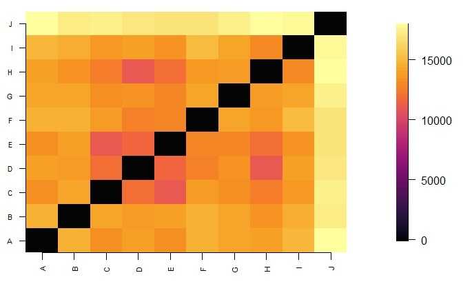
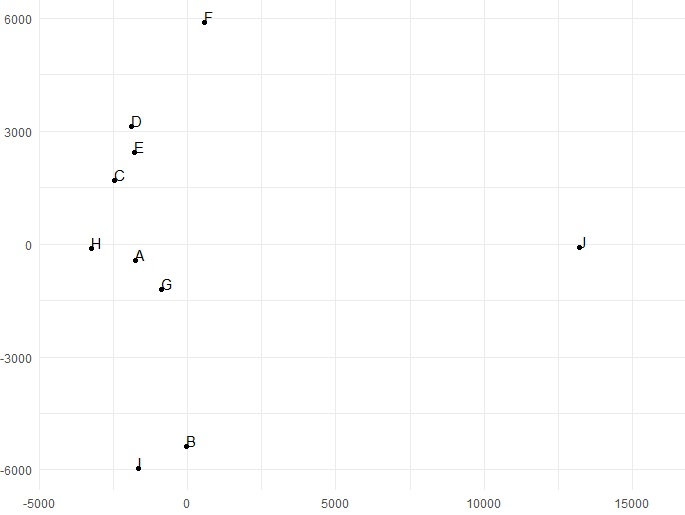

+++
template = "page.html"
title = "Multi Dimensional Scaling"
date =  2022-04-03
draft = false
description = "Example case of MDS on genotypes"
[taxonomies]
tags = ["data-science"]
+++


Multi Dimensional Scaling (MDS) is very similar to [Principal Component Analysis (PCA)](/articles/principal-component-analysis/), except that instead of converting correlations into a 2D graph, it converts distances among the samples into a 2D graph.
<!-- more -->

## Definition

Imagine that you have ten runners and their measured performance for ten races. You want to visualize on a 2D graph the similarity (or dissimilarity) of the performances of the different runners. **Multi Dimensional Scaling** is a method to compute coordinates for each item in a chosen number of dimensions (usually 2D) so that the distances between points match the dissimilarities between items as closely as possible.

* In other word we calculate for each ${\binom{10}{2} = 45}$ pairs of runners, a distance or dissimilarity based on their results on each race. The results are stored in a **dissimilarity matrix**.
* These distances are then computed using a stress function that minimize the difference between interpoint distance on the graph and the actual  distance calculated in the dissimilarity matrix. 
* We plot the 2D coordinates: runners with similar performance end up close and those with different performance end up far. Note that MDS can also be used on greater dimension (3D, 4D, ...).


Let's calculate **Euclidian distance** for our dissimilarity matrix:

$$
\text{Euclidean Distance}(v, w) = \sqrt{\sum_{i=1}^{n} (v_i - w_i)^2}
$$

* ${(v, w)}$ pair of two items ${v}$ and ${w}$ (*e.g* two runners we compare)
* ${i}$ the values to compare (*e.g* the measured performance ${v_i}$ and ${w_i}$ for runners ${v}$ and ${w}$ for the race ${i}$)

Then MDS minimize the calculated distances for each pair in order to plot them together on a 2D graph:

* Given distances ${d_{ij}}$ between any runners ${i}$ and ${j}$
* Find positions ${(x_{ij}, y_{ij})}$
* With 2D space ${k = 2}$
* That minimize a stress function

$$
\sum_{k=1}^{k=2}\sum_{i}\sum_{j} (|x_{ik}-x_{jk}| - d_{ij})^2
$$

:warning: When the dissimilarities are Euclidean distances, MDS gives the same coordinates of points as PCA. This is because minimizing the Euclidean distances between points is equivalent to maximizing their linear correlations.

There are all distances you can compute with `rdist` in R:

**Manhattan distance**

$$
d(x,y) = \sum_{i=1} |x_i - y_i|
$$

* Counts the total absolute differences.
* Useful when you care about additive differences *e.g* distance between genotypes


**Canberra distance**

$$
d(x,y) = \sum_{i=1} \frac{|x_i - y_i|}{|x_i| + |y_i|}
$$

* Normalizes the difference by the magnitude of the values.
* Sensitive to small change near zero
* Useful for data with many zeros *e.g.* allele frequencies in populations.


**Binary distance (Jaccard)**

$$
d(x,y) = \frac{r + s}{q + r + s}
$$
<small>
- Where ${q}$ number of cases where ${(x = 1 ; y = 1)}$
- Where ${r}$ number of cases where ${(x = 1 ; y = 0)}$
- Where ${s}$ number of cases where ${(x = 0 ; y = 1)}$
</small>

* Measure dissimilarity between presence/absence data
* Ignore absence/absence case
* Useful for presence/absence data *e.g.* grid of regions with observed species or not within

**Maximum distance (Chebyshev)** 

$$
d(x,y) = \max_{i} |x_i - y_i|
$$

* Only capture largest single difference
* Useful if the worst-case difference dominates *e.g.* nucleotide pair read quality control


## Example of distance between genotypes

### Data set

We work on a collection of 10 tetraploid genotypes and 10,000 SNPs. We want to visualize how close the genotypes are on a 2D graph.

```
vcf <- read_tsv(file="example.vcf")
```

| SNP_ID | A | B | C | D | E | F | G | H | I | J |
| --- | --- | --- | --- | --- | --- | --- |--- | --- | --- | --- |
| SNP00 | 0 | 1 | 0 | 0 | 1 | 1 | 1 |0 |0 |0 |
| SNP01 | 4 | 4 | 0 | 0 | 1 | 0 |1 |0 |4 |4 |
| SNP02 | 0 | 2 | 3 | 2 | 2 | 3 |2 |3 |0 |0 |
| ... | ... | ... | ... | ... | ... |... |... |... |... |... |
| SNP9999 | 2 | 0 | 4 | 4 | 1 | 4 |1 |4 |2 |2 |

### Dissimilarity Matrix

A **dissimilarity matrix** is a table that shows the distance between pairs of vectors. Here our vectors are genotypes observed on 10,000 SNPs. We use Manhattan measure to compute distances between genotypes. We observe 5 classes of genotypes 0,1,2,3,4. For a given pair ${(v, w)}$ of observed genotypes ${i}$, the maximum distance is 4 - 0 = 4 and the minimum distance is 0.

$$
\text{Manathan Distance}:  \sum_{i} |v_i - w_i|
$$

As we cannot process missing data, we remove SNPs with missing calls so that we keep 9,000/10,000 SNPs to generate the dissimilarity matrix.

In R, you need `rdist` function from the [rdist R package](https://cran.r-project.org/web/packages/rdist/) to compute pairwise distances.

```
vcfDist <- rdist::rdist(t(vcf[,-1] %>% na.omit) , metric= "manhattan")
dst <- data.matrix(vcfDist)
colorsLevels =hcl.colors(100, "Inferno")
dimDst <- ncol(dst)
par(mar = c(5, 5, 5, 5))
fields::image.plot(1:dimDst, 1:dimDst, dst, axes = FALSE, xlab="", ylab="", col=colorsLevels)
axis(1, 1:dimDst, row.names(dst), cex.axis = 0.7, las=3)
axis(2, 1:dimDst, colnames(dst), cex.axis = 0.7, las=1)
```

This is a plot of the pairwise manhattan distance between genotypes. The lighter the greater the distance.



### Multi dimensional scaling

We want to visualize genotypes distance in the dissimilarity matrices as a set of geometry points. Here the
term *distance* is standing for *measure of dissimilarity*. We want to project our manhattan distances in an
euclidian space of 2 dimensions. We use classic **multi dimensional scaling** to produce 2D-coordinates
from manhattan distance values.


* Given distances ${d_{ij}}$ between genotypes ${i}$ and ${j}$
* Find positions ${(x_{ij}, y_{ij})}$
* With maximum dimension of the space which the data are to be represented in ${k = 2}$
* That minimize a stress function

$$
\sum_{k=1}^{k=2}\sum_{i}\sum_{j} (|x_{ik}-x_{jk}| - d_{ij})^2
$$


In base R, MDS is available as `cmdscale` function.


```
fit <- cmdscale(vcfDist, eig = TRUE, k = 2)

fitVcfDistDf <- data.frame(
  genotype = row.names(fit$points),
  x = fit$points[, 1],
  y = fit$points[, 2]
)

ggplot(fitVcfDistDf, aes(x = x, y = y, label = genotype)) +
  geom_point() +
  geom_text(hjust = 0, vjust = 0) +
  theme_minimal() +
  xlim(-4000, 16000) +
  xlab("") +
  ylab("")
```





The MDS reveals that the genotypes `J` and `F` are distinct from the rest of the samples.

## Conclusion

* PCA creates plots based on correlations among samples. It is a visualization of variance.
* MDS create plots based on distances or dissimilarity among samples. It is a visualization of similarity.


## References

> **Multidimensional scaling for large genomic data sets**
>
> *Jengnan Tzeng, Henry Horng-Shing Lu and Wen-Hsiung Li*
>
> BMC Bioinformatics, 2008. DOI: [10.1186/1471-2105-9-179](https://doi.org/10.1186/1471-2105-9-179)


> **Multidimensional scaling: I. theory and method.**
>
> *Warren S Torgerson*
>
> Psychometrika, 1952. DOI: [10.1007/BF02288916](https://doi.org/10.1007/BF02288916)
