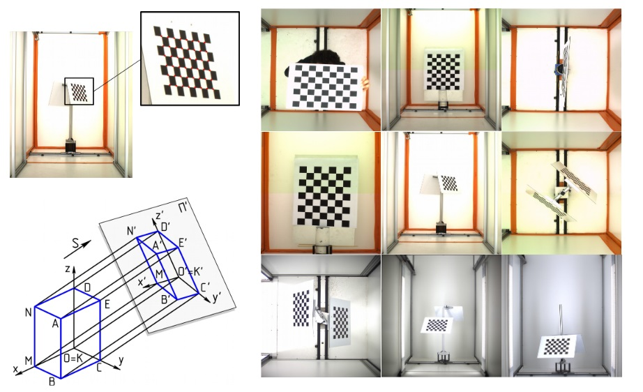
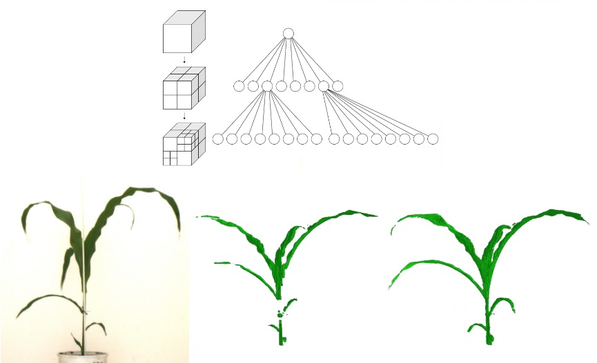
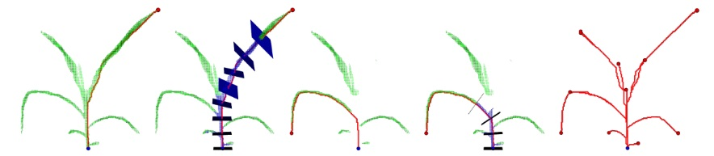
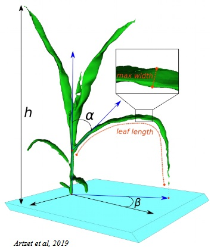

+++
template = "page.html"
title = "Phenomics"
date =  2019-11-25
draft = false
description= "My experience at CIRAD about bioimaging, biochemical and molecular analyses to determine the link between DNA sequences and specific phenotypes."
[taxonomies]
tags = ["omics"]
+++

As part of the [MaDICS working group](https://www.madics.fr/) on data science and plant phenotyping, I had the opportunity to visit the Montpellier Plant Phenotyping Platform. During this workshop, I tested **Phenomenal**, a pipeline designed to reconstruct the 3D architecture of maize plants grown in greenhouse conditions. I discovered a new omics called "Phenomics" and how high-thoughput bioimaging is used to generate phenome information at large-scale.
<!-- more -->

## Phenomics

**Phenomics** is the high-throughput analysis of phenotypes. Phenotypes are observable traits such as shape, colour or growth on organisms. While genomics describe the whole genome, phenomics describe the whole **phenome**. The phenome is the complete set of observable traits of a given individual.

In plant biology, phenomics is useful to understand how plants respond to environmental factors, biotic and abiotic stress. It relies mainly on non-invasive high-throughput bioimaging.

## High-throughput Bioimaging

**Bioimagining** is the automation of large-scale acquisition of biological images. Technologies used are:

* Microscopy with robot manipulating high-resolution confocal
* Drone capturing pictures of crop fields
* Greenhouse with plants in pots carried by conveyor belt to the imagining chamber

Using multi-camera system, it is possible to reconstruct from those pictures, the 3D architecture of observed plants. Morphological traits determining 3D plant architecture have a large effect on biomass accumulation via light distribution in the canopy. To observe such effect, we need a high-throughput pipeline for capturing 3D plant morphology and geometry using multi-view image reconstruction.

## 3D reconstruction of maize architecture using camera

**[Phenomenal](https://github.com/openalea/phenomenal)** is a software developed by Christophe Pradal and his team. This is an automated plant architecture analysis pipeline. It has been tested on maize in greenhouse.

### 1. Image acquisition

Each plant is imaged using a precision turntable system with two calibrated cameras (top and side views). The plant is rotated on the turntable and imaged at multiple angles (3 , 13 or 25 views), depending on the protocol. The results is a set of pictures for each plant forming the basis for 3D reconstruction.

### 2. Multiple-camera calibration

Reconstruction of the 3D plant geometry from images requires the calibration of the imaging system in order to produce neat images. Using [OpenCV](https://opencv.org/) library, the program detects the chessboard corner points in each image. Then, the 3D frame reference centered on the pot axis is defined. The chessboard is used like a reference object to calibrate the two cameras. The *intrinsic* calibration will refine camera parameters such as focal length, image center, lens. The *extrinsic* calibration will refine position and orientation of the two cameras.

### 3. Multi-view reconstruction: Space carving with Octree voxelization

Now we have neat 2D images and the related position, orientation of cameras and their focal length. We can start to build a 3D construct of the plant. We divide space into voxels (3D pixels). Each voxel is projected into each 2D images. Voxel that are observed on each 2D images of a given plant are considered *photo-consistent*.

Postprocessing improves the 3D model. The small holes or tutor hidding the canopy on certain angles are filled. Phenomenal uses a reference view which is the one with the largest plant convex hull to recover false negative voxels. False negative are excluded voxels that are actually *photo-consistent* on the reference view. Such recovered voxels are grouped on pixels on which they are projected on the reference view. Then the closest neighbour voxels are also recovered. The result is an improved 3D model without "holes".

### 4. Meshing

Once the plant is reconstructed as a 3D grid of voxels we can turn this "blocky" structure into a smooth surface. This is the role of *meshing*. Voxels are connected together to create a triangular surface mesh. IT transforms the voxel plant into a 3D model that looks like the real object.

### 5. Skeletonization

After voxel reconstruction and meshing, we extract the skeleton of the plant. The algorithm convert the grid of voxels into a graph of connected positions defined in a 3D space. A starting node located on the plant is selected. From this starting node, all the shortest paths to other nodes are calculated. The longest path is the main skeleton branch. For each node in the skeleton, nodes in the perpendicular plane are tagged. All nodes connected to a tagged plane are added and considered part of the leave. We obtain the main branch, the secondary branches and the leaves of the skeleton. Finally, visited paths are pruned when they are circular *i.e.* one node in the path is visited twice.

The skeleton is useful to calculate lot of information about the plant architecture:

* Plant:
  * Number of leaf
  * Volume, surface
  * Maximal height
  * Convex hull
* Leaves:
  * Volume
  * Insertion
  * Length
  * Maximum and mean width
* Stem:
  * Length
  * Heigth
  * Diameter

### 6. Analysis

The automated pipeline for 3D architectural reconstruction enables high-frequency phenotyping. Maize trait can be observed hourly and under varying greenhouse conditions. These phenotypes measurments can be stored as tables and used for statstical analyses *e.g.* growth modeling or QTL mapping. Furthermore this also can be used as input for genotype–phenotype prediction using machine learning approaches.

## The Montpellier Plant Phenotyping Platforms (M3P)

This high-throughput phenotyping platforms (PhenoArch, PhenoDyn and PhenoPsis), grouped together in the [Montpellier Plant Phenotyping Platforms (M3P)](https://eng-lepse.montpellier.hub.inrae.fr/platforms-m3p/montpellier-plant-phenotyping-platforms-m3p), are used to analyse and model the genetic variability of plant response to environmental stresses and climate change (particularly drought and high temperatures).
M3P is one of the 10 nodes of the french infrastructure for phenotyping. The European infrastructure counts 200 nodes.

* **[Phenopsis](https://eng-lepse.montpellier.hub.inrae.fr/platforms-m3p/montpellier-plant-phenotyping-platforms-m3p/phenopsis)** irrigates precisely and take a picture of more than 500 individual *Arabidopsis thaliana plants* in rigorously controlled conditions.
* **[PhenoDyn](https://eng-lepse.montpellier.hub.inrae.fr/platforms-m3p/montpellier-plant-phenotyping-platforms-m3p/phenodyn)** measures growth rate and transpiration rate of 420 plants every minute, together with environmental conditions.
* **[PhenoArch](https://eng-lepse.montpellier.hub.inrae.fr/platforms-m3p/montpellier-plant-phenotyping-platforms-m3p/phenoarch)** aims at analysing the genetic determinisms of plant responses to environmental
conditions in particular drought, temperature and light (2400 plants).

## PhenoArch

**PhenoArch** is a phenotyping platform dedicated to the analysis of genetic determinisms of plant response (growth, transpiration, development) to environmental conditions, in particular drought, temperature and light.
Installed in a 350 m² greenhouse, it is based on a conveyor belt that transports 1700 potted plants between irrigation areas and an imaging chamber. It allows multi-trait association studies to be carried out under contrasting soil water conditions and climate scenarios. The characteristics measured are biomass (via biovolumes), transpiration and architecture. The images collected and the monitoring of pot weights allow growth and transpiration to be estimated and water use efficiency to be assessed.
Analysis pipelines are used to estimate the incident radiation and the radiation intercepted by each plant and to deduce the radiation use efficiency.
PhenoArch is covered with environmental sensors to estimate the conditions perceived by the plants at each moment. The throughput of PhenoArch allows it to be used for association genetics analysis as well as for genomic selection.

**Example of an experiment carried out on PhenoArch:**

{{ youtube(id="SzVcnt0HfY0") }}

## References

* ReproHackathon GDR MaDICS [IFB-ElixirFr/ReproHackathon](https://github.com/IFB-ElixirFr/ReproHackathon)

> **Phenomenal: An automatic open source library for 3D shoot architecture reconstruction and analysis for image-based plant phenotyping**
>
> *Simon Artzet, Tsu-Wei Chen, Jérôme Chopard, Nicolas Brichet,  Mielewczik, Sarah Cohen-Boulakia, Llorenç Cabrera-Bosquet, François Tardieu, Christian Fournier, Christophe Pradal*
>
> bioRxiv. 21 October 2019. DOI: [10.1101/805739](https://doi.org/10.1101/805739)

> **Quantification of the effects of architectural traits on dry mass production and light interception of tomato canopy under different temperature regimes using a dynamic functional–structural plant model**
>
> *Tsu-Wei Chen, Thi My Nguyet Nguyen, Katrin Kahlen, Hartmut Stützel*
>
> Journal of Experimental Botany. 02 September 2014. DOI: [10.1093/jxb/eru356](https://doi.org/10.1093/jxb/eru356)