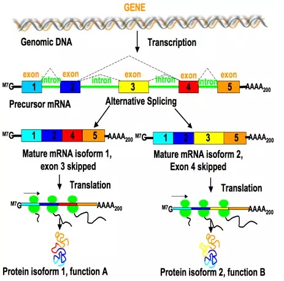
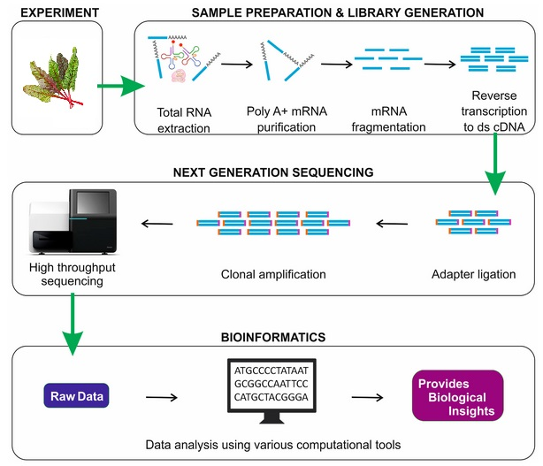
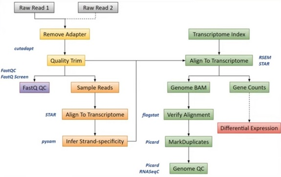
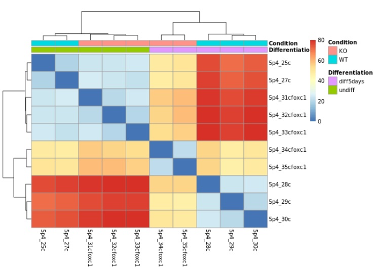

+++
template = "page.html"
title = "RNA-Seq"
date =  2022-08-22
draft = false
description= "RNA-Seq technology and bioinformatics workflow"
[taxonomies]
tags = ["biotech", "omics"]
+++

One of the approaches to study host–pathogen interactions at the molecular level is **RNA sequencing (RNA-Seq)**. This technology provides access to gene expression profiles in various conditions such as viral infection or environmental stress. I had the opportunity to process RNA-Seq data from sugar beet plants to investigate transcriptional responses to virus yellows disease, a condition caused by a complex of aphid-transmissible viruses. Here, I describe transcriptomics and the methods used for RNA-Seq data analysis.

<!-- more -->

## RNA molecules

**Ribonucleic Acid (RNA)**, unlike Desoxyribonucleic Acid (DNA) is not a long double-stranded molecule. While DNA function is the long-term storage of genetic information and its transmission to new organisms, RNA is used to transcribe the genetic information within the organism. While DNA is self-replicating and has a very stable molecular structure, whereas RNA is synthesized from DNA and is highly reactive. RNA is constantly produced, used, degraded and recycled. The overall activity involving RNA is referred to as *gene expression*.

There are different types of RNA:
* Ribosomal RNA (rRNA): Constitute the ribosome, agent of translation of the transcript.
* Messenger RNA (mRNA): Carry the blueprint for building proteins in the ribosome. In eukaryotes, mRNA often has a 5' cap and a 3' polyadenylated (poly-A) tail that enhance stability and translation efficiency.
* Transfer RNA (tRNA): Bring amino acids to the ribosome during translation.
* Small RNA (sRNA): Regulatory roles
* And many more: IncRNA, eRNA, scaRNA, gRNA, piRNA, etc.

### Splicing of mRNA

After transcription, the mRNA contains both coding regions (exons) and non-coding regions (introns). During splicing, the introns are removed and the exons are joined together to form a continuous coding sequence. In some cases, splicing can happen in different ways. It allows a single gene to produce different versions of a protein called *isoforms*. The splicing is controlled by a molecular machinery called spliceosome. This increases the variety of proteins that can be generated using the same gene.

### Capping and Polyadenylation

Capping is the addition of 7-methylguanosine (M7G) cap to the 5'end of a mRNA. It protects the mRNA from degradation and improve it's affinity with the ribosome.
Polyadenylation is the addition of a poly-A tail *i.e.* a long chain of Adenine (A) nucleotides to the 3'end of a mRNA. This tail protects the mRNA from degradation and improves translation efficiency by ribosomes. Moreover, the poly-A is essential to select mRNA from other types of RNA molecules.

## High-throughput RNA sequencing

RNA-sequencing is a High-Throughput Sequencing technique for identifying and quantifying RNA molecules in biological samples. This technology is used for assessing *gene expression* or splicing of transcripts.

## Sample preparation and library generation

### RNA purification

After tissue extraction, for instance a leaf, the total RNA is isolated from sample. RNA quality is assessed. If RNA integrity is good enough, the RNA is purified to keep the selected type.

The most typical library preparation protocol uses the poly-A selection strategy for purifying mRNA by filtering RNA with 3' polyadenylated poly-A tails to include only mRNA. As a result, non polyadenylated transcripts such as rRNA, tRNA, lncRNAs, miRNA, histone mRNA, degraded RNA, bacterial transcripts, and many viral transcripts are removed.

Further, the ribosomal depletion is conducted to remove rRNA as it represents over 90% of the RNA in a cell, which if kept would drown out other data in the transcriptome.

### cDNA synthesis

Sequencer such as Illumina require DNA, not RNA, as input. Therefore, before sequencing, the RNA must be reverse-transcribed into cDNA. cDNA, or complementary DNA, is a DNA copy synthesized from an RNA molecule using the enzyme reverse transcriptase.

### Stranded mRNA protocol

The DNA is *double-stranded* meaning it has two strands sense and antisense. The bases on one strand (A, T, G, C) pair with complementary bases on the other strand (A with T, C with G). The mRNA is a copy of the strand sense or antisense but not both. To ease downstream analysis, it is fortunate to keep the right strand.

When the second strand of cDNA is synthesized, the protocol uses the introduction of dUTP instead of dTTP during amplification. The incorporation of dUTP in the second strand synthesis block the production of the second strand. In consequences, only the transcripted strand is kept in the final library. With stranded sequencing, we have no ambiguity and better estimation of gene expression level.

### Adapter ligation

The remaining RNA is degraded and a second DNA strand is synthesized to produce double-stranded cDNA. The 5' and 3' ends of cDNA fragments are next prepared to allow efficient ligation of adapters containing unique barcodes and adapters for hybridization of cDNA fragments onto a flowcell.

### Amplification

Before sequencing, the cDNA is usually amplified using Polymerase Chain Reaction (PCR) to obtain enough material. However, PCR can create *duplicates*. Duplicates are identical reads that originate not from different RNA molecules, but from repeated amplification of the same original fragment. These PCR duplicates can bias expression measurements. To solve this, a Unique Molecular Identifier (UMI) random barcode is added to each original molecule before amplification. 

### Multiplexing

To save time and cost, sequencing often uses multiplexing, where multiple samples are mixed and sequenced together in a single run. Each sample is labeled with a unique barcode during library preparation.

## Sequencing

The sequencer reads the base sequence (A, T, C, G) of each cDNA fragment. Each of these sequences is called a *read*. Depending on the technology and the protocol, RNA-Seq can produce:
* In single-end sequencing, the machine reads from one end of each fragment. They are are used for gene expression quantification.
* In paired-end sequencing, it reads from both ends of each fragment, higher precision.It is useful for detecting splicing events and refinement of transcriptome annotation.

At the end of the read, the sequencing accuracy tends to drop. This is a common issue, especially in  Illumina sequencing due to signal decay. This bias is solved thanks to bioinformatics software that clean low quality tail of read sequence.

The output of RNA-Seq is first demultiplexed yielding either one FASTQ file per sample (for single-end reads protocol) or two fastq-files per sample (for paired-end reads protocol).

### Biological replicates in an RNA-seq experiment

To improve reliability differential gene expression detection, it is necessary to include multiple independent samples from each condition. Such **biological replicates** make it possible to capture the variability in gene expression within the same conditions.

Indeed, with fewer than three replicates per condition, it becomes difficult to estimate variability within groups, making it difficult to detect significant differences of gene expression between conditions.

As the number of replicates increases, the [sensitivy and specificy](/articles/sensitivity-and-specificity) of differential expression methods also improve. For robust detection of differential expression, at least six replicates per condition are recommended.

For experiment with fewer than 12 replicates, use `edgeR`.
For 12 or more replicates, use `DESeq2`.

## RNA-Seq Bioinformatics Pipeline

### 1. Cleaning

We check the quality of RNA-Seq fastq files and remove adapters, contaminants and low quality sequences.
* Control quality is performed with [FASTQC](https://www.bioinformatics.babraham.ac.uk/projects/fastqc/)
* Illumina adapters sequences are trimmed using [cutadapt](https://cutadapt.readthedocs.io/en/stable/)
* [Trimgalore](https://www.bioinformatics.babraham.ac.uk/projects/trim_galore/) removed low quality 3' tail sequence of reads
* Unique Molecular Identifiers (UMIs) are removed and extracted to be added to the read name
* [umitools](https://github.com/CGATOxford/UMI-tools) groups PCR duplicates and deduplicates reads to yield one read per group of PCR clones

### 2. Read mapping

A genome reference in FASTA format contains the entire genomic sequence *i.e.* the chromosomes of an organism. It is used for mapping read sequences of mRNA onto the reference genome.

The annotation of the genome in GTF format provide the location of genes, introns or exons on the reference genomic sequence.

`rsem-prepare-reference` from [RSEM](https://deweylab.github.io/RSEM/) generates the **transcriptome** FASTA file from FASTA genome reference and annotation GTF file. The transcriptome is the complete set of RNA molecules that can be transcribed from the reference genomic sequence.

To determine where on the transcriptome our reads originated from, we align our reads to the reference genome using [STAR](https://github.com/alexdobin/STAR) (Spliced Transcripts Alignment to a Reference). STAR is an aligner designed to specifically address many of the challenges of RNA-Seq data mapping using a strategy to account for spliced alignments.

### 3. Quantification

Now that we have our mapping (.BAM files) and a transcriptome (.FASTA file) we can quantify in alignment-based mode with [Salmon](https://combine-lab.github.io/salmon/).

For each sample, we generate a quantification file `quant.sf`. This file is a plain-text, tab-separated file with a single header line (which names all of the columns).Each row describes a single quantification record. The columns have the following interpretation.
* `Name`: name of the target transcript provided in the input transcript database (FASTA file).
* `Length`: length of the target transcript in nucleotides.
* `EffectiveLength`: This is the computed effective length of the target transcript. (Scaled length with observed different lengths for a same transcript)
* `TPM`: relative abundance of this transcript in units of Transcripts Per Million (TPM).
* `NumReads`: number of reads mapping to each transcript that was quantified. It is an “estimate” insofar as it is the expected number of reads that have originated from each transcript given the structure of the uniquely mapping and multi-mapping reads and the relative abundance estimates for each transcript.

### 4. Differential Expression Analysis

[DESeq2](https://bioconductor.org/packages/release/bioc/vignettes/DESeq2/inst/doc/DESeq2.html) is an R/Bioconductor implemented method to detect differentially expressed features. It tests for differential expression using negative binomial generalized linear models. DESeq2 is based on the hypothesis that most genes are not differentially expressed.

Two input files are required:
* **Gene expression count matrix:** results of the processing of RNA-Seq data, quantification of gene expression level by samples. This is a table of raw counts with row as gene and column as samples. Indeed the DESeq2 model internally corrects for library size.
* **Sample metadata:** Information about samples such as condition or genotype

DESeq2 identifies genes with statistically significant differences in expression level between experimental conditions.
DESeq2 supports multifactor experimental designs, allowing the simultaneous analysis of multiple variables or conditions that may influence gene expression. This is important when experiments involve complex setups, such as different conditions, time points, genotypes, populations, etc.

Outputs of differential expression analysis:
* **Log2 fold changes** for each factor and their interactions, indicating how much gene expression increases or decreases under specific conditions compared to a reference.
* **Statistical significance values (p-values)** for each factor and interaction term, showing which genes are differentially expressed with confidence.

#### Visualization

* **Principal Component Analysis (PCA)** reveals cluster of samples related to experimental factors and driven by the observed gene expression levels.
* **Heatmaps with Dendrograms** display sample correlation and sample-to-sample distances based on observed gene expression levels. The dendogram give hierarchical cluster of experimental factors.

<small>In this example of differential expression visualization, two factors are considered: condition and differentiation. The condition factor includes two groups: KO (knockout) and WT (wild type), while the differentiation factor has two groups: diff5days and undiff. The dendrogram shows hierarchical clustering of the samples based on both condition and differentiation. The heatmap displays the similarity of gene expression levels between samples, where blue indicates samples with similar expression profiles and red represents samples with more distinct expression patterns. As you can see, samples with the same condition and differentiation shows similar expression profiles, whereas samples with different condition or differentation shows different profiles. The differential expression analysis demonstrates that both condition and differentiation have an effect on gene expression.</small>

### 5. Functional Analysis

Following differential expression analysis, the list of genes of interest are investigated. [Gene Ontology](https://geneontology.org/) and pathway databases reveals overrepresented biological functions and metabolic pathways related to the genes of interest. The functional analysis helps connect observed changes in gene expression to known biological processes.

## Conclusion

We can extract and purify RNA, then convert it into cDNA to sequence the mRNA. Thanks to bioinformatics, we can cross transcriptome information with the sequencing data (reads) to measure how active each gene is by quantifying its expression level. This information is useful for differential expression analysis which compares gene expression levels between different conditions or groups in order to identify genes that are involved. Finally, RNA-Seq is a powerful tool to pinpoint which genes play an active role in a disease or any biological process. For instance,breeders use RNA-Seq to identify genes associated with resistance to biotic stress *e.g.* yellow virus infection in sugar beet.

## References

* RNA-Seq analysis how-to: [Julien Delafontaine](https://bioinfo-fr.net/lanalyse-de-donnees-rna-seq-mode-demploi)
* RNA splicing: [Isabelle Stevant](https://bioinfo-fr.net/etude-de-la-regulation-de-lepissage-alternatif-par-interactions-proteinesarn-a-lechelle-du-genome)
* Course to process RNA-Seq data: [PHINDaccess RNAseq course 2020](https://biocorecrg.github.io/PHINDaccess_RNAseq_2020/)
* How to run RNA-Seq data processing: [GenoToul Bioinfo Course](https://bioinfo.genotoul.fr/index.php/rnaseq-bioinfobiostats/)
* RNA sequencing analysis pipeline: [nf-core/rnaseq](https://nf-co.re/rnaseq)

> **Aphid-mediated beet yellows virus transmission initiates proviral gene deregulation in sugar beet at early stages of infection**
>
> *Roxana Hossain, Glenda Willems, Niels Wynant, Simon Borgolte*
>
> PLOS One. 2024 October 19. DOI: [10.1371/journal.pone.0311368](https://doi.org/10.1371/journal.pone.0311368)

> **The nf-core framework for community-curated bioinformatics pipelines.**
>
> *Philip Ewels, Alexander Peltzer, Sven Fillinger, Harshil Patel, Johannes Alneberg, Andreas Wilm, Maxime Ulysse Garcia, Paolo Di Tommaso & Sven Nahnsen.*
>
> Nature Biotechnology. 2020 February 13. DOI: [10.1038/s41587-020-0439-x](https://doi.org/10.1038/s41587-020-0439-x)

> **How many biological replicates are needed in an RNA-seq experiment and which differential expression tool should you use?**
>
> *Nicholas J Schurch, Pietá Schofield, Marek Gierliński, Christian Cole, Alexander Sherstnev, Vijender Singh, Nicola Wrobel, Karim Gharbi, Gordon G Simpson, Tom Owen-Hughes, Mark Blaxter, Geoffrey J Barton*
>
> RNA. 2016 June 22. DOI: [10.1261/rna.053959.115](https://doi.org/10.1261/rna.053959.115)

> **A survey of best practices for RNA-Seq data analysis**
>
> *Ana Conesa, Pedro Madrigal, Sonia Tarazona, David Gomez-Cabrero, Alejandra Cervera, Andrew McPherson, Michał Wojciech Szcześniak, Daniel J. Gaffney, Laura L. Elo, Xuegong Zhang & Ali Mortazavi*
>
> Genome Biology. 2016 January 26. DOI: [10.1186/s13059-016-0881-8](https://doi.org/10.1186/s13059-016-0881-8)

> **RNA-Seq: a revolutionary tool for transcriptomics**
>
> *Zhong Wang, Mark Gerstein & Michael Snyder*
>
> Nature Reviews Genetics. 2009 January 10. DOI: [10.1038/nrg2484](https://doi.org/10.1038/nrg2484)

