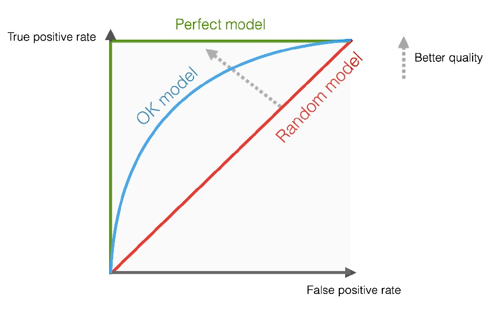

+++
template = "page.html"
title = "ROC Curve"
date =  2015-04-15
draft = false
description = "ROC curve"
[taxonomies]
tags = ["data-science"]
+++

Binary classifier are models that outputs value 0 or 1 from any input value. For instance sick or healthy, right or false, resistant or sensititive to a disease. The model attributes value 0 or 1 is made based on a threshold applied to probabilities or scores. For example, a patient may be classified as sick if the predicted probability of disease is greater than 0.8, and healthy otherwise. How do we know which threshold is the best for? 
<!-- more -->

## Definition

Changing the threshold affects the performance of the classifier. For instance, a lower threshold will identify more positive cases, increasing **sensitivity**, but it will also increase the number of **false positives**, reducing **specificity**. Conversely, a higher threshold increases specificity but may miss **true positives**, reducing sensitivity.

The **ROC curve** (**R**eceiver **O**perating **C**haracteristic) is a visualisation of the trade off between [sensitivity and specificity](/articles/sensitivity-and-specificity/) for every thresholds. The ROC curve plots:

* **Sensitivity** (True Positive Rate) on the y-axis.
* **1 − Specificity** (False Positive Rate) on the x-axis.

Each point on the curve therefore corresponds to a different decision threshold. A perfect model will produce a curve that rises rapidly toward the upper-left corner, corresponding to maximum sensitivity and maximum specificity. A random classifier, in contrast, produces a diagonal line.

The performance of a classifier can be summarised by the **AUC** (**A**rea **U**nder the **C**urve). An AUC of 0.5 indicates performance equivalent to random guessing, whereas an AUC of 1.0 corresponds to perfect accuracy.

## Example

During my internship at INSERM Unit S1134, Macromolecular Biology under supervision of MM Yassine Ghouzam and Jean-Christophe Gelly, I
have to work on the optimization of a predictive model for 3D molecular structures of protein at atomic resolution. The model's name was ORION. To assess the performance of ORION compared with PSI-BLAST and HHsearch, we compared 1032 predicted structures with their original structures for each method. For each query, the methods give a ranked list of proteins from the database. Proteins are ranked by E-value for PSI-BLAST, probability for HHsearch and raw score for ORION. The true positives (TPs) and false positives (FPs) were counted considering the classification level of interest. A TP was denoted when the two proteins compared belong to the same class level and a FP is counted for hits within different class levels. Each protein is then labeled as TP or FP in the ranked list.

By applying the formula it is possible to calculate the True Positive Rate (TPR) and False Positive Rate (FPR) for each ranked proteins. The ROC curve is the plot of TPR as x-axis and FPR as y-axis.

## References

> **ORION : a web server for protein fold recognition and structure prediction using evolutionary hybrid profiles**
>
> *Yassine Ghouzam, Guillaume Postic, Pierre-Edouard Guerin, Alexandre G. de Brevern & Jean-Christophe Gelly* 
>
> Scientific Reports. 2016 Jun 20. DOI: [10.1038/srep28268](https://doi.org/10.1038/srep28268)