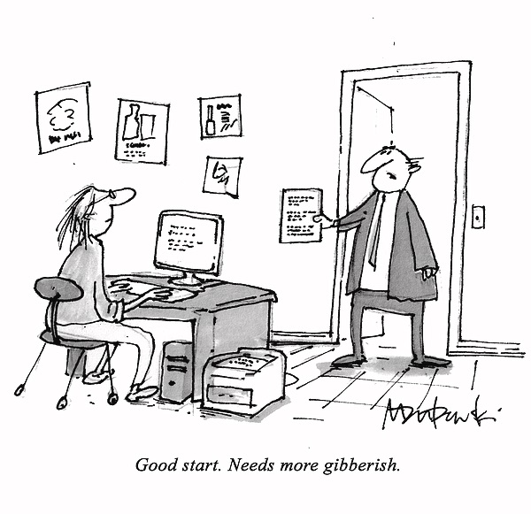
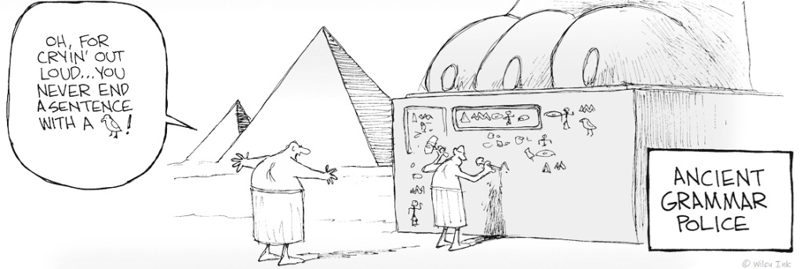

+++
template = "page.html"
title = "Style and Writing in the 21st Century"
date =  2020-04-02
draft = false
description="Does writing well matter in an age of instant communication? "
[taxonomies]
tags = ["society"]
+++

I watched Steven Pinker’s talk on YouTube about writing style in the 21st century, and it was brilliant. Does writing well matter in an age of instant communication? According to Pinker, yes it does, but we must minimize the flaws of the post-modern style. Writing has never been natural for humans. Some difficulties are as old as writting itself, some are new, and some have only recently been revealed thanks to cognitive science and linguistics. Here, I have summarized the advices from Pinker on how to write in a better style.
<!-- more -->

## Why is so much writing so bad?

Why do we have to struggle with so much *legalese*?

> "The revocation by these Regulations of a provision previously revoked subject to savings does not affect the continued operations."

With so much *academese*?

> "It is the moment of non-construction, disclosing the absentation of actuality from the concept in part through its invitation to emphasize, in reading, the helplessness of its fall into conceptuality."

Why is it so hard to set the time on a digital alarm clock? 

* As captured in this cartoon from **Mark Dubowski**, a first theory could be that **bad writing is a deliberate choice**. Perhaps this is the way bureaucrats choose to retaliate against society. This may be true that some writers are banboozling their readers some of the time. But it doesn't ring true. Because good scientist can also write bad prose.

* A second theory is that digital media stupifies the new generation. **Writting was better in previous times**. Actually, complains about the immediate decline of our language can be found in every area:
  * Mass media age
    > "Recent graduates, including those with university degrees, seem to have no mastery of the language at all."
    >
    > *Joseph Mersand, writer, 1961*
  * Telegraph age
    > "Our freshmen can't spell, can't puncutate. Every high school is in disrepair because its pupils are so ignorant of the merest rudiments."
    >
    > *Charles Henshaw Ward, teacher, 1917*
  * Modern age
    > "Our language is degenerating very fast... I begin to fear that it will be impossible to check it."
    >
    > *James Beattie, poet and philosophy professor, 1785*
  * Pharaoh age (according to this cartoon from **Wiley Ink**)
    

* Last theory according to **Charles Darwin** is that every man has an instinctive tendency to speak, as we see in the babble of our young children, whereas no child has an instinctive tendency to bake, brew or write. **Speaking is instinctive whereas writting is hard.**

## The Problem with Traditional Style Advice

As writting is the result of a work, we should follow rules from style advice book for instance *The Element of Style* from Elwyn Brooks White (yes the author of the infamous *Stuart Little*). However such advices are useless to write in the style of the 21st century:
* Arbitrary list of dos and don'ts based on the tastes and peeves of the authors
* No principled understanding of how language works

## Why we can write in a better Style in the 21st Century

In the 21st century, the style advices are based on science:
* **Language structure theory:** Grammar is not a set of arbitrary rules inherited from Latin language. It is a natural organization of the words we speak, and thefore it can be described.
* **Evidence-based dictionaries:** Unlike prescriptive dictionaries that may impose incorrect or outdated usages.
* **Cognitive science:** What makes sentences easy or hard to read.

## Classic Style

In Academia, the good writting style is the **classic style**:

* Prose as *a window onto the world*
  * The writer has seen something in the world.
  * He positions the reader so she can see it with her own eyes.
* The reader and writer are equals
* The goal is to help the reader see *objective reality*
* The style is conversation

### What are *Non*-Classic Styles?

Classic style is just one of a variety of styles. They are many: contemplative, oracular, practical, etc. However, they are one style that infects most academic prose, they called it the **post-modern style** or ego style:

* The writer is concerned about seeming *naive* to the reader.

*Naive* means without knowledge or experience. For instance when you open a recipe cookbook, as a reader, you put aside some existential questions like `Do eggs really exist?`, `What is cooking and why do we cook?`, `Is food something knowledgeable?`, etc. In a cookbook, such questions are inappropriate, and the classic style ignores them. The purpose is to treat exclusively the subject, the recipe in the case of a cookbook.

### Classic vs. Post-Modern Prose

The focus is on *the thing being shown* not on the *activity of studying it*.
* Post-Modern
  > "In recent years, an increasing number of researchers have turned their attention to the problem of child language acquisition. In this article, recent theories of this process will be reviewed."
* Classic
  > "All children acquire the ability to speak without explicit lessons. How do they accomplish this feat?"

## Minimize Apology

> "The problem of language acquisition is extremely complex. It is difficult to give precise definitions of the concept of language and the concept of acquisition and the concept of children. There is much uncertainty about the interpretation of experimental data and a great deal of controversy surrounding the theories. More research needs to be done."

* You can delete this lengthy verbiage with no loss in content.
* The reader already know that many concepts are hard to define
* The reader is there to see what the writer will do about it

## Minimize *hedging*

* `literally`, `somewhat`, `fairly`, `rather`, `nearly`, `relatively`, `seemingly`, `comparatively`, `apparently`, etc.
* Sudder quotes `""`
  * *She is a `"quick study"` and has been able to educate herself in `virtually` any area that interests her*

The compulsive hedging is a manner to cover our words so we can stay ambiguous *e.g* `She virtually loved it.`.
 * Take the risk to be clear and possibly wrong than muddy and not even wrong.
 * Not everything has to be stated with absolute precision.

## Minimize Clichés

* Each time you use a cliché, the reader shutdowns their imagination
* Avoid clichés `like the plague`:
  > "We needed to think `outside the box` in our `search for the holy grail`, but found that it was neither a `magic bullet`, so we `rolled with the punches` and `let the chips fall where they may` while `seeing the glass as half-full`. It's a `no-brainer`!"

## Minimize Meta

* Write about *the world* not about how you write about it.
* Avoid metaconcepts *i.e* concepts about concepts: `approach`, `assumption`, `concept`, `condition`, `context`, `framework`, `issue`, `level`, `model`, `paradigm`, `perspective`, `process`, `role`, `strategy`, `tendency`, `variable`, etc.

## Minimize Zombie Nouns

* **Nominalization** is turning a verb into a noun. Instead of *appearing* you make an *appearance*.
* Bad usage examples:
  * In academia:
    * :zombie: "Subjects were tested under conditions of good to excellent acoustic isolation."
    * :white_check_mark: "We tested the students in a quiet room."
  * In politics:
    * :zombie: "The President is desirous of trying to see how we can make our best efforts in order to find a way to facilitate."
    * :white_check_mark: "The President wants to help."
  * In engineering:
    * :zombie: "Mild exposure to CO can result in accumulated damage over time. Extreme exposure to CO may rapidly be fatal without producing significant warning symptoms."
    * :white_check_mark: "Using a generator indoors CAN KILL YOU IN MINUTES."

## Minimize the Passive Form

**Passive form** like nominalization contributes to turn your prose into zombie prose. However the passive form could not have survived for 1500 years if it did not serve some purpose. So how to prevent people to overuse it? 

Present yourself the language like an application for converting a *web of thoughts* into a *string of words*. 

For instance the play *Oedipus* of Sophocles is composed of:
  * Subjects: Oedipus, Jocasta, Laius
  * Actions: is, kill, marry
  * Functions: father, mother, wife, husband, son

The summary of *Oedipus* is: "Oedipus married his mother and killed his father."

Here the summary is incoherent. Why? Because a sentence is a *string of words* and in the english language the order of words matters.
* Words oder is used as a code for meaning who did what to whom
* Is also the order in which the bits of information are absorbed by the reader
  * The material at the beginning of the sentence are information required to understand what will happen.
  * The material at the end of the sentence are what the reader should now notice.

Any prose that violates this principles will be incoherent. Hopefully, English syntax provides writers with constructions such as passive form to vary the order of words while preserving meaning:
* Oedipus killed Laius
* Laius was killed by Oedipus
* It was Laius whom Oedipus killed
* It was Oedipus who killed Laius
Writers must choose the construction that introduces information to the reader in the order in which she can absorb them.

## Minimize semantic distinction

In general, one should avoid reaching for a hoity-toity word to replace a humber synonym.

* *fulsome* is not equivalent to *full*
* *simplistic* is not equivalent to *simple*
* *complex* is not equivalent to *complicated*

## Minimize correct usage

Correct usage should be kept in perspective:
* The least important part of good writting
* far less important than
  * classic style
  * coherent ordering of ideas
  * overcoming the curse of knowledge
  * argumentation
* Tacit, evolving conventions

### Sense vs. Usage

* **Sense:** the meaning of a word, as defined in the dictionary.
* **Usage:** how a word is used by people depending on the context.

Sense and usage don’t always match. A word’s meaning may be twisted by its common usage.
Example: a *review* originally referred to a military inspection. Common usage has shifted it to mean a journal.

## The Curse of Knowledge

Does not occur to the writer that readers...
* have learned their jargon
* do know the intermediate steps that seem too obvious to mention
* can visualize a scene currently in the writer's mind's eye

And so the writer does not bother to...
* explain the jargon
* spell out the logic
* supply the concrete details

**How to overcome the curse?**

1. Get a flesh and blood person to read your writting. It can be your mother or yourself several days later. 
2. Allow your reader to form a mental image based on what you're writting.
  * An idea is not a string of words, the mind must grasp it
  * Use concrete examples
  * Use visual metaphors and symboles instead of abstract terms

## Conclusion

Modern linguistic and cognitive science provide better ways of enhancing our writing. A model of prose communication, the **classic style** in which language is a window on the world. We better understand how language works as a way of converting a web of thoughts into a string of words. The main reason writing remains difficult, however, is the **curse of knowledge**. A challenge every writer must recognize and overcome.

## To go further

**Steven Pinker** is a linguist, Professor in the Department of Psychology at Harvard University, and is known for his advocacy of evolutionary psychology and the computational theory of mind.  

{{ youtube(id="OV5J6BfToSw") }}

## References

* The Royal Institution Talk film:  [Linguistics, Style and Writing in the 21st Century with Steven Pinker](https://www.youtube.com/watch?v=OV5J6BfToSw)

> **The Sense of Style**
>
> *Steven Pinker*
>
> The Thinking Person's Guide to Writing in the 21st Century, 2022. ISBN-13: [978-0143127796](https://openlibrary.org/isbn/978-0143127796)

> **Politics and the English Language**
>
> *George Orwell*
>
> An essay, 1947. ISBN-13: [978-0141393063](https://openlibrary.org/isbn/978-0141393063)

> **The Elements of Style**
>
> *Elwyn Brooks White and William Strunk Jr.*
>
> The English writting style manual, 1918. ISBN-13: [978-0205309023](https://openlibrary.org/isbn/978-0205309023)
 