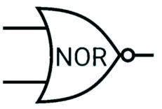

+++
template = "page.html"
title = "Turing Complete: From Logical Gates to CPU Architecture"
date =  2025-09-17
draft = false
description = "What I learned from the game Turing complete about computer science."
[taxonomies]
tags = ["computer-science"]
+++

In 2021, LevelHead published [Turing Complete](https://turingcomplete.game), a game about computer science. My friend **Christophe Georgescu** recommended me to play it. Unfortunately, I took his advice and now I can not stop to play this game! The game challenges you to design an entire computer from scratch. You start with basic logic gates, then move on to components, memory, CPU architecture, and finally assembly programming. By the way, the game is neat and present all these concepts in a playful and intuitive way.
<!-- more -->

## Truth Tables

A **truth table** shows how the truth or falsity of a compound statement depends on the truth or falsity of the simple statements from which it is constructed.

Example with the `AND` gate:

| Input 1 | Input 2 | Output | 
| --- | --- | --- | 
| :x: | :x: | :x: |
| :white_check_mark: | :x: | :x: |
| :x: | :white_check_mark: | :x: |
| :white_check_mark: | :white_check_mark: | :white_check_mark: |

**Input** and **Output** will often be represented with variable names, like in algebra. And instead of using colors, you will often see the values represented as 0/1 or False/True.

## Logical Gates

It turns out tht you can build all the logic for a computer out of either `NAND` or `NOR` gates. The **Apollo** guidance computers, were built entirely of `NOR` gates. Designed in the sixties, they had only 4KB of RAM and 32KB of disk space, but guided astronauts to the moon nonetheless.

Modern computers are not built entirely of just one of the logical gates, but when applicable `NAND` gates are prefered over `NOR`, because they have less delay and occupy less area.

### NAND gate

1 unless both inputs are 1.

| Input 1 | Input 2 | Output |
| --- | --- | --- |
| 0 | 0 | 1 |
| 1 | 0 | 1 |
| 0 | 1 | 1 |
| 1 | 1 | 0 |

### AND gate

1 when both inputs are 1.

| Input 1 | Input 2 | Output |
| --- | --- | --- |
| 0 | 0 | 0 |
| 1 | 0 | 0 |
| 0 | 1 | 0 |
| 1 | 1 | 1 |

### OR gate

1 when either input is 1

| Input 1 | Input 2 | Output |
| --- | --- | --- |
| 0 | 0 | 0 |
| 1 | 0 | 1 |
| 0 | 1 | 1 |
| 1 | 1 | 1 |

### NOR gate

1 when neither inputs are 1.

| Input 1 | Input 2 | Output |
| --- | --- | --- |
| 0 | 0 | 1 |
| 1 | 0 | 0 |
| 0 | 1 | 0 |
| 1 | 1 | 0 |

### XOR gate

1 when inputs are different

| Input 1 | Input 2 | Output |
| --- | --- | --- |
| 0 | 0 | 0 |
| 1 | 0 | 1 |
| 0 | 1 | 1 |
| 1 | 1 | 0 |

### XNOR gate

1 when inputs are the same.

| Input 1 | Input 2 | Output |
| --- | --- | --- |
| 0 | 0 | 1 |
| 1 | 0 | 0 |
| 0 | 1 | 0 |
| 1 | 1 | 1 |

### Buffer

Outputs this tick's input, next tick.

### NOT gate

Inverts the input.

| Input | Output |
| --- | --- |
| 0 | 1 |
| 1 | 0 |

## De Morgan's Laws

The truth tables of the four fundamental gates are symmetrical. You can convert betwee, them by *inverting the input* (vertical arrows) or *inverting the output* (horizontal arrows) as indicated by the graphic below.

Notes:

1. You can get from any basic gate to any other, at most you have to `NOT` both inputs and output.
2. You can go between `OR`/`NOR` by inverting output. The same goes `AND`/`NAND`. In fact `NOR` means `NOT` `OR` and `NAND` means `NOT AND`. Notice the component shape of `OR`/`NOR` are identical except for the little dot at the tip which means `NOT`. `AND`/`NAND` are also identical except for this dot.
3. Negating the output flips all the bits in the last row of the truth table. Negating the inputs mirrors the last row of the truth table around the center. 

## Arithmetic Logic Unit

## Memory

## CPU Architecture

## Assembly

## References

https://www.nand2tetris.org/

https://turingcomplete.game