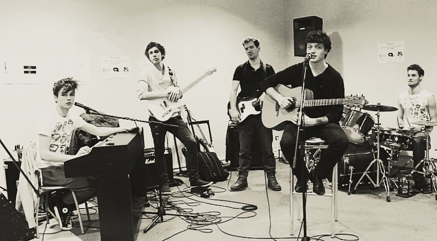

+++
template = "page.html"
title = "What Playing in Rock Bands Taught Me About Collaboration"
date =  2015-02-01
draft = false
description = "How being part of a Rock Band taught valuable lessons about collaboration"
[taxonomies]
tags = ["career"]
+++

Few knows but Music is part of Mathematics. Musicians often develop a way of thinking that is close to the logic used in science or engineering. Examples of scientists who are also musicians and reciprocally are numerous: **Albert Einstein**, physicist and violonist; **Bruce Dickinson**, lead singer of *Iron Maiden* and airline pilot; **Brian May** lead guitarist of *Queen* and astrophysicist; **Bryan Holland**, guitarist of *The Offspring*, who holds a Ph.D. in Molecular Biology.

Last but not least, **Steve Jobs** shown how collaborative skills in a rock band can be applied to teams that develop high tech products.
<!-- more -->

During my journey as a student in [Paris University](https://u-paris.fr/), I was part of several rock bands and played on stage in various nightclubs, weddings and business school galas. My career in Bioinformatics is more and more demanding in both time and effort, so I must now let go my passion for music. I have been a musician since the age of four, and after spending so much years playing in rock bands, I feel like I reached the end of my career as a musician.

Here are the lessons rock bands taught me about people and collaboration.

## Early Years

I studied piano and music theory in the conservatoire for five years. After the conservatoire, I specialized in jazz piano and the art of improvisation for one year. One summer in the countryside, a friend introduced me to the guitar, We were obsessed by *Nirvana*, *The Red Hot Chili Peppers* and *Gorillaz*. I continued playing piano exploring blues and jazz scores by *Tom Waits* and *John Coltrane*. Finally, an older pianist friend taught me about bal musette and how to play pop songs on the synthesizer.

By high school, I started playing in rock band, performing covers of heavy metal and rock bands such as *Radiohead*, *Muse*, and *Metallica*. I progressively gave up piano to learn guitar and bass instead.

## Parisian Nights on Stage

While being a student in Paris, I was first obsessed by scores from *Megadeth* and founded an heavy metal band aiming to make original songs inspired by **Dave Mustaine** and **Marty Friedman**. After a year of hard work, we had built enough of an audience to perform our first concerts, playing both our own compositions and covers of other heavy metal bands such as *Led Zeppelin* and *Black Sabbath*.

Unfortunately, the band had to split due to the different life paths of its members. The alchemy we had was difficult to recreate with others, so I gave up on forming a new band.

I realized how much I enjoyed being on stage and decided to follow the path of least resistance at this time: I accepted any offers from rock or pop bands looking for a bassist.

From there, everything was easy:

### Rehearsals

Many schools and associations provide free rooms and instruments for students to practice. The cost is often very cheap, especially for students.

### Concerts

* They are **associations** that link nightclubs and bands. Back in 1960s, *Auvergnat* and *Kabyle* clubs were well known for having hosted some of the first rockabilly bands in Paris. Today, they continue this tradition by supporting underground music. Each band brings its own audience, which helps the nightclub attract customers. Materials like amps and drum kits are usually provided by the association. Sometimes, you have to share with other bands of different styles such as RNB, rap, or electro.
* **Business schools** frequently organize galas and parties. I was always surprised by how business schools are supportive to music and culture.
* **Open jam sessions** offer free spaces where anyone can bring their instrument and play for a public audience. These sessions are open to all, encouraging improvisations and battles. Like the soccer field at sunday, it is hogged by the old regulars.
* After a concert, **people from the audience** may offer an opportunity to play at weddings or other private events.

### Networking with Other Musicians

They are specialized websites and forums like [zikinf](https://www.zikinf.com/) to connect musicians. They are useful to find bands or fill missing positions. Over time, as I become part of the little parisian community, people start reaching out directly just because they know me.

### Finding an Audience

#### Word of Mouth

Nightclubs usually excepts 50-70 people. Most nightclubs in Paris are very small, so 20 people make the place look occupied, while overcrowded with 50 people. For some reasons people wandering in the streets are attracted by overcrowded nightclubs. So 50 people can easily turn into 100 by the end of the evening. In addition, concerts make people stay instead of just having one drink.

When you group yourself with three other bands. If each band brings 20 people, 20 × 4 = 80 people. Already good enough, and the nightclub might expect more visitors over the evening.

As a band is composed of 5 members, if each member brings at least 4 persons (which is easy), we got the 20 persons per band necessary to a full audience. In addition, the association or friends can bring extra people.

So far, Facebook and social networks have never brought anyone to an event who was not already invited by someone IRL. We use Facebook like posters: it does not really help, but it makes the event looks more official.

Even with an audience, you will convert less than 1% into real fans. So at a typical concert with 100 people, you might only gain one new fan. Because most people come to see their friends and have a good time, not specifically for the music. And the worst part is your fan are often the type of people who do not use Facebook at all! So you have to text them personally to keep them in the loop.

But even then, even by playing very well, being talented, and performing many concerts for years in a row, I think there is a *glass ceiling* in Paris. I mean a maximum number of fans for rock music. Nevertheless, you are more famous than the number of your fans would suggest. People who don't attend your concerts may have already heard of your band by their friends.

### Competitions and Showcases

The magazine *Rock & Folk*, led by **Philippe Manoeuvre**, often organized showcase competitions to help new bands get noticed. The advantage of these events is that they take place in larger places, such as the *Gibus club*. The competition was decided by audience votes. The band with the most fans win a recording session and exposure.

But even then, winners were bands like *BB Brunes*, *The Naast* or *Plastiscines*. While in London, it was *Artic Monkeys* and *Kasabian* who emerged. The gap in exposure between Paris and London is abyssal.

## Making a band

A rock band is a group of gentlemen who come together to play covers or original compositions on stage.

### The type of musicians

For fun I made caricatures of the different types of musicians based on people I have met. Each character is defined by an obsession: expression, composition, sound setup, interpretation, stage presence.

#### :astronaut: The Gifted

* Strenghts: Genius in improvisation, finds ideas from outer space.
* Flaws: Chaotic, hard to repeat, does not communicate well.

#### :construction_worker: The Builder

* Strengths: Gives structure to songs, organizes the band, creative composer.
* Flaws: Can be rigid as he insists on sticking to his "vision", lacks feeling and groove.

#### :cook: The Colorist

* Strengths: Seeking for new sounds, instruments, effects and tone.
* Flaws: Less focus on interpretation, can get lost in gear, perfectionist with setups.

#### :mage: The Purist

* Strengths: Perfectionist, disciplined, technically strong, plays with feeling and groove.
* Flaws: Not very inventive, conservative, eternal student mindset.

#### :firefighter: The Lover

* Strengths: Charismatic, magnetic on stage, brings mystery and coolness.
* Flaws: Weak technician, more about the show than the music, sometimes a poser.

### Synergy 

The beauty of a team is that while individuals may have flaws, when they come together, those flaws can turn into strengths for the group.

* :astronaut: :mage: **The Gifted and the Purist**: The Purist will be amazed by the Gifted's playing. He will work hard to figure out how the Gifted does it and then explain it to the rest of the group. Symetrically, the Purist, who is usually reluctant to play on stage because "not ready yet" is reassured by the Gifted's virtuosity.
* :cook: :firefighter: **The Colorist and the Lover**: The Lover is not the creative kind. But he will pick the easy flashy ideas from his friend the Colorist to bring some crazy momentum to the show. While the Colorist does not really knows which of his ideas can touch the audience, the Lover will do. Symetrically without the Colorist, the Lover will not have such original ideas to improve the show.
* :construction_worker: :construction_worker: **Two Builders**: Composition is vast and a composer is rarely good at everything. For example, it helps to have one specialist for the rhythmic parts and another one for harmonies.

## The Alchemy

### Aggregating Ideas

No one ever brings a finished song. That is why a band tends to be collegial and not dictatorial because it is not possible to make a good song without the full engagement of everyone in the process of creation.

Generally, everyone bring an idea: it can be a cool riff, a nice structure, a nice chord progression, a melody, a theme, a new instrument, a weird way to use a tone freak, or just a feeling to express, whatever! The other members will then add their own ideas or recall ideas previously discussed during other rehearsals.

>
> Why do we not combine the riff of X with the melody of Y using the sound effect of Z? Mhm I'm not sure. Z do you have something else that could suit more with the theme of the song?
>

Aggregating everyone's ideas is a long process. There are usually dozens of songs under construction, and some elements are often still missing to make a piece feel complete. Then, often over a drink, spending good times together someone got the spark, the missing piece that finish the song. I remember being on the train, having the epiphany, so excited that I called my guitarist friend and sang him the notes to play on the phone. And he was like "You found it! You're a genius!". Everyone on the train stared at me as if I were mad. Music and his creative process are somewhat captivating.

### Balancing Egos

Everyone in the band is taking great pride of her musician skills and even more of his ideas. Rejecting someone's idea can hurt her feelings, and they might want to leave the band or even sabotage the collective work.

How to select good ideas without hurting people?

First, being good friends and spending enjoyable time together makes it easier to be honest and direct. If an idea is bad, I won’t lie to my friend. This help to fasten ideas selection. The downside is that when the same people's ideas are always accepted while others are always rejected. It creates resentment.

This is why we use "the bag of ideas". All ideas that aren't bad go into the bag so they can be used later. Ideas are used like bricks that can be assembled into different songs. It is hard to predict what will make a good song, so it is better if everyone has fun and feels contributing. In the end, the audience decides which song works best. Because we always involve everyone, no one takes it personally. It is not the song of X versus the song of Y. It is the song of the band.

### Be Pragmatical

Despite we are all friends and so on. It is important to keep in mind the goal: to play on stage and be ready. If a member did not show up for rehearsals, struggled technically without making progress, stole belongings  or created a negative vibe, then we had no choice but to split the band.

### Spending a lot of time Together

To achieve a high level of musical synchronization, you need to be very familiar with each other. This comes naturally, through imprinting, imitation, and rehearsals. You really have to spend a lot of time together. This is why it helps to love each other. However, the reward of such dedication is fantastic: when you manage to play in perfect sync, you feel a kind of shared magic power that give chills. And the audience feels it as well.

### Playing What you Love

You have to choose wisely the song you will work on together. If the band don't have goose bumps at the early stage you have to throw it away. Why? Because you will spend a lot of time playing over and over this song, revisiting the same passages, and polishing every detail. To sustain that effort with passion and precision, you need to love the song.

### Behavior is more important than Skills

When I first started learning guitar, I also needed a bit of money. So, almost at the same time, I began giving guitar lessons. My students were usually just six months behind me in experience, but that was enough to make me the "teacher". When someone is less experienced, they can not say your true level.

Now, imagine you are a guitarist and you need to recruit a drummer. You are in trouble, because you can not say the true level of the candidates. Every drummer you meet is more experienced on their instrument than you are.

* In a band, one skilled musician is good enough. They are other roles. Scores can be adapted to match a musician's skill level.
* Enthusiasm matters. Do the candidate inspires the rest of the band?
* Motivation matters. Is the candidate ready to take the band all the way to the stage?
* Reliability matters. Will the candidate show up on time for rehearsals?
* Character matters. Will the candidate improve the mood in the band?
* Creativity matters. Will the candidate proposes ideas, or stay passive?
* Flexibility matters. Can the candidate find solutions if a guitar is missing five minutes before going on stage?
* Sociability matters. Will the candidate bring new fans to the band?
* The big question. Will the candidate expand the spirit of the band or shrink it?

### Learning from each others

While practicing your instrument, they are two way: the hard way and the easy way. 

* The hard way is what how you learn in a conservatoire. You repeat passages thousands of times until your fingers and brain are perfectly synchronized, reaching perfect execution.
* The easy way is what you learn from other musicians.There are many shortcuts and tricks that produce the same effect with minimal effort. These tricks are usually discovered by those who have gone through the hard way, so by learning from your peers, you can spare yourself a lot of hard work. 

### Having an Outside Observer

As far as I remember, there was always at least one person watching our rehearsals. Often it was friends or members of other bands or just the guardian of the local. Their presence added a little pressure, helping us get used to play in front of an audience.

It also kept arguments in checkmate. Disagreements quickly turned into jokes, saving a lot of time. Rehearsals are short, and every minute counts.

We could also get feedback: whether an influence was too noticable in a composition; whether the sound balance was right or wether the suggestion from X or Y was relevant or not. Finally when our friends said "This rocks!" after a final play, it was pure joy.

### Building Trust

Going on stage is intimidating. The fear of failing yourself, the fear of letting your friends down, the fear of being let down by them. I have realized that when everything is shared equally within the band, there is very little stress before a performance.

On the contrary, in a more hierarchical band, with a leader at the top, fear is everywhere. The leader is anxious because, he is carrying the weight of the band. The other members are anxious because of the leader being anxious. The audience feels something is off. 

Trust comes from sharing.

### Having Fun

To be honest, we spent so much time stressing over small things without interest that if we had taken ourselves too seriously, the whole experience would have felt sinister.

Of course, we still had to be on time for rehearsals and organize concerts, which required a certain level of seriousness. But I think the reason we managed to play on stage despite not being perfect was the good vibes. Creativity is impossible without being relaxed. Working with people you love and having fun clearly fosters inspiration. I can not count the number of times I got spark of ideas just after a good laugh.

## Conclusion

I learned from my friends to do not worry and to live fully in the moment. Music is something *alive*. Collaboration is not about forcing a rational consensus. It is about feeling good with people, appreciating them, and understanding their flaws, strengths and most important what makes them extraordinary.

Music taught me to combine open-mindedness with practical common sense: being flexible, tolerant of differences and free from preconceptions. Finally, playing with soul is only what matters.