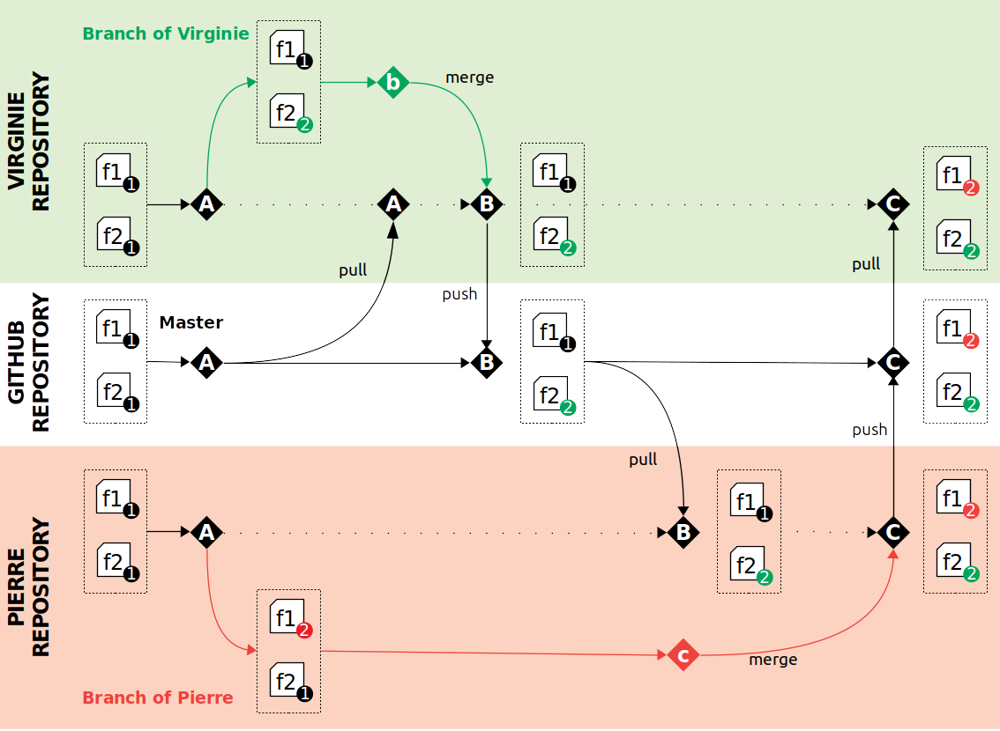

+++
template = "page.html"
title = "Travailler en équipe avec git"
date =  2019-11-26
draft = false
tags = ["tech", "git"]
lang = "fr"
+++

*Version française*  

# Phase 2 - Travailler à tour de rôle

# Phase 3 - Travailler en parallèle

Notion de branches. 

