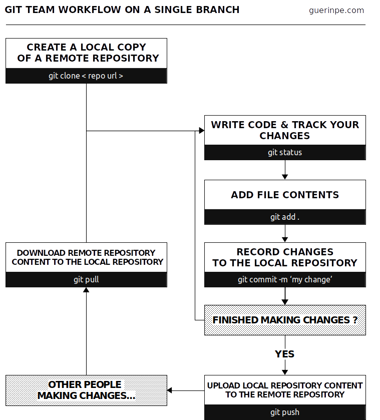

+++
template = "page.html"
title = "Travailler en équipe avec git"
date =  2019-11-26
draft = false
tags = ["tech", "git"]
lang = "fr"
+++

J'utilise `git` depuis plusieurs années, seul ou en collaboration avec mon équipe ou nos partenaires. Avec le temps, j'ai acquis mes propres habitudes d'utilisation que je présente dans cet article.

_______________________________________________________________________________

# Qu'est ce que git ?

Quand un projet informatique gagne en complexité, il faut souvent le diviser en versions. Qu'il s'agisse d'une progression naturelle du projet à travers le temps ou simplement d'y ajouter des options supplémentaires. La gestion de ces versions devient fastidieuses à mesure que le projet grandit; elle devient hasardeuse lorsque le projet implique plusieurs collaborateurs.

`git` est le logiciel qui gére le versionnage des fichiers. Plus exactement, il oblige les utilisateurs à versionner systématiquement leurs fichiers. Enfin, il ne faut pas confondre git avec les forges logicielles telles que gitlab, github ou bitbucket qui utilisent notamment `git`. Une forge logicielle permet de travailler sur internet avec d'autres utilisateurs et propose un cadre qui couvre bien plus de fonctionnalités que notamment la gestion des versions.

# Ma fiche pense-bête pour se servir de git

J'ai défini deux niveaux d'utilisation de git (recto et verso). Le recto correspond à une utilisation très basique de `git`, adaptée pour travailler à tour de rôle.  Le verso correspond à une utilisation plus avancée de `git` avec l'utilisation des branches. Il s'agit de vérifier une nouvelle branche, d'y travailler puis de fusionner les modifications sur la branche principale *master* en un seul commit.

**[Télécharger le PDF](https://github.com/ednaMontpellier/workshop_git/raw/master/git_team_workflow_peguerin.pdf)**

