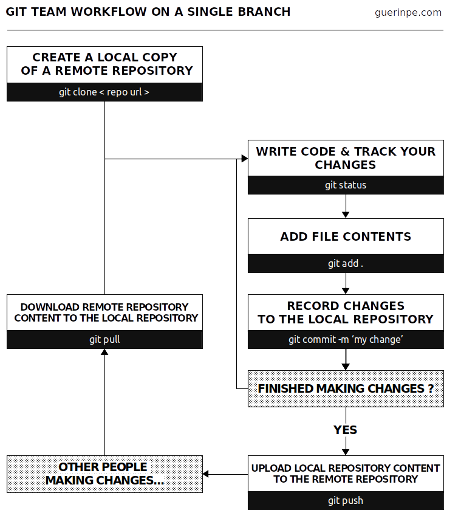
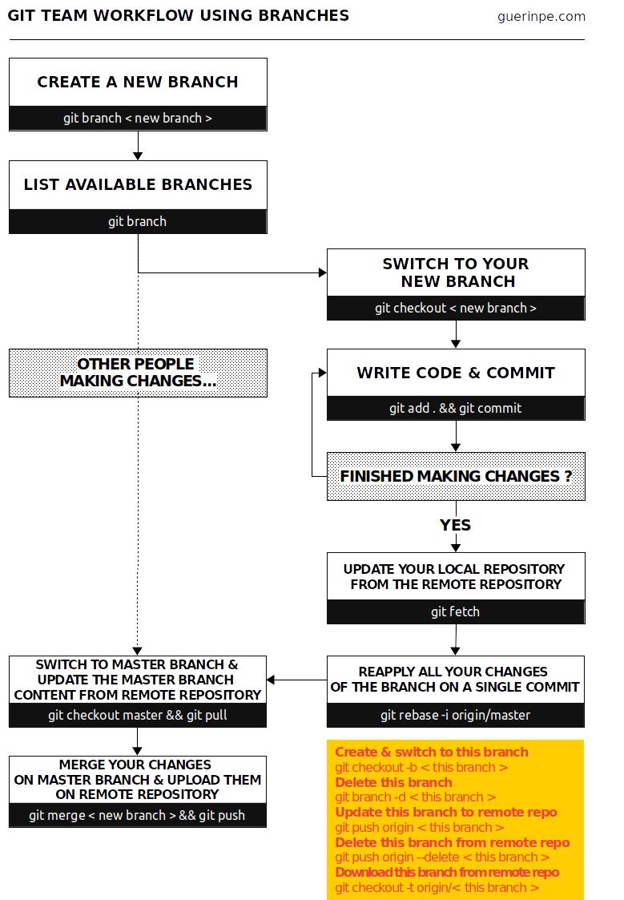

+++
template = "page.html"
title = "Team working with Git"
date =  2019-11-26
draft = false
description = "A quick reference for basic Git commands to help students learn Git."
[taxonomies]
tags = ["tech"]
+++

I've been using `Git` for years, alone or in collaboration with my team. Over time, I developed habits that I present in this article.
 <!-- more -->

# What's Git?

When a programming project becomes more complex, you need to versionize it. Either a natural progression of the project over time or simply to add additional options. Managing these versions remains tedious as the project grows and even becomes risky when the project involves several collaborators.

`Git` is the software that manages the versioning of files. More precisely, it forces users to version their files systematically. Finally, don't confuse Git with Gitlab, Github, or bitbucket, which are forges. A forge is a web-based collaborative software platform for both developing and sharing computer applications. it encompasses much more functionality than version management.

I defined two types of usage for `Git` (front and back). The front part corresponds to a very basic use of `Git`, adapted to work in turn. The back part is a more advanced use of `Git` wich requires branches. This involves checking out a new branch, working on it, and then merging the changes into the main *master* branch into a single commit.

**[Download as PDF](https://github.com/ednaMontpellier/workshop_git/raw/master/git_team_workflow_peguerin.pdf)**

