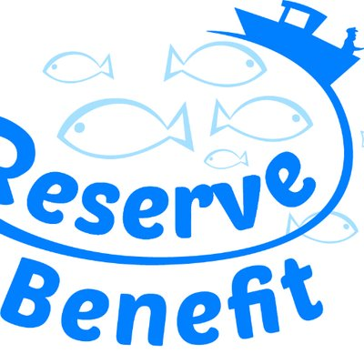
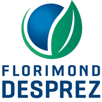
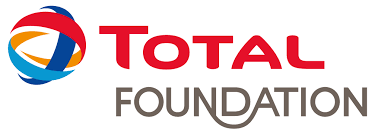

+++
template = "page_static.html"
title = "Portfolio"
date =  2025-08-12
draft = false
in_search_index = false
+++

 Genbar 2 

 I programmed a software to identify genetic boundaries between populations from individual spatial coordinates and genetic variants data.

 (C, C++, htslib)

 

 May 2019 - Feb 2020 

Metabarcoding

I programmed several workflow to process metabarcoding environmental DNA data from MONACO MARINE WORLDWIDE EXPEDITION.

 (obitools, vsearch, swarm, cutadapt, bash, python, singularity, snakemake)

 

 Jan 2019 - Jul 2021

Benchmarking of metabarcoding workflows

We tested some combinations of softwares to improve performances of metabarcoding data processing.

 (obitools, vsearch, qiime, python, singularity, Univa Grid Engine)

 

 Mar 2018 - Jul 2021

Population genomics

I genotyped 1200 individuals belonging to 3 fish species. I worked with restriction enzyme-based data such as RAD-seq.

 (illumina paired-end, STACKS, vcftools, bedtools, bwa, python, snakemake, singularity, Univa Grid Engine, bash)

 

 Jun 2017 - Oct 2019 

Beets genome metrics

I calculated metrics (nucleotide diversity, Tajima's D) on the beets genome from 14,409 random single nucleotide polymorphisms (SNPs) among 299 accessions of cultivated beets.

 (R, python, genpop)

 

 May 2017 - May 2018 

First Global Map of Fish Genetic Diversity

 I built a database containing over 50,000 DNA sequences representing 3,815 species of marine fish and 1,611 species of freshwater fish. I estimated the average genetic diversity at different geographical scales.

 (julia, python, R, singularity, MUSCLE, UGENE, geonames, BOLD, shiny)

 

 May 2017 - Feb 2020 

Landscape genomics

I processed low-coverage RAD-seq data from 1800 individuals belonging to 2 fish species collected from all over the Mediterranean sea.

 (dDocent, freebayes, vcftools, samtools, trimmomatic, bash, python, singularity, snakemake)

 

 Feb 2017 - Mar 2021 

Genome assembly

I did the sequencing and assembly of 3 new fish species nuclear and mitochondrial genomes.

 (illumina paired-end, mate-pair, 10X genomics chromium, Abyss, Platanus, QUAST, SLURM, bash)

 

 Jan 2017 - Nov 2019 

Report bad quality region of coding sequences from genome sequencing data

I developped a software able to detect human genomic variations with low coverage. Graphical Interface. 

 (Illumina paired-end, samtools, bedtools, variation annotation, python, mySQL, qt4)

 

 Jan 2016 - Jul 2016 

Optimization of a method of fold recognition in protein structure

I added a new algorithm to predict 3D-modelisation of protein structure at atomic resolution 

 (PDB, pymol, C, C++, python, R, html, css )

 

 Feb 2015 - Jun 2015 

