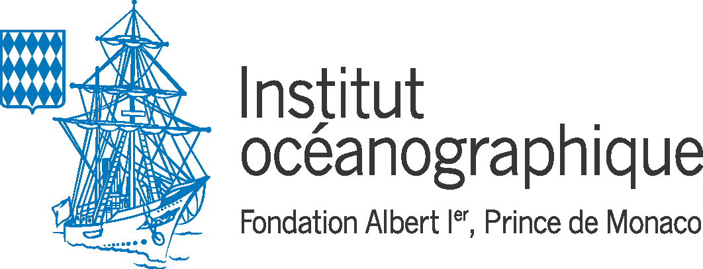
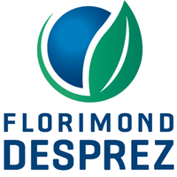
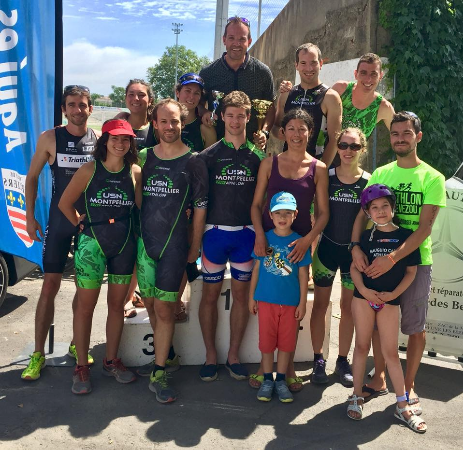

+++
template = "page.html"
title = "Curriculum Vitae"
date =  2021-10-21
draft = false
tags = ["resume"]
lang = "fr"
+++

# Bio-informaticien
FLORIMOND DESPREZ GROUP

## Coordonnées

* **Courriel:** <a href="mailto:pierre.edouard.guerin@gmail.com"> pierre.edouard.guerin [at] gmail.com</a>
* **Téléphone:** (+33) 04 67 61 32 35

## Experience

    <h3>Responsable en Bio-informatique</h3>
    <h6>FLORIMOND DESPREZ UR Laboratoire de Génétique et Biométrie, Cappelle-en-Pevele</h6> 
    
            
        J'apporte mes compétences en programmation et bio-informatique sur les projets de recherche scientifique du groupe en collaboration avec les sélectionneurs et les partenaires internationaux.
    
 
        <mark>python</mark>            
        <mark>R</mark>
        <mark>C++</mark>
        <mark>rust</mark>
        <mark>Singularity</mark>
        <mark>Docker</mark>
        <mark>SLURM</mark>
        <mark>Nextflow</mark>
        <mark>Jupyter notebook</mark>

		<h3>Bio-informaticien ingénieur d’étude</h3>
        <h6>CNRS UMR 5175, Centre d'Ecologie Fonctionnelle et Evolutive, Montpellier</h6> 
		
            
			Développement de logiciels et réalisation de chaînes de traitement de données en calcul intensif pour l’analyse et la visualisation de données massives issues du séquençage ADN haut-débit (génomique, ADN environnemental). J’assure également la veille technologique pour mettre en place de nouvelles méthodes de traitement des données et optimiser la reproductibilité scientifique.
        
 
            <mark>python</mark>            
            <mark>R</mark>
            <mark>C++</mark>
            <mark>Singularity</mark>
            <mark>Docker</mark>
            <mark>SGE</mark>
            <mark>SLURM</mark>
            <mark>Snakemake</mark>
            <mark>Nextflow</mark>
            <mark>Jupyter notebook</mark>
	
	
	

		<h3>Bio-informaticien stagiaire</h3>
        <h6>INSERM UMR S598, Génétique des Diabètes, Paris</h6>
		

			Développement de nouvelles fonctionnalités pour un logiciel dédié au diagnostic médical automatisé en exploitant les données de variants génétiques rares détectés sur les séquences de génomes humains.
		

            <mark>python</mark>            
            <mark>Qt</mark>
            <mark>mySQL</mark>
            <mark>Docker</mark>
	
	
	

		<h3>Bio-informaticien stagiaire</h3>
        <h6>INSERM UMR S1134, Dynamique des Structures et Interactions des Macromolécules en Biologie, Paris</h6>
		

			Conception et développement d'un nouvel algorithme pour améliorer la prédiction de modélisation 3D des structures des protéines à résolution atomique.
		

            <mark>C</mark>            
            <mark>C++</mark>
            <mark>postgreSQL</mark>
            <mark>HTML</mark>
            <mark>CSS</mark>
            <mark>Javascript</mark>
	

	

## Formation

* **2016: Master Bioinformatique, Biologie, Informatique**, Université Paris Diderot, France
* **2014: Licence Bioinformatique, Biologie, Informatique**, Université Paris Diderot, France

_______________________________________________________________________________

# Projets

## Recherche & Innovation Groupe FLORIMOND DESPREZ

Mes projets au services du groupe sont  **confidentiels**. Merci de me contacter pour plus d'informations.

## Recherche publique

Genbar 2

  J'ai programmé un logiciel pour identifier les populations génétiques à partir de coordonnées spatiales individuelles et de données sur les génotypes individuels.

 (C, C++, htslib)

 

 Mai 2019 - Fev 2020  

Etude comparative des outils pour le traitement des données metabarcoding

Nous avons comparer les différents logiciels disponibles pour chaque étape du traitement des données metabarcoding pour en optimiser les performances.

 (obitools, vsearch, qiime, python, singularity, Univa Grid Engine)

 

 Fev 2019 - Mar 2020 

Metabarcoding

J'ai programmé plusieurs logiciels pour traiter les données de metabarcoding d'ADN environnemental.

 (obitools, vsearch, swarm, cutadapt, bash, python, singularity, snakemake)

 

 Mar 2018 - Jul 2021

Génomique des paysages

J'ai traité des données RAD-seq à faible couverture provenant de 1800 individus parmis 2 espèces de poissons, collectés  dans toute la Méditerranée.

 (dDocent, freebayes, vcftools, samtools, trimmomatic, bash, python, singularity, snakemake)

 

 Jun 2017 - Jul 2021 

Carte mondiale de la diversité génétique des poissons

 J'ai construit une base de données contenant plus de 50000 séquences d'ADN représentant 3815 espèces de poissons marins et 1611 espèces de poissons d'eau douce. J'ai estimé la distribution mondiale de la diversité génétique moyenne.

 (julia, python, R, singularity, MUSCLE, UGENE, geonames, BOLD, shiny)

 

 Mai 2017 - Fev 2020 

Etude du génome de la betterave

J'ai mesuré la diversité nucléotidique, D de Tajima sur le génome de la betterave à partir de 14409 polymorphismes aléatoires de nucléotides uniques (SNP) parmi 299 accessions de betteraves cultivées.

 (R, python, genpop)

 

 Mai 2017 - Mai 2018 

Génomique des populations

J'ai effectué le génotypage de 1200 individus parmis 3 espèces de poissons. Mon workflow est conçu pour analyser des données de séquençage RAD-seq.

 (illumina paired-end, STACKS, vcftools, bedtools, bwa, python, snakemake, singularity, Univa Grid Engine, bash)

 

 Avr 2017 - Dec 2018 

Assemblage de génomes

J'ai supervisé le séquençage et réaliser l'assemblage des génomes nucléaires et mitochondriaux de 3 nouvelles espèces de poissons.

 (illumina paired-end, mate-pair, 10X genomics chromium, Abyss, Platanus, QUAST, SLURM, bash)

 

 Jan 2017 - Nov 2019 

Automatisation du contrôle qualité des séquences d'exome 

J'ai développé un logiciel capable de détecter les variations génomiques humaines potentiellement pathologique mais avec une mauvaise qualité de séquençage. 

 (Illumina paired-end, samtools, GATK, bedtools, variation annotation, python, mySQL, qt4)

 

 Jan 2016 - Jul 2016 

Optimisation d'une méthode de reconnaissance des repliements dans la structure des protéines

J'ai implémenté et mise à l'épreuve un nouvel algorithme qui améliore la prédiction des modélisations 3D des structure des protéines à résolution atomique. 

 (PDB, pymol, C, C++, python, R, html, css )

 

 Fev 2015 - Jun 2015 

_______________________________________________________________________________

# Logiciels

## Recherche & Innovation Groupe FLORIMOND DESPREZ

* Les logiciels et services que je tiens pour le groupe sont **confidentiels**. Merci de me contacter pour de plus amples informations.

## Recherche publique

* **[WFGD](https://shiny.cefe.cnrs.fr/wfgd/)** (contributeur principal) : carte interactive de la diversité génétique des poissons dans le monde.
* **[ANVAGE](https://github.com/Grelot/anvage)** (contributeur principal): ANnotation Variants GEnome est une boîte à outil programmée en python qui permet de réaliser certaines analyses de routine tel que l'annotation de variants à partir d'un fichier d'annotation ou la detection de mutations non-conservative sur des genes d'interêt.
* **[Rgeogendiv](https://github.com/Grelot/rgeogendiv)** (contributeur principal) : package R pour télécharger, préparer et aligner des séquences ADN géoréférencés sur Genbank afin de calculer la diversité génétique à différentes échelles géographiques. 
* **[Workflow analyse metabarcoding ADN environnemental](https://gitlab.mbb.univ-montp2.fr/edna)** (contributeur principal): mon workflow a analysé les donnnées de Metabarcoding dans le cadre de la mission d'exploration marine de Monaco en collaboration avec l'IFREMER, le CNRS, l'ETH Zurich et la compagnie SPYGEN.
* **[Workflow génotypage génomes réduits RAD-seq](https://gitlab.mbb.univ-montp2.fr/reservebenefit/snakemake_stacks2)** (contributeur principal) : mon workflow a analysé plus de 3000 génomes de poissons parmis 4 espèces pour le projet européen RESERVEBENEFIT en collaboration avec le Helmholtz-Zentrum für Ozeanforschung Kiel et Instituto Español de Oceanografía. 
* **[Genbar2](https://github.com/Grelot/genbar)** (contributeur principal) : suite du logiciel Genbar1 développé dans les années 90 qui permettait à l’origine d’assigner des populations génétiques à partir de données microsatellites. La version 2 que j’ai developpé en C++ peut analyser les données de séquençage nouvelle génération grâce à la librairie *htslib*. 
* **[ExAM](https://sourceforge.net/projects/exam-exome-analysis-and-mining/)** (contributeur) : logiciel en python avec une interface graphique qui analyse automatiqument les séquençages d’exon pour annoter les variants. Le logiciel était utilisé par les médecins de notre laboratoire pour accélérer leurs analyses génétiques.
* **[ORION](https://www.dsimb.inserm.fr/ORION/)** (contributeur) : outil interactif pour la prédiction des structures de protéines à partir des séquences amino-acides (réalisé 4 ans avant *Alphafold* qui a depuis révolutionné ce domaine). 

_______________________________________________________________________________

# Publications scientifiques

> **Use of environmental DNA in assessment of fish functional and phylogenetic diversity**
>
> *Virginie Marques, Paul Castagne, Andréa Polanco Fernandez, Giomar Helena Borrero-Perez, Regis Hocde,  Pierre-Edouard Guerin, Jean-Baptiste Juhel, Laure Velez, Nicolas Loiseau, Tom Bech Letessier, Sandra Bessudo, Alice Valentini, Tony Dejean, David Mouillot, Loïc Pellissier, Sébastien Villéger*
>
> Conservation Biology. 2021 July 18. DOI: [10.1111/cobi.13802](https://doi.org/10.1111/cobi.13802)

> **Restricted dispersal in a sea of gene flow**
>
> *Laura Benestan, Nicolas Loiseau, Pierre-Edouard Guerin, Katarina Fietz, Elena Trofimenko, Siren Rühs, Willi Rath, Arne Biastoch, Angel Perez-Ruzafa, Pilar Baixauli, Aitor Forcada, Philippe  Lenfant, Sandra Mallol, Rachel Goni, Laure Velez, Marc Höppner, Stuart Kininmonth, David Mouillot, Oscar Puebla, Stephanie Manel*
>
> Proceedings of the Royal Society B. 2021 May 18. DOI: [10.1098/rspb.2021.0458](https://doi.org/10.1098/rspb.2021.0458)

> **Benchmarking bioinformatic tools for fast and accurate eDNA metabarcoding species identification**
>
> *Laetitia Mathon, Alice Valentini, Pierre-Edouard Guerin, Eric Normandeau, Cyril Noel, Clément Lionnet, Emilie Boulanger, Wilfried Thuiller, Louis Bernatchez, David Mouillot, Tony Dejean, Stephanie Manel*
>
> Molecular Ecology Resources. 2021 May 17. DOI: [10.1111/1755-0998.13430](https://doi.org/10.1111/1755-0998.13430)

> **Blind assessment of vertebrate taxonomic diversity across spatial scales by clustering environmental DNA metabarcoding sequences**
>
> *Virginie Marques, Pierre‐Edouard Guerin, Mathieu Rocle, Alice Valentini, Stephanie Manel, David Mouillot, Tony Dejean*
>
> Ecography. 2020 Aug 04. DOI: [10.1111/ecog.05049](https://doi.org/10.1111/ecog.05049)

> **New genomic ressources for three exploited Mediterranean fishes**
>
> *Katharina Fietz, Elena Trofimenko, Pierre-Edouard Guerin, Veronique Arnal, Montserrat Torres-Oliva, Stephane Lobreaux,Angel Perez-Ruzafa, Stephanie Manel, Oscar Puebla*
>
> Genomics. 2020 July 03. DOI: [10.1016/j.ygeno.2020.06.041](https://doi.org/10.1016/j.ygeno.2020.06.041)

> **Global determinants of freshwater and marine fish genetic diversity**
>
> *Stephanie Manel, Pierre-Edouard Guerin, David Mouillot, Simon Blanchet, Laure Velez, Camille Albouy & Loic Pellissier*
>
> Nature communications. 2020 Feb 10. DOI: [10.1038/s41467-020-14409-7](https://doi.org/10.1038/s41467-020-14409-7)

> **Predicting genotype environmental range from genome–environment associations**
>
> *Stephanie Manel, Marco Andrello, Karine Henry, Daphne Verdelet, Aude Darracq, Pierre‐Edouard Guerin, Bruno Desprez, Pierre Devaux*
>
> Molecular Ecology. 2018 May 17. DOI: [10.1111/mec.14723](https://doi.org/10.1111/mec.14723)

> **ORION : a web server for protein fold recognition and structure prediction using evolutionary hybrid profiles**
>
> *Yassine Ghouzam, Guillaume Postic, Pierre-Edouard Guerin, Alexandre G. de Brevern & Jean-Christophe Gelly* 
>
> Scientific Reports. 2016 Jun 20. DOI: [10.1038/srep28268](https://doi.org/10.1038/srep28268)

_______________________________________________________________________________

# Autres activités

## Sciences

* Mon [blog scientifique](https://guerinpe.com/articles/)
* Membre de l'association des **JE**unes **BI**oinformaticiens de **F**rance [Jebif](https://jebif.fr/en/)
* Auteur d'articles de vulgarisation scientifique pour la communauté [bioinfo-fr](https://bioinfo-fr.net/author/pierre-edouard-guerin)
* [Machine learning](https://github.com/Grelot/machine_learning_demo) en exploitant les technologies basées sur python *(pandas, numpy, tensorflow, scikit-learn)* j'améliore mes compétences en partipant aux compétitions numériques sur [kaggle](https://www.kaggle.com/pierreedouardguerin).

## Projets personnels

* **[speckyman](https://github.com/Grelot/speckyman)**: un jeu-video de plate-forme codé en Javascript
* **[fromdnatomusic](https://github.com/Grelot/fromdnatomusic)**: convertir des séquences ADN en piste audio MIDI
* **[Nos data ont du talent](https://www.youtube.com/channel/UCvjBNumU6EvJiiGfxqNfd7Q)**: une chaîne YOUTUBE de représentations graphiques originales de données économiques et démographiques publiques, en particuliers, les séries temporelles.

## Triathlon

Je suis triathlète fftri et membre de l'**U**nion **S**portive des **N**ageurs de Montpellier [USN-MONTPELLIER](https://www.usn-montpellier.fr/usn-web/view/index.php) depuis 2017. Rejoignez-nous !

