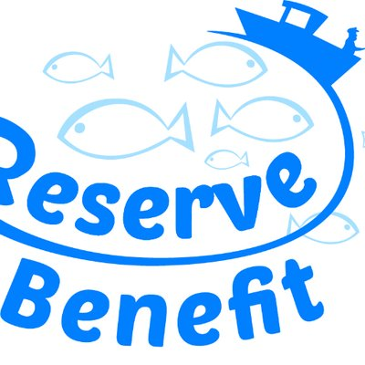

+++
template = "page.html"
title = "Curriculum Vitae"
date =  2019-08-20
draft = false
tags = ["education", "profile"]
lang = "fr"
+++

Je m'appelle Pierre-Edouard **GUERIN**. Informaticien de formation, après quelques missions au sein des unités de l'INSERM à Paris, je suis maintenant en CDD au CNRS de Montpellier depuis 2017.

_______________________________________________________________________________

# Coordonnées

* **Courriel:** <a href="mailto:pierre.edouard.guerin@gmail.com"> pierre.edouard.guerin [at] gmail.com</a>
* **Téléphone:** (+33) 04 67 61 32 35

# Experience

**De février 2017 à aujourd'hui: Ingénieur d'étude en calcul scientifique**, CNRS UMR 5175, Centre d'Ecologie Fonctionnelle et Evolutive, Montpellier
- Développement de logiciels et réalisation de chaînes de traitement de données en calcul intensif pour l’analyse et la visualisation des mégadonnées issues du séquençage ADN haut-débit (génomique, ADN environnemental). J’assure également la veille technologique pour mettre en place de nouvelles méthodes de traitement des données et optimiser la reproductibilité scientifique. *(python, R, bash, snakemake, julia, C++, SLURM, Docker, Singularity, univa grid engine)*

**De janvier 2016 à août 2016: Développeur logiciel** (Stage de Master), INSERM UMR S598, Génétique des Diabètes, Paris
- Développement de nouvelles fonctionnalités pour un logiciel dédié au diagnostic médical automatisé en exploitant les données de variants génétiques rares détectés sur les séquences de génomes humains. *(python, mySQL, qt4 )*

**De février 2015 à juin 2015: Bioinformaticien** (Stage de Master), INSERM UMR S1134, Dynamtique des Structures et Interactions des Macromolécules en Biologie, Paris  
- Conception et développement d'un nouvel algorithme pour améliorer la prédiction de modélisation 3D des structures des protéines à résolution atomique. *(python, R, C, C++, bash, CSS, HTML, Javascript)*

# Projects

Génomique des populations

J'ai effectué le génotypage de 1200 individus parmis 3 espèces de poissons. Mon workflow est conçu pour analyser des données de séquençage RAD-seq.

 (illumina paired-end, STACKS, vcftools, bedtools, bwa, python, snakemake, singularity, Univa Grid Engine, bash)

 

 D'avril 2017 à décembre 2018 

Etude comparative des outils pour le traitement des données metabarcoding

J'ai developpé un workflow modulable qui utilise tous les outils de l'état de l'Art disponibles. Nous avons ensuite comparé leurs performances afin de selectionner le workflow optimal.

 (obitools, vsearch, cutadapt, bash, python, singularity, Univa Grid Engine)

 

 De février 2019 à mars 2020 

Carte mondiale de la diversité génétique des poissons

 J'ai construit une base de données contenant plus de 50000 séquences d'ADN représentant 3815 espèces de poissons marins et 1611 espèces de poissons d'eau douce. J'ai estimé la distribution mondiale de la diversité génétique moyenne.

 (julia, python, R, singularity, MUSCLE, UGENE, geonames, BOLD, shiny)

 

 De mai 2017 à février 2020 

Genbar 2

  J'ai programmé un logiciel pour identifier les populations génétiques à partir de coordonnées spatiales individuelles et de données sur les génotypes individuels.

 (C, C++, htslib)

 

 De mai 2017 à février 2020 

Assemblage de génomes

J'ai supervisé le séquençage et réaliser l'assemblage des génomes nucléaires et mitochondriaux de 3 nouvelles espèces de poissons.

 (illumina paired-end, mate-pair, 10X genomics chromium, Abyss, Platanus, QUAST, SLURM, bash)

 

 De janvier 2017 à novembre 2019 

Metabarcoding

J'ai programmé plusieurs logiciels pour traiter les données de metabarcoding d'ADN environnemental issue de la CAMPAGNE D'EXPLORATION OCEANOGRAPHIQUE DE MONACO.

 (obitools, vsearch, swarm, cutadapt, bash, python, singularity, snakemake)

 

 De mars 2018 à aujourd'hui

Génomique des paysages

J'ai traité des données RAD-seq à faible couverture provenant de 1800 individus parmis 2 espèces de poissons, collectés  dans toute la Méditerranée.

 (dDocent, freebayes, vcftools, samtools, trimmomatic, bash, python, singularity, snakemake)

 

 De juin 2017 à aujourd'hui 

Etude du génome de la betterave

J'ai fait plusieurs mesures (diversité nucléotidique, D de Tajima) sur le génome de la betterave à partir de 14409 polymorphismes aléatoires de nucléotides uniques (SNP) parmi 299 accessions de betteraves cultivées.

 (R, python, genpop)

 

 De mai 2017 à mai 2018 

Automatisation du contrôle qualité des séquences d'exome 

J'ai développé un logiciel capable de détecter les variations génomiques humaines potentiellement pathologique mais avec une mauvaise qualité de séquençage. 

 (Illumina paired-end, samtools, GATK, bedtools, variation annotation, python, mySQL, qt4)

 

 De janvier 2016 à juillet 2016 

Optimisation d'une méthode de reconnaissance des repliements dans la structure des protéines

J'ai implémenté et mise à l'épreuve un nouvel algorithme qui améliore la prédiction des modélisations 3D des structure des protéines à résolution atomique. 

 (PDB, pymol, C, C++, python, R, html, css )

 

 De février 2015 à juin 2015 

# Logiciels

* **[wfgd](https://shiny.cefe.cnrs.fr/wfgd/)**: carte mondiale de la diversité génétique des poissons
* **[Genbar2](https://github.com/Grelot/genbar2)**: logiciel C++ détection et assignation des individus à des populations génétiques à partir de données ADN type génotypage
* **[DEMORT](https://pypi.org/project/demort/)**: a DEmultiplexing MOnitoring Report Tool
* **[EXAM](https://sourceforge.net/projects/exam-exome-analysis-and-mining/)**: a whole exome sequencing analysis and its graphical interface
* **[COAT](https://github.com/Grelot/diabetesGenetics--COAT)**: Reporte les régions codantes de génomes humains, potentiellement liées à un diabète et avec une mauvaise qualité de séquençage.
* **[ORION](http://www.dsimb.inserm.fr/ORION/)**: une méthode de détection des modèles de structure de protéines

# Publications scientifiques

* **Blind assessment of vertebrate taxonomic diversity across spatial scales by clustering environmental DNA metabarcoding sequences** ([Ecography Journal en auguste 2020](https://doi.org/10.1111/ecog.05049))
* **New genomic ressources for three exploited Mediterranean fishes** ([Genomics en juillet 2020](https://doi.org/10.1016/j.ygeno.2020.06.041))
* **Global determinants of freshwater and marine fish genetic diversity** ([Nature Communications en février 2020](https://www.nature.com/articles/s41467-020-14409-7))
* **Predicting genotype environmental range from genome–environment associations** ([Molecular Ecology en mai 2018](https://doi.org/10.1111/mec.14723))
* **ORION : a web server for protein fold recognition and structure prediction using evolutionary hybrid profiles** ([Scientific Reports en juin 2016](https://doi.org/10.1038/srep28268))

# Formation

* **2016: Master double compétence informatique et biologie**, Université Paris Diderot, France
* **2014: Licence double compétence informatique et biologie**, Université Paris Diderot, France

_______________________________________________________________________________

# Autres activités

## Sciences

* Mon [blog scientifique](https://guerinpe.com/articles/)
* Membre de l'association des **JE**unes **BI**oinformaticiens de **F**rance [Jebif](https://jebif.fr/en/)
* Auteur d'articles de vulgarisation scientifique pour la communauté [bioinfo-fr](https://bioinfo-fr.net/author/pierre-edouard-guerin)
* [Machine learning](https://github.com/Grelot/machine_learning_demo) en exploitant les technologies basées sur python *(pandas, numpy, tensorflow, scikit-learn)* j'améliore mes compétences en partipant aux compétitions numériques sur [kaggle](https://www.kaggle.com/pierreedouardguerin).

## Projets personnels

* **[speckyman](https://github.com/Grelot/speckyman)**: un jeu-video de plate-forme codé en Javascript
* **[fromdnatomusic](https://github.com/Grelot/fromdnatomusic)**: convertir des séquences ADN en piste audio MIDI
* **[Nos data ont du talent](https://www.youtube.com/channel/UCvjBNumU6EvJiiGfxqNfd7Q)**: une chaîne YOUTUBE de représentations graphiques originales de données économiques et démographiques publiques, en particuliers, les séries temporelles.

## Triathlon

Je suis triathlète fftri et membre de l'**U**nion **S**portive des **N**ageurs de Montpellier [USN-MONTPELLIER](https://www.usn-montpellier.fr/usn-web/view/index.php) depuis 2017. Rejoignez-nous !

_______________________________________________________________________________
