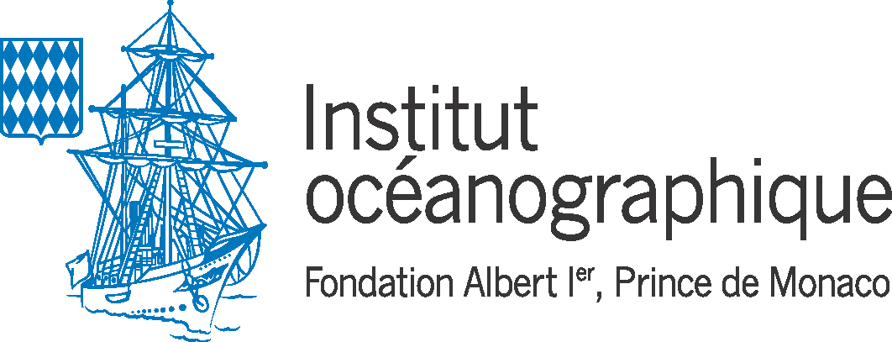

+++
template = "page.html"
title = "Curriculum Vitae"
date =  2019-08-20
draft = false
tags = ["resume"]
+++

My name is Pierre-Edouard **GUERIN**. I'm currently working as a computational biologist in [CEFE](https://www.cefe.cnrs.fr) research team at [CNRS](http://www.cnrs.fr/languedoc-roussillon/03com-labos/03-2-lab-site/02-lab-site-montp.htm) of Montpellier, France.

_______________________________________________________________________________

# Education

* **2016: Master's degree of Bioinformatics**, Université Paris Diderot Paris 7, France
* **2014: Licence's degree of Bioinformatics**, Université Paris Diderot Paris 7, France

# Experience

**February 2017 to present: Computational biologist**  
Center of Functional Ecology and Evolution, Montpellier, France  
- Landscape genomics approach to assess genetic populations of mediteranean fishes for the european mission RESERVEBENEFIT  
- Program to process *metabarcoding* marine eDNA data for the world oceanographic mission of Monaco
- Genome assembly 

**January 2016 to august 2016: Software developer** (Master internship)
Genetics of Diabetes, Paris, FR  
- Human genomes DNA high throughput sequencing data analysis  
- Program to detect and annotate rare genetic variants  
- Graphical interface  

**February 2015 to June 2015: Computational biologist** (Master internship)  
- Dynamics of Structures and Interactions of Macromolecules in Biology Paris, FR  
- 3D-modelisation of protein structure at atomic resolution  
- Optimization of a method of fold recognition in protein structure  
- New algorithm to predict protein structure  

# Projects

Population genomics

I genotyped 1200 individuals belonging to 3 fish species. I worked with restriction enzyme-based data such as RAD-seq.

 (illumina paired-end, STACKS, vcftools, bedtools, bwa, python, snakemake, singularity, Univa Grid Engine, bash)

 

 From april 2017 to december 2018 

Benchmarking of metabarcoding workflows

I did a modularized workflow in order to process metabarcoding data with different combination of softwares. Then we designed the workflow with the best performances.

 (obitools, vsearch, cutadapt, bash, python, singularity, Univa Grid Engine)

 

 From februrary 2019 to march 2020 

First Global Map of Fish Genetic Diversity

 I built a database containing over 50,000 DNA sequences representing 3,815 species of marine fish and 1,611 species of freshwater fish. I estimated the average genetic diversity at different geographical scales.

 (julia, python, R, singularity, MUSCLE, UGENE, geonames, BOLD, shiny)

 

 From may 2017 to february 2020 

Genome assembly

I did the sequencing and assembly of 3 new fish species nuclear and mitochondrial genomes.

 (illumina paired-end, mate-pair, 10X genomics chromium, Abyss, Platanus, QUAST, SLURM, bash)

 

 From January 2017 to Novembrer 2019 

Metabarcoding

I programmed several workflow to process metabarcoding environmental DNA data from MONACO MARINE WORLDWIDE EXPEDITION.

 (obitools, vsearch, swarm, cutadapt, bash, python, singularity, snakemake)

 

 From april 2018 to present 

Landscape genomics

I processed low-coverage RAD-seq data from 1800 individuals belonging to 2 fish species collected from all over the Mediterranean sea.

 (dDocent, freebayes, vcftools, samtools, trimmomatic, bash, python, singularity, snakemake)

 

 From june 2017 to present 

Beets genome metrics

I calculated metrics (nucleotide diversity, Tajima's D) on the beets genome from 14,409 random single nucleotide polymorphisms (SNPs) among 299 individuals of cultivated beets.

 (R, python, genpop)

 

 may 2017 to may 2018 

Landscape genomics

I developped a software able to detect human genomic variations with low coverage. Graphical Interface. 

 (Illumina paired-end, samtools, bedtools, variation annotation, python, mySQL, qt4)

 

 From january 2016 to july 2016 

Optimization of a method of fold recognition in protein structure

I added a new algorithm to predict 3D-modelisation of protein structure at atomic resolution 

 (PDB, pymol, C, C++, python, R, html, css )

 

 From february 2015 to june 2015 

 

# Softwares

* **[wfgd](https://shiny.cefe.cnrs.fr/wfgd/)**: interactive worldmap of fish genetic diversity
* **[Genbar2](https://github.com/Grelot/genbar2)**: identify genetic boundaries between populations using individual spatial coordinates and genetic variants
* **[DEMORT](https://pypi.org/project/demort/)**: a DEmultiplexing MOnitoring Report Tool
* **[EXAM](https://sourceforge.net/projects/exam-exome-analysis-and-mining/)**: a whole exome sequencing analysis and its graphical interface
* **[COAT](https://github.com/Grelot/diabetesGenetics--COAT)**: a COverage Analysis Tool for exome sequencing data
* **[ORION](http://www.dsimb.inserm.fr/ORION/)**: a sensivitve method for protein template detection

# Publications

* **New genomic ressources for three exploited Mediterranean fishes** (submitted to Molecular Ecology Ressources in november 2019)
* **Global determinants of freshwater and marine fish genetic diversity** ([Nature Communications in february 2020](https://www.nature.com/articles/s41467-020-14409-7))
* **Predicting genotype environmental range from genome–environment associations** ([Molecular Ecology in may 2018](https://doi.org/10.1111/mec.14723))
* **ORION : a web server for protein fold recognition and structure prediction using evolutionary hybrid profiles** ([Scientific Reports in june 2016](https://doi.org/10.1038/srep28268))

_______________________________________________________________________________

# Other activities

## Sciences

* My scientific [blog](https://guerinpe.com/articles/)
* Member of the association of Young French Bioinformaticians [Jebif](https://jebif.fr/en/)
* Author on french bioinformatics participative blog [bioinfo-fr](https://bioinfo-fr.net/author/pierre-edouard-guerin)

## Personnal projects

* **[speckyman](https://github.com/Grelot/speckyman)**: a platform game developed in JavaScript
* **[fromdnatomusic](https://github.com/Grelot/fromdnatomusic)**: convert DNA sequences into MIDI track and listen to it
* **[Nos data ont du talent](https://www.youtube.com/channel/UCvjBNumU6EvJiiGfxqNfd7Q)**: a youtube channel dedicated to data visualisation

## Triathlon

I'm an active member of the [USN-MONTPELLIER](https://www.usn-montpellier.fr/usn-web/view/index.php) sportive club since 2017. Join us !

______

